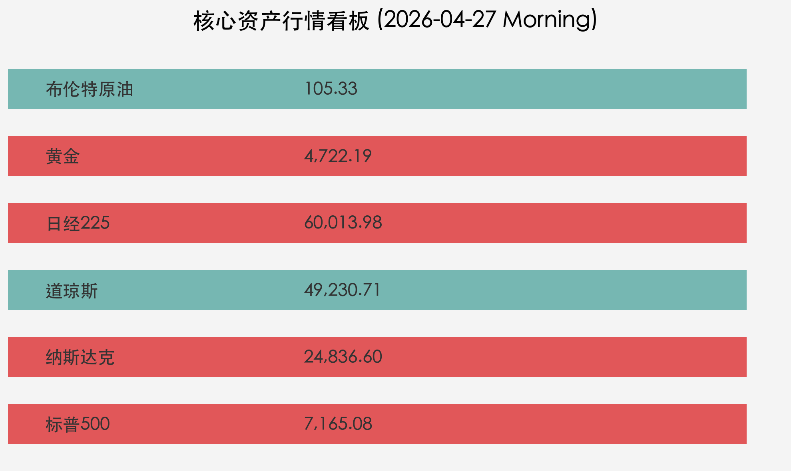

# 全球市场周报：地缘阴云与科技狂欢的极致博弈

**日期：2026年04月27日 (星期一)** &nbsp; **时段：早间展望 (Morning Outlook)**

> **核心摘要**：周末美伊和平谈判意外破裂引发原油与地缘溢价回归，然而美股半导体狂欢余温未消，日经225指数周一开盘历史性冲破60,000点大关。本周市场核心焦点在于美联储议息会议及科技股财报的延续性。

## 周末财经要闻终极汇总

*   **美伊伊斯兰堡谈判破裂**：4月26日消息，旨在缓解中东局势的和平谈判宣告失败。霍尔木兹海峡航运中断风险再度被市场定价，布伦特原油站稳 **$105** 关口。
*   **日经225指数开盘见证历史**：受上周五美股芯片股大涨带动，日经225今日开盘迅速冲高至 **60,013.98** 点，首次站上6万点整数位。
*   **宏观预期下调**：穆迪将印度FY27年度GDP增长预测下调至 **6%**，理由是能源成本上升及消费疲软。
*   **企业财报压力**：Reliance Industries (RIL) Q4利润同比下降 **8.1%**，Axis Bank 净利润持平，显示传统行业复苏动能受阻。

## 新一周市场核心博弈逻辑

本周市场进入“避险”与“成长”的双线博弈：
1.  **避险属性回归**：谈判破裂后，黄金、美元指数及原油价格呈现联动上涨趋势，地缘政治溢价将抵消部分由于经济放缓带来的通缩预期。
2.  **AI泡沫与盈利现实**：美股纳斯达克与标普500虽创新高，但市场正密切观察英特尔及后续芯片龙头的盈利成色是否足以支撑当前的高估值。
3.  **政策博弈**：市场对美联储（Fed）即将召开的议息会议充满警惕，在油价反弹背景下，通胀路径的确定性减弱可能导致联储措辞转鹰。

## 本周重磅经济数据与会议前瞻

*   **美联储（Fed）5月议息会议**：市场普遍关注点在于对通胀“粘性”的最新表述。
*   **美国4月非农就业数据**：评估劳动力市场降温是否如预期进行。
*   **中国4月官方PMI**：作为5月长假前的核心经济指标。
*   **日本央行（BoJ）动向**：在日经冲破6万点后，货币政策正常化的讨论预计升温。

## 头部券商/投行开盘策略点睛

*   **高盛 (Goldman Sachs)**：维持“建设性”看多观点。认为一季度盈利增长 **12%** 将是股市的核心驱动力，地缘政治引发的短期回撤是配置高质量成长股的良机。预测2026年底前仍有两次降息。
*   **摩根士丹利 (Morgan Stanley)**：相对谨慎，将2026年黄金目标价下调至 **$5,200**。警告中东供应冲击导致的“粘性通胀”可能推迟美联储政策转向，建议关注高利润的财富管理业务作为减震器。

## 核心行情复盘

## 今日市场情绪：【科技狂热 vs 地缘忧虑】

> Prompt: Cyberpunk style, A majestic digital phoenix made of glowing emerald circuit boards rising above a futuristic Tokyo skyline (representing Nikkei 225 record high), while in the dark background, a stormy sea of black oil barrels and broken negotiation tables represents the failed US-Iran peace talks. A human trader (real person) stands on a high-tech balcony, looking at the phoenix with a mixture of awe and caution., masterpiece, high detail, intricate composition, cinematic lighting, 8k resolution

---
**免责声明**：内容仅供参考，不构成投资建议。市场有风险，投资需谨慎。
