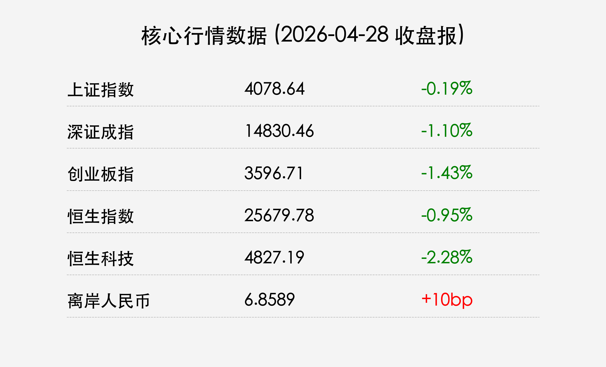

# 每日市场收盘简报

**日期：2026年04月28日 (星期二)** &nbsp; **时段：收盘报**

> **核心摘要**：A股与港股在“五一”长假前夕表现谨慎，三大指数震荡走跌。药明康德受业绩利好支撑A股封涨停，监管层联合打击金融产品非法网络营销，市场重心正向AI硬件与业绩确定性板块转移。

## 核心行情复盘

今日A股市场三大指数集体收跌，成交额维持在2.5万亿元以上的高位，显示出较强的换手意愿。

*   **上证指数**：报 **4078.64点**，下跌 **0.19%**。
*   **深证成指**：报 **14830.46点**，下跌 **1.10%**。
*   **创业板指**：报 **3596.71点**，下跌 **1.43%**。
*   **港股市场**：恒生指数收跌 **0.95%**，恒生科技指数表现较弱，下跌 **2.28%**。

**板块表现**：
*   **领涨板块**：煤炭、券商、创新药。**药明康德**因一季报净利大增，A股强势封停。
*   **领跌板块**：商业航天、教育、文化传媒、大模型相关科技股。

## 核心解读与市场逻辑

1.  **节前效应显著**：随着“五一”5天长假的临近，部分获利盘选择落袋为安，市场波动性有所放大。
2.  **AI投资逻辑演进**：AI板块内部出现明显分化。中金与中信均指出，投资逻辑正从“估值驱动”转向“业绩/硬件驱动”，算力硬件及具备确定性业绩支撑的个股表现相对坚挺。
3.  **药明康德“定心丸”**：作为权重股的药明康德封涨停，提振了医药外包板块的情绪，但在科技股整体调整的背景下，未能带动指数翻红。

## 政策脉动

1.  **金融直播营销监管**：央行、证监会等八部门联合发布新规，严厉打击通过直播、短视频进行非法荐股及误导性营销，旨在净化资本市场生态。
2.  **国债期货开放**：QFII/RQFII正式获准参与国债期货套期保值交易，标志着中国债券市场国际化程度进一步提升，有利于引导长期资金入市。
3.  **流动性支持**：央行今日开展435亿元逆回购，维持利率1.40%不变，确保月末及节前流动性平稳。

## 最新机构观点

*   **中金公司 (CICC)**：AI产业已进入“看报表”阶段，硬件端（GPU、服务器、光模块）的业绩确定性显著优于软件应用端，建议关注头部硬件厂商。
*   **中信证券 (CITIC)**：强调流动性拐点后的防御性，看好券商板块内部的并购重组机会，认为头部券商的整合将提升行业整体估值。
*   **高盛 (Goldman Sachs)**：维持对中资银行股的偏好，认为其一季度盈利改善具可持续性，且在震荡市中具备更好的抗风险能力。

## 今日市场情绪：[节前蓄势与硬件共鸣]

> [A humanoid robot in a high-tech workshop, meticulously assembling glowing server racks that form a mountain range, while in the background, a massive hourglass is slowly dripping red sand.]

**内容说明**：
画面展示了人形机器人在高科技工坊中组装算力山脉，象征AI投资逻辑向硬件基座转移；背景中的巨大沙漏滴落红砂，暗喻节前倒计时的审慎观望情绪。

---

**免责声明**：内容仅供参考，不构成投资建议。

日期：2026-04-28-evening
