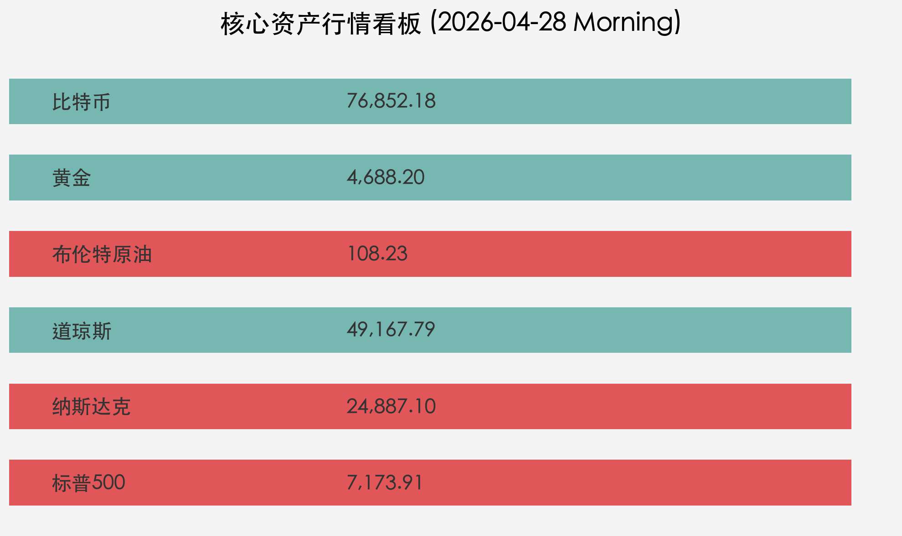

# 全球市场周报：美股再创历史新高，能源危机与财报季前哨战

**日期：2026年04月28日 (星期二)** &nbsp; **时段：早间展望 (Morning Outlook)**

> **核心摘要**：标普500与纳斯达克指数周一双双刷新历史收盘纪录，尽管地缘政治导致的油价飙升带来通胀阴影，但市场对AI算力支出的乐观预期主导了情绪。本周进入“超级财报周”，科技巨头的业绩将决定牛市成色。

## 核心行情复盘

周一美股市场呈现小幅分化但重心上移的态势，投资者在关键财报周开启前保持谨慎乐观。

*   **标普500指数 (S&P 500)**：收报 **7,173.91点**，上涨 **0.12%**，再创历史新高。
*   **纳斯达克综合指数 (Nasdaq)**：收报 **24,887.10点**，上涨 **0.20%**，连续录得创纪录表现。
*   **道琼斯工业平均指数 (Dow Jones)**：收报 **49,167.79点**，小幅下跌 **0.13%**，受传统工业及防御板块波动影响。
*   **布伦特原油 (Brent Crude)**：收报 **$108.23/桶**，大涨 **2.5%**，地缘冲突导致的霍尔木兹海峡封锁风险持续发酵。
*   **黄金 (Gold)**：收报 **$4,688.20/盎司**，下跌 **0.45%**，受美债收益率攀升及美元走强压制。
*   **比特币 (Bitcoin)**：报 **$76,852.18**，下跌 **1.79%**，在高位阻力位下方进行技术性回调。

## 核心解读与市场逻辑

> **“算力信仰”对冲“通胀隐忧”**
> 尽管美债10年期收益率攀升至 **4.335%**，且油价重回 **108美元** 高位，但英伟达（Nvidia）单日 4.0% 的涨幅再次证明了AI基建逻辑的统治力。市场正用“科技生产力带来的通缩效应”来对抗“能源紧缺带来的通胀效应”。

> **财报季前哨战：Magnificent Seven 的终极审判**
> 本周亚马逊、Alphabet、Meta 和微软将陆续发布财报。市场目前的定价已包含极高的增长预期，任何资本支出（CAPEX）指引的微弱下修都可能引发高位震荡。

## 政策脉动

*   **美联储（Fed）议息会议预警**：市场普遍预计本周联储将维持利率不变，但重点在于鲍威尔是否会针对油价反弹对 PPI 的潜在冲击释放“鹰派信号”。
*   **地缘政治僵局**：美伊在霍尔木兹海峡的“相互封锁”态势未见缓解，IEA 警告称若局势持续，全球原油供应缺口或将长期维持在 1000 万桶/日以上。

## 最新机构观点

*   **高盛 (Goldman Sachs)**：维持对美股的“建设性”看多观点，预计2026年底美债10年期收益率将趋向 **4.40%**。看好金价长期触及 **$5,400**，认为其仍是最佳的地缘政治对冲资产。
*   **摩根士丹利 (Morgan Stanley)**：相对审慎，将黄金2026年目标价下调至 **$5,200**。看好比特币矿商向AI数据中心的业务转型，认为“AI算力与能源协同”是未来五年的核心主题。

## 今日市场情绪：【巅峰之上的守望】

> Prompt: Cyberpunk style, A futuristic trader observing a digital horizon where stars are replaced by glowing corporate logos, while a storm of black oil swirls in the distance. A human trader (real person) stands on a high-tech balcony, looking at the glowing record-high indices on a holographic screen with a mixture of awe and caution., masterpiece, high detail, intricate composition, cinematic lighting, 8k resolution

---
**免责声明**：内容仅供参考，不构成投资建议。市场有风险，投资需谨慎。
