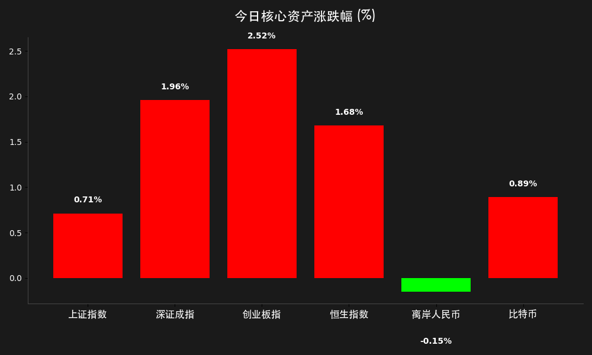
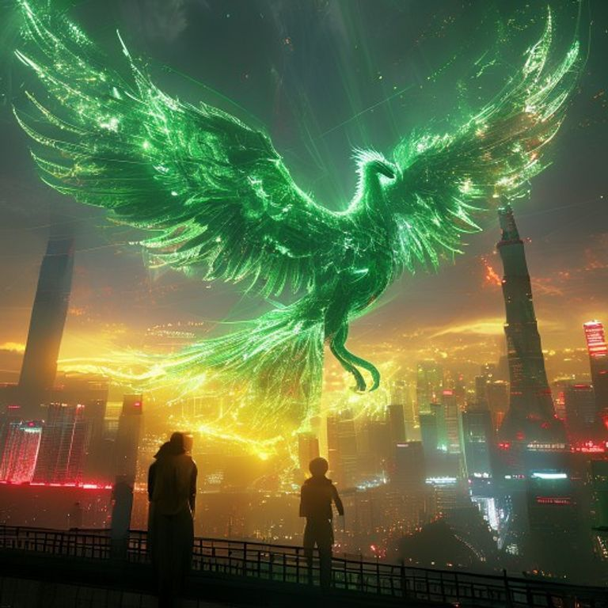

# 收盘报：政治局会议定调“适度宽松”，A股2.6万亿巨量齐涨，稀土永磁掀涨停潮

**日期：2026年04月29日 (星期三)** &nbsp; **时段：下午收盘**

> **核心摘要**：今日 A 股与港股市场在政治局会议释放“积极财政+适度宽松货币”强力信号下全线爆发。沪指重返 4100 点，两市成交额放大至 2.61 万亿元，稀土永磁、电池及 AI 算力板块领涨，市场情绪进入高亢区间。

## 核心行情复盘

今日市场呈现明显的“量价齐升”态势。受政治局会议宏观定调鼓舞，主力资金大规模回流，近 4000 只个股上涨，赚钱效应极佳。

| 指数名称 | 收盘点位 | 涨跌幅 | 备注 |
| :--- | :--- | :--- | :--- |
| **上证指数** | **4107.51** | **+0.71%** | 重回 4100 点关键心理位 |
| **深证成指** | **15120.92** | **+1.96%** | 成长股发力，表现亮眼 |
| **创业板指** | **3687.17** | **+2.52%** | 电池、新能源权重股集体大涨 |
| **恒生指数** | **26050.00** | **+1.68%** | 重返 26000 点，外资回补明显 |

*   **成交额与资金面**：A 股全天成交额达 **2.61 万亿元**，较前一交易日显著放量。
*   **主力动向**：主力资金显著流入 **小金属**（+38.09 亿元）和 **电池**（+33.40 亿元）板块。**北方稀土**净流入达 27.31 亿元。
*   **领涨板块**：稀土永磁、锂电池、有色金属、猪肉概念及 AI 算力板块掀起涨停潮。

> **核心解读**：今日上涨的核心驱动力在于 4 月 28 日政治局会议的官方通稿（29 日见报）。会议明确了“更加积极的财政政策”和“适度宽松的货币政策”，这在 2026 年通胀压力背景下超出了市场原本的审慎预期，直接点燃了风险偏好。同时，市场正从“地缘忧虑”转向“景气交易”，AI 算力与稀土（溢价时代）成为主力资金的共识突破口。

## 政策脉动

1.  **政治局会议定调**：强调要精准有效实施**更加积极的财政政策和适度宽松的货币政策**。这是近期宏观政策力度最大的一次确认，极大地缓解了市场对流动性收紧的担忧。
2.  **人工智能+行动**：会议提出加强算力网、新一代通信网规划，全面实施“人工智能+”行动。这为 AI 产业链的长期逻辑提供了顶层设计支持。
3.  **地产与对外开放**：强调稳定房地产市场并宣布自 2026 年 5 月 1 日起对所有非洲建交国实施零关税，体现了在复杂国际环境下的全方位开放与风险对冲逻辑。

## 最新机构观点

*   **中金公司（CICC）**：认为随着外部风险溢价下行，被压制的“景气交易”有望重回市场主导地位。成长风格的上涨动力来自 AI 领域的突破，市场正进入业绩与估值双提升阶段。
*   **中信证券（CITIC）**：提出 2026 年将迎来“金属的溢价时代”。供应扰动与需求局部高景气共同支撑价格，特别看好稀土及小金属板块。此外，国内电商行业已见底，存在“戴维斯双击”机会。

## 今日市场情绪：政策东风点燃绿色生机

今日市场情绪犹如涅槃凤凰，在政策暖风与科技突破的双重加持下，市场正式告别此前的震荡阴云。

> Prompt: Surrealism style, A massive green phoenix made of glowing laser light and rare earth minerals rising from the skylines of Shanghai and Shenzhen, its wings weaving through a golden lattice of policy documents from the Political Bureau. In the background, a digital sunrise turns the red trading screens into a sea of emerald green. A human trader (real person) stands on a balcony, looking at the phoenix with triumph., masterpiece, high detail, intricate composition, cinematic lighting, 8k resolution

---
免责声明：内容仅供参考，不构成投资建议。
