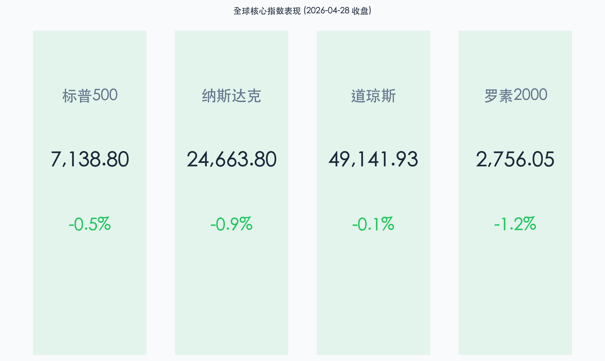
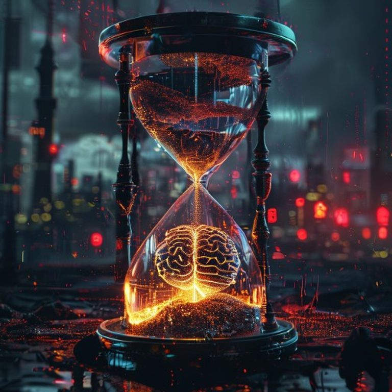

# 隔夜全球市场观察：AI 泡沫忧虑重燃，原油飙升挑战联储“收官战”

**日期：2026年04月29日 (星期三)** &nbsp; **时段：早报**

> **核心摘要**：隔夜美股全线收跌，AI 领军企业业绩预警引发科技股抛售潮；地缘局势紧张推动原油价格大涨 2.5%，通胀压力回升使鲍威尔执掌的最后一次 FOMC 会议蒙上阴影。

## 核心行情复盘

隔夜美股市场风险偏好显著回落，主要指数悉数中断连涨势头。AI 板块的估值逻辑在不及预期的经营数据面前遭遇重击，同时能源价格的剧烈波动再次扣动了市场的通胀敏感神经。

*   **标普 500 指数**：下跌 **0.5%**，报 **7,138.80** 点。
*   **纳斯达克综合指数**：下跌 **0.9%**，报 **24,663.80** 点，创一个月来最差单日表现。
*   **道琼斯工业平均指数**：下跌 **0.1%**，报 **49,141.93** 点。
*   **罗素 2000 指数**：下跌 **1.2%**，报 **2,756.05** 点。

## 核心解读与市场逻辑

> **1. AI 增长“天花板”疑云**：
> 华尔街日报披露 OpenAI 内部未达周活与营收目标，直接重击了市场对 AI 变现速度的乐观预期。作为算力基石的 **Nvidia (-1.4%)**、**Broadcom (-4.4%)** 等半导体巨头遭遇获利了结，投资者开始反思超大规模资本开支能否在短期内转化为同等规模的利润增量。
>
> **2. 能源黑天鹅与霍尔木兹海峡阴霾**：
> 霍尔木兹海峡局势的极度不确定性推动原油价格盘中飙升超 **2.5%**。这不仅让能源板块成为标普 500 指数中唯一的亮点，更通过通胀预期向债市施压，导致市场对美联储未来降息路径的定价出现反复。
>
> **3. 财报季的结构性分化**：
> 尽管科技股受挫，但传统经济龙头表现坚韧。**可口可乐 (+3.9%)** 与 **通用汽车 (+1.3%)** 凭借强劲的季度业绩和上调的盈利指引，为市场提供了避险出口。

## 政策脉动

*   **美联储 FOMC 会议启幕**：为期两天的政策会议于 4 月 28 日开始。这是**鲍威尔作为美联储主席的最后一次会议**。
*   **鲍威尔“告别秀”的挑战**：目前联邦基金利率维持在 **3.5% - 3.75%**。市场普遍预计本次会议将维持利率不变，但重点在于鲍威尔如何平衡原油驱动的通胀压力与经济放缓风险。
*   **继任者博弈**：特朗普提名的下任主席人选 **Kevin Warsh** 被视为潜在的鸽派，这种预期与当前高企的能源价格形成了矛盾的博弈点。

## 最新机构观点

*   **摩根士丹利 (Mike Wilson)**：尽管今日出现回调，但仍维持标普 500 **7,800** 点的基准目标。他认为企业盈利增长仍高出历史平均 10%，AI 驱动的运营杠杆将使每次回调都成为买入机会。
*   **高盛 (Goldman Sachs)**：建议客户“逢低买入”因 AI 恐慌而被错杀的科技龙头。高盛认为，美国经济对石油冲击的敏感度已大幅下降，结构性的科技繁荣尚未终结。
*   **摩根资产管理 (David Kelly)**：警告称美联储正处于“精细的平衡木”上。能源价格上涨既增加了通胀压力，又可能拖累全球增长，这使得政策路径变得极度复杂。

## 今日市场情绪：通胀回火与 AI 避险

> Prompt: Cyberpunk style, A massive hourglass where the flowing sand is replaced by thick, black crude oil, slowly burying a glowing silicon brain. In the background, a digital skyline is flickering with red warning signals., masterpiece, high detail, intricate composition, cinematic lighting, 8k resolution

隔夜市场呈现出典型的“风险规避”特征：投资者在宏观政策（美联储会议）与行业基本面（AI 变现）的双重不确定性面前选择了获利了结。

---
免责声明：内容仅供参考，不构成投资建议。
