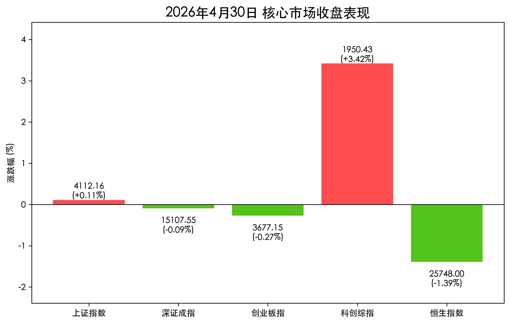
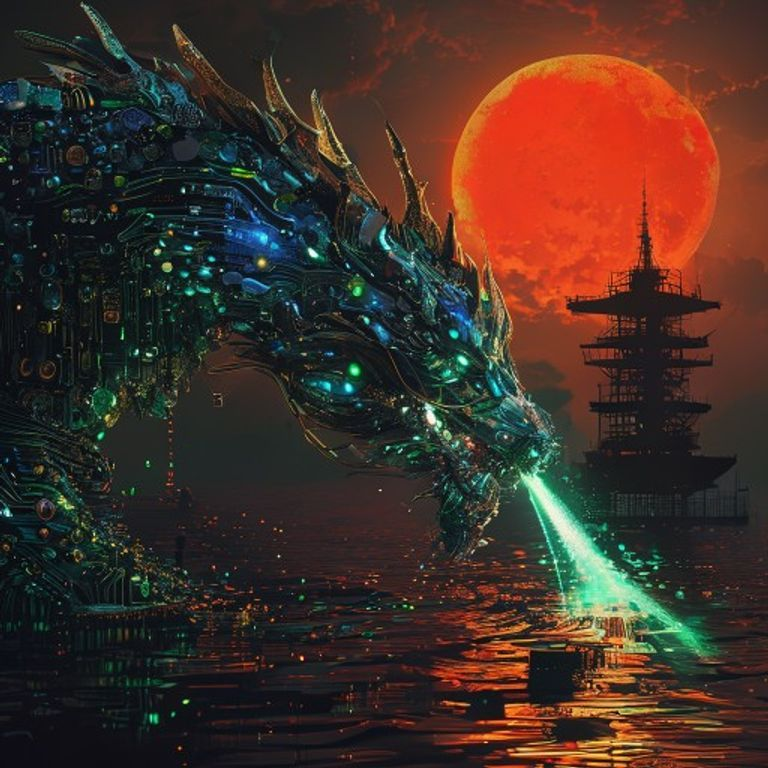

# 收盘报：科创板节前“狂飙”3.4%，半导体掀涨停潮，油价高企压制全球偏好

**日期：2026年04月30日 (星期四)** &nbsp; **时段：下午收盘**

> **核心摘要**：五一长假前最后一个交易日，A 股呈现极致结构化行情。科创板受算力芯片国产替代利好刺激爆涨 3.42%，寒武纪等权重股创历史新高；然而受隔夜美联储鹰派信号及地缘政治引发的油价飙升影响，港股及传统权重板块表现疲软。市场在长假前呈现明显的“弃旧迎新”特征，科技成长成为避险与进攻的双重共识。

## 核心行情复盘

今日 A 股与港股走势分化。科创板在半导体产业链带动下独立行走，而恒生指数则深陷地缘政治与通胀担忧的泥潭。

| 指数名称 | 收盘点位 | 涨跌幅 | 备注 |
| :--- | :--- | :--- | :--- |
| **上证指数** | **4112.16** | **+0.11%** | 稳守 4100 点，窄幅震荡 |
| **深证成指** | **15107.55** | **-0.09%** | 权重蓝筹调仓压力明显 |
| **创业板指** | **3677.15** | **-0.27%** | 新能源赛道受油价波动扰动 |
| **科创综指** | **1950.43** | **+3.42%** | **全场最强**，半导体掀涨停潮 |
| **恒生指数** | **25748.00** | **-1.39%** | 受外围地缘偏好收缩拖累 |

*   **成交额与资金面**：沪深北三市合计成交额达 **2.76 万亿元**，较昨日继续放量，显示节前博弈激烈。
*   **领涨板块**：**半导体及元件**、**算力芯片**、**国产软件**。寒武纪创历史新高，芯原股份、明微电子等十余股封住 20% 涨停。
*   **领跌板块**：**石油石化**（高位获利回吐）、**旅游酒店**（节前博弈落地）、**银行**、**钢铁**。

> **核心解读**：今日行情是“硬科技景气”与“全球宏观压力”的正面较量。一方面，伊朗局势导致的 $118 原油高价加剧了全球通胀担忧，压制了港股及利率敏感资产；另一方面，国内政策对 AI 算力底座的强力支持，使得资金在节前最后一天疯狂涌入科创板，试图抢占节后“科技开门红”的先机。4 月全月，上证上涨 5.66%，科创 50 更是暴涨 25%，为 2026 年二季度奠定了坚实的牛市底色。

## 政策脉动

1.  **AI 底座国家战略**：高层今日再次强调人工智能作为新一轮产业变革的核心，提出要加快自主可控算力网建设。这直接触发了今日科创板半导体板块的爆发式上涨。
2.  **节前流动性呵护**：央行今日开展大额逆回购操作，确保五一长假期间金融市场流动性平稳，缓解了市场对月末调仓的资金压力。
3.  **地缘政治关注**：相关部门正密切关注霍尔木兹海峡局势对国内能源供应链的影响。虽然短期推升了油价，但也倒逼了国内新能源及国产替代产业链的紧迫感。

## 最新机构观点

*   **中信建投（CSC）**：认为 AI 算力产业链目前仍处于估值合理区间。随着一季报披露完毕，业绩弹性最大的细分领域（如先进封装、高性能 CPU/GPU）将迎来持续的价值重估。
*   **银河证券（Galaxy Securities）**：建议投资者在五一长假期间保持均衡配置。虽然科技成长是主线，但需警惕节后可能出现的获利盘兑现，关注业绩持续超预期的细分龙头。
*   **高盛（Goldman Sachs）**：对 A 股维持“超配”建议，认为尽管外围环境动荡，但中国经济基本面的韧性（PMI 稳健）及政策工具箱的丰富度，使其成为全球资本的避风港。

## 今日市场情绪：芯片之龙跃出黑金重围

今日市场情绪呈现极强的反差感：外围是压抑的石油黑金压力，内部是璀璨的科技成长突围。

> Prompt: Surrealism style, A majestic dragon constructed from glowing sapphire microchips and golden circuit boards soaring out of a dark, viscous ocean of black crude oil. The dragon breathes a beam of emerald light towards a giant digital clock showing the start of a holiday. In the background, a blood-red sun is partially eclipsed by a silhouetted oil tanker. A human trader (real person) watches from a high-tech pagoda., masterpiece, high detail, intricate composition, cinematic lighting, 8k resolution

---
免责声明：内容仅供参考，不构成投资建议。
