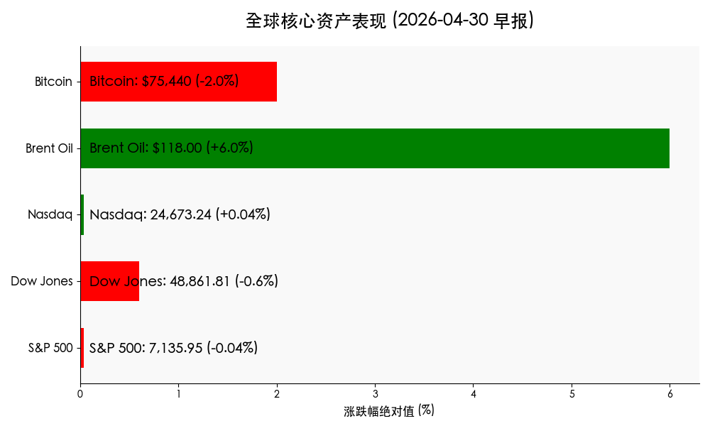
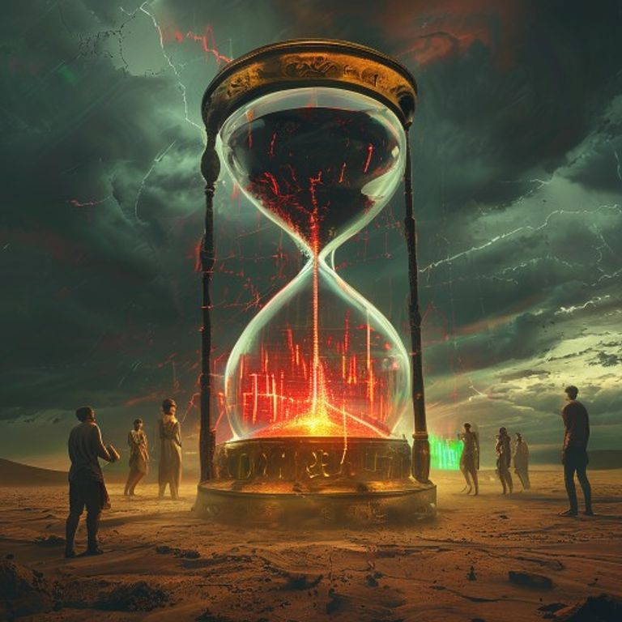

# 早报：美联储历史性“八四开”内歧，伊朗封锁致原油飙升，科技巨头静待财报审判

**日期：2026年04月30日 (星期四)** &nbsp; **时段：上午开盘前**

> **核心摘要**：美联储在今日凌晨的会议上虽然维持利率不变，但内部罕见爆出 8-4 的严重分歧，鹰派势头强劲令降息预期几乎化为泡影。同时，伊朗封锁霍尔木兹海峡的消息导致布伦特原油暴涨 6% 逼近 118 美元，地缘政治溢价重回市场巅峰。美股三大指数表现分化，投资者在“七巨头”财报公布前夕保持高度审慎。

## 核心行情复盘

隔夜美股市场在多重重磅事件交织下呈现震荡走势。尽管能源股随油价起舞，但利率担忧压制了市场整体估值表现。

| 指数名称 | 收盘点位 | 涨跌幅 | 备注 |
| :--- | :--- | :--- | :--- |
| **标普 500 指数** | **7,135.95** | **-0.04%** | 尾盘拉升，勉强守住 7100 点 |
| **道琼斯指数** | **48,861.81** | **-0.60%** | 受联合健康等权重股拖累明显 |
| **纳斯达克指数** | **24,673.24** | **+0.04%** | 芯片股反弹抵消了部分利率压力 |
| **布伦特原油** | **$118.00** | **+6.00%** | 伊朗局势升级引发供应中断担忧 |
| **比特币 (BTC)** | **$75,440** | **-2.00%** | 风险偏好收缩，跌落 $77,000 高点 |

*   **债市异动**：美债 10 年期收益率触及一月高位 **4.42%**，30 年期收益率突破 **5.0%** 大关，反映出市场正在重新定价“更久、更高”的利率逻辑。
*   **行业领涨**：能源板块 (+2.35%) 在油价暴涨带动下领跑，科技板块 (+0.18%) 在财报预期支持下微涨。
*   **行业领跌**：公用事业 (-1.23%) 和材料 (-1.10%) 表现垫底，对利率敏感的防御性板块受压严重。

> **核心解读**：当前市场逻辑正从“软着陆”向“地缘冲突+高通胀”剧本转移。伊朗冲突导致的能源成本飙升，直接威胁到联储的抗通胀进展，这也是本次 FOMC 投票中出现四名反对票的关键原因。此外，SEC 批准纳斯达克进入 23 小时交易时代的提案，也标志着全球资本市场正向“全天候博弈”进化。

## 政策脉动

1.  **美联储历史性分歧**：FOMC 宣布维持基准利率在 **3.5%–3.75%**，但出现了 1992 年以来最多的 **4 张反对票**。三名官员甚至主张加息以遏制通胀。这种分裂表明美联储的“共识墙”正在瓦解。
2.  **伊朗海域封锁**：美国宣布将持续封锁伊朗港口，直至签署新核协议。伊朗的回应是加强对霍尔木兹海峡的控制，导致布油价格出现自 2022 年以来的单日最大涨幅。
3.  **纳斯达克 23 小时交易**：SEC 批准了纳斯达克的全天候交易申请，尽管具体实施日期未定，但这一政策动向预示着未来全球流动性将进一步向顶级资产集中，但也可能加剧隔夜波动。

## 最新机构观点

*   **高盛（Goldman Sachs）**：虽然短期面临养老基金约 230 亿美元的月末调仓压力，但维持对 2026 年标普 500 盈利增长 **12%** 的预测。高盛认为当前的调整是“清理浮盈”，并坚持认为年底前仍有 **两次降息** 的机会（属于市场中的极少数派）。
*   **摩根士丹利（Morgan Stanley）**：目标价定在 **7,500 点**。其策略师认为当前是“高空钢丝”牛市，利润增长必须达到 14% 以上才能维持现有估值。建议配置向“高质量”倾斜，重点关注受益于 AI 基础设施的能源与金融板块。

## 今日市场情绪：沙漏中的黑金迷局

今日市场情绪犹如沙漠中摇摇欲坠的天平，地缘政治的油压正不断冲击着联储的利率逻辑。

> Prompt: Surrealism style, A giant hourglass filled with thick black crude oil instead of sand is tilting dangerously on a golden balance scale, while in the background, eight Greek gods are arguing intensely around a glowing digital monitor displaying volatile red and green financial pulses. A human trader (real person) stands in the middle of the desert, looking at the hourglass with a mix of anxiety and calculation, under a stormy sky., masterpiece, high detail, intricate composition, cinematic lighting, 8k resolution

---
免责声明：内容仅供参考，不构成投资建议。
