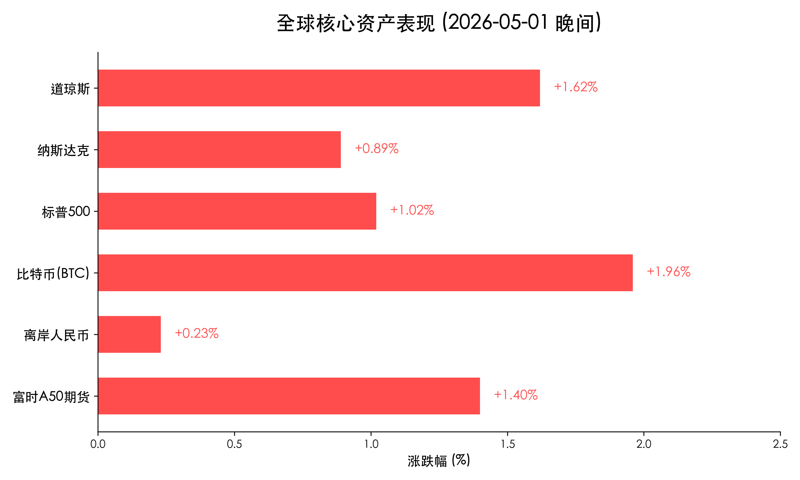

# 收报：五一长假开启，离岸中国资产集体拉升，消费市场呈现“结构性爆发”

**日期：2026年05月01日 (星期五)** &nbsp; **时段：傍晚收盘后**

> **核心摘要**：五一假期首日，国内市场虽处于休市状态，但离岸资产表现强劲，富时 A50 期货直线拉升超 1.4%，离岸人民币汇率同步走强。国内消费市场呈现“超长假期”效应，旅游人次预测创新高，县域旅游与“情绪消费”成为核心增长点。

## 离岸行情复盘

虽然 A 股与港股今日因劳动节休市，但全球资金对中国资产的热情并未停歇。受隔夜美股创历史新高的正面情绪传导，离岸市场表现极佳。

| 资产名称 | 实时点位/价格 | 涨跌幅 | 市场解读 |
| :--- | :--- | :--- | :--- |
| **富时中国 A50 期货** | **15,772.00** | **+1.40%** | 直线拉升，反映节后补涨预期 |
| **离岸人民币 (CNH)** | **6.8321** | **+0.23%** | 人民币走强，资本流入压力缓解 |
| **比特币 (BTC)** | **$77,264** | **+1.96%** | 风险偏好扩张，站稳 7.7 万关口 |
| **标普 500 指数 (美收)** | **7,209.01** | **+1.02%** | 财报季红利释放，指数创新高 |
| **纳斯达克指数 (美收)** | **24,892.31** | **+0.89%** | 科技巨头业绩分化但整体向上 |

> **市场洞察**：离岸 A50 的强势拉升（+1.4%）主要归因于两点：一是隔夜美股 Alphabet 与卡特彼勒超预期财报带动的全球风险偏好回暖；二是国内 4 月 PMI 连续扩张夯实了基本面底座。离岸人民币的走强进一步印证了外资对节后中国资产的看好。

## 假期宏观热点：五一消费的“结构性爆发”

2026 年五一假期因叠加多地“春假”，形成了独特的超长黄金周，消费端展现出以下特征：

*   **流量之巅**：交通运输部预测全社会人员流动量将达 **15.2 亿人次**，日均 3.04 亿，创历史同期新高。
*   **县域爆发**：旅游重心加速下沉，安吉、阳朔、平潭等县域目的地预订热度大涨 **128%**，高性价比成为游客首选。
*   **情绪价值导向**：“跟着演出去旅行”效应显著，演唱会与赛事带动的“一地多日”沉浸式消费占比大幅提升。
*   **租赁经济火热**：无人机、汉服、露营装备租赁量同比翻番，反映出年轻人“轻装出游、以租代买”的理性消费新常态。

## 政策与重要动向

1.  **文旅部促消费行动**：全国启动“五一文化和旅游消费周”，累计发放文旅消费券超 **2.84 亿元**。
2.  **入境便利化红利**：受益于免签政策扩大，上海、西安等城市入境游出现爆发式增长，中国假日经济正向全球溢出需求。
3.  **节后流动性预期**：市场普遍预期央行节后将继续通过 3000 亿买断式逆回购呵护市场，流动性环境维持合理充裕。

## 最新机构观点

*   **中信证券**：认为当前 A 股正处于“估值修复”向“业绩驱动”的切换点，建议关注假期期间表现抢眼的**消费服务业**与**跨境旅游**板块。
*   **摩根大通**：离岸人民币的坚挺显示了中国资产的避险属性增强，预计节后港股通恢复后，外资将进一步增配中国核心资产。
*   **中金公司**：五一数据再次验证了内需的韧性，特别是县域经济的崛起将为后续消费刺激政策提供新的支点。

## 今日市场情绪：霓虹闪烁下的假日静谧

今晚的市场情绪呈现出一种“蓄势待发”的赛博质感：离岸屏幕上的红绿数字在假日霓虹中闪烁，象征着中国资产在静谧的长假中正凝聚着突破的力量。

> Prompt: Cyberpunk style, A futuristic metropolis where neon signs of Chinese lanterns glow alongside digital market tickers showing green and red. A massive high-tech dragon made of emerald circuit boards flies over the city, carrying a golden scroll with 'Labour Day 2026' written on it. In the foreground, a human trader (real person) is relaxing on a holographic balcony, looking at a distant digital sunrise over a sea of data clouds. The atmosphere is a fusion of holiday rest and technological power., masterpiece, high detail, intricate composition, cinematic lighting, 8k resolution

---
免责声明：内容仅供参考，不构成投资建议。
