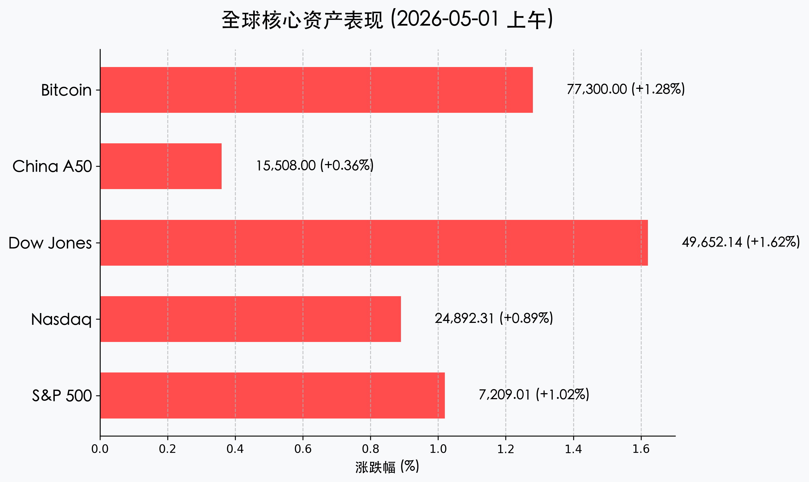
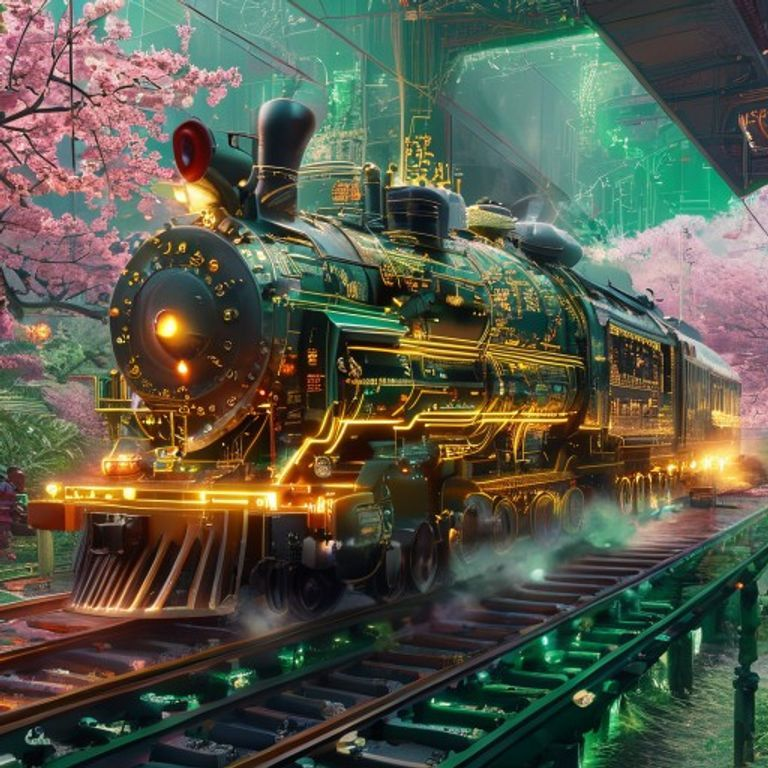

# 早报：美股三大指数创历史新高，Alphabet与卡特彼勒齐飞，中方开启五一长假模式

**日期：2026年05月01日 (星期五)** &nbsp; **时段：上午开盘前**

> **核心摘要**：隔夜美股在强劲财报驱动下创下历史新高，Alphabet 暴涨 10% 引领科技股反弹。与此同时，中国市场正式进入五一长假模式，4 月官方 PMI 连续两个月处于扩张区间，展现出稳健的经济修复动能。在全球风险偏好回升的背景下，富时 A50 期货及比特币均表现强劲。

## 核心行情复盘

4 月 30 日，美股市场在企业财报季的辉煌篇章中完美收官。尽管此前市场对高通胀和美联储分歧有所担忧，但 Alphabet 和卡特彼勒的超预期表现直接击碎了空头逻辑。

| 指数名称 | 收盘点位 | 涨跌幅 | 备注 |
| :--- | :--- | :--- | :--- |
| **标普 500 指数** | **7,209.01** | **+1.02%** | 历史首次突破 7200 点大关 |
| **纳斯达克指数** | **24,892.31** | **+0.89%** | 科技巨头业绩分化中逆势走强 |
| **道琼斯指数** | **49,652.14** | **+1.62%** | 传统工业龙头卡特彼勒建功 |
| **富时中国 A50 期货** | **15,508.00** | **+0.36%** | 假日期间离岸市场情绪平稳 |
| **比特币 (BTC)** | **$77,300** | **+1.28%** | 风险偏好扩张带动加密资产反弹 |

*   **领涨主力**：**Alphabet (Google)** 暴涨约 10%，其云业务 62% 的增长和 AI 盈利逻辑得到市场认可；**卡特彼勒 (CAT)** 同样飙升 10%，受益于全球 AI 基础设施与数据中心建设热潮。
*   **科技分化**：Meta 跌约 9%，微软跌 4%，投资者对巨额 AI 资本支出的短期回报仍有疑虑。
*   **大宗商品**：油价在伊朗局势波动中回落至 105 美元附近；金价高位徘徊于 4620 美元；比特币稳守 7.7 万美元关口。

> **核心解读**：当前市场呈现典型的“业绩牛”特征。Alphabet 的爆发标志着 AI 逻辑已从“硬件基建”向“软件应用与云变现”深度迈进。而卡特彼勒的表现则揭示了 AI 繁荣对实体工业（如数据中心建设）的巨大外溢效应。对于处于假期中的 A 股投资者而言，离岸 CNH 汇率的稳定与 A50 的微涨为节后开盘积蓄了正面情绪。

## 政策脉动

1.  **中国 PMI 延续扩张**：4 月官方制造业 PMI 为 **50.3%**，连续两个月处于扩张区间。尽管环比略有回落，但整体生产与新订单动能依然稳健，夯实了全年 5% 左右的增长基础。
2.  **央行节前流动性呵护**：人行宣布将于 5 月 6 日开展 **3000 亿元** 3 个月期买断式逆回购操作，精准覆盖节后首个交易日，释放了维护流动性合理充裕的明确信号。
3.  **证监会铁腕治乱**：证监会全面部署 2026 年上市公司财务造假专项打击行动，强调“造假即退市”，节前已有 18 家公司面临强制退市，市场生态持续净化。

## 最新机构观点

*   **高盛（Goldman Sachs）**：维持“宽幅牛市”判断，认为 AI 基础设施逻辑正在扩散。不仅看好芯片，更看好支持数据中心的**能源供应商**和**精密连接器**厂商。
*   **摩根士丹利（Morgan Stanley）**：将标普 500 年底目标上调至 **7,500 点**。他们认为 AI 驱动的“无就业生产率爆发”将压制长期通胀，从而在不依赖降息的情况下推高估值。
*   **中金公司（CICC）**：看好中国经济“先抑后扬”的复苏路径，建议配置高股息资产与具有“新质生产力”特征的技术领军企业。

## 今日市场情绪：创纪录的加速与静谧的春晖

今日市场情绪呈现出一种奇妙的对比：美股如同被 AI 与工业巨头引擎驱动的高速列车，正在全速冲向历史新高；而大洋彼岸的中国市场则在五一的春晖中享受静谧，正积蓄能量迎接下一阶段的博弈。

> Prompt: Surrealism style, A massive high-tech locomotive made of glowing circuit boards and golden machinery (representing Caterpillar and Alphabet) racing along a track made of emerald light, shattering records along the way. In the background, a serene and lush garden (representing the China May Day holiday) is visible through a digital window, where a red dragon sleeps peacefully under a blooming cherry blossom tree. A human trader (real person) stands in the locomotive cockpit, looking at the glowing horizon with a sense of triumph., masterpiece, high detail, intricate composition, cinematic lighting, 8k resolution

---
免责声明：内容仅供参考，不构成投资建议。
