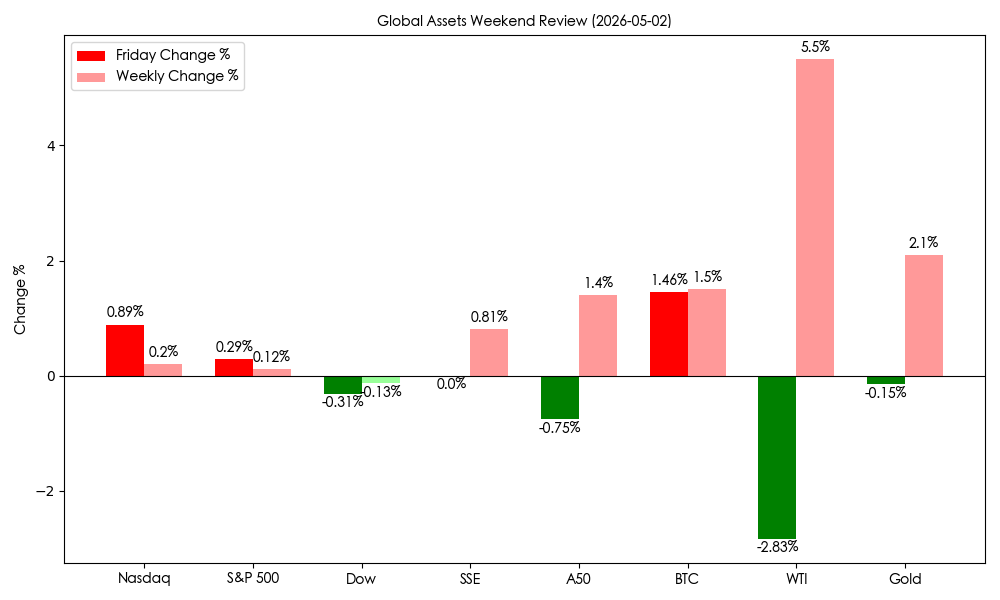
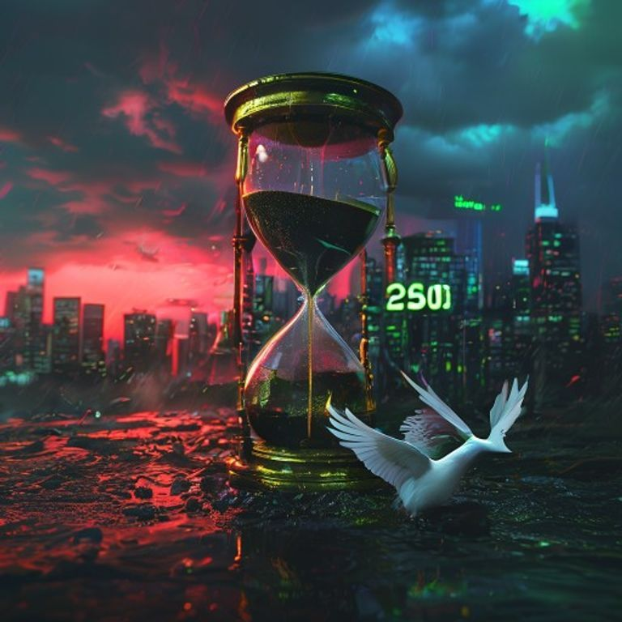

# 周报：纳指跨越 25,000 关口，五一长假中国资产呈现“假期溢价”

**日期：2026年05月02日 (星期六)** &nbsp; **时段：周末全周复盘**

> **核心摘要**：本周全球市场见证了科技股的史诗级突破，纳斯达克指数首次站上 25,000 点。尽管地缘政治一度推高油价，但周五的和平预期及强劲的财报季为全周画下句点。国内市场虽进入五一长假，但 A50 与离岸资产表现出的“假期溢价”预示了节后开门红的高概率。

## 核心资产周度/日度表现回顾

本周市场呈现明显的“结构化牛市”特征。科技巨头领涨，而能源板块随地缘局势剧烈波动。

| 资产名称 | 周五收盘/最新 | 周五涨跌 | 全周累计 | 市场简评 |
| :--- | :--- | :--- | :--- | :--- |
| **纳斯达克** | **25,114.44** | **+0.89%** | **+0.20%** | 首次站上 2.5 万点，科技股王者归来 |
| **标普 500** | **7,230.12** | **+0.29%** | **+0.12%** | 创历史新高，盈利预期上修 |
| **道琼斯** | **49,499.27** | **-0.31%** | **-0.13%** | 传统工业板块受高通胀隐忧承压 |
| **上证指数** | **4,112.00** | -- | **+0.81%** | 节前站稳 4100 点，制造业回暖 |
| **A50 期货** | **15,654.00** | **-0.75%** | **+1.40%** | 假日期间离岸资金抢筹，蓄势待发 |
| **比特币** | **$78,391** | **+1.46%** | **+1.50%** | 风险偏好扩张，逼近 8 万大关 |
| **WTI 原油** | **$103.00** | **-2.83%** | **+5.50%** | 全周因中东局势暴涨，周五因和平预期回调 |
| **现货黄金** | **$4,612.50** | **-0.15%** | **+2.10%** | 避险与通胀对冲需求双重驱动 |

## 过去 48 小时重磅事件深度复盘

> **1. 纳指 25,000 点的“苹果底座”**：周五晚间苹果公司超预期财报不仅是科技板块的胜利，更是市场对 AI 端侧落地逻辑的深度认可。苹果股价单日涨超 3%，直接抵消了美联储票委分歧带来的阴影，推动纳指跨越历史性门槛。

> **2. “霍尔木兹海峡”的局势逆转**：全周最大的不确定性来自中东。伊朗与美国的紧张对峙一度让布伦特原油冲向 $110，但在周五晚间，随着伊朗提交新和平建议的消息传出，油价应声回落近 3%。这标志着市场正从“战争定价”转向“外交定价”。

> **3. 五一消费的“结构性爆发”**：国内五一长假首两日数据录得历史新高。县域旅游订单增长 128%，旅游人次预测达 15.2 亿。这不仅验证了内需的韧性，也为节后消费板块（免税、影视、酒旅）的走强埋下了伏笔。

## 下周全球宏观大事预警

1.  **5 月 4 日 (周一)**：中国 4 月财新制造业 PMI 公布。若数据维持 51.0 以上，将进一步确认经济复苏逻辑。
2.  **5 月 6 日 (周三)**：美国 4 月 ADP 就业人数及 ISM 非制造业 PMI。市场将据此寻找美联储 6 月利率路径的蛛丝马迹。
3.  **5 月 8 日 (周五)**：中国 4 月进出口数据。全球贸易环境对出口链的影响将成为市场博弈核心。

## 顶级机构周末策略内参摘要

*   **高盛 (Goldman Sachs)**：认为科技股虽然已进入“高处不胜寒”阶段，但由于其强大的自由现金流，依然是目前最稳健的防御性资产。
*   **中信证券**：五一假期的数据超预期将成为节后 A 股的“助燃剂”。建议投资者重点关注此前估值受压制的**消费核心资产**与**半导体设备**。
*   **摩根大通 (J.P. Morgan)**：原油市场的波动尚未结束。尽管短期有和平预期，但低库存与地缘不稳定性意味着 $100 以下的油价仍具有极高的逢低配置价值。

## 今日市场情绪：突破后的静谧与希望

今日市场情绪由科技的狂欢（纳指突破）与地缘的释然（和平建议）共同交织。在黑色的石油沙漏下，金色的天平正寻找新的平衡；而衔着橄榄枝的白鸽飞过 25,000 点的霓虹塔尖，象征着投资者对未来的谨慎乐观。

> Prompt: Cyberpunk style, A giant hourglass filled with black oil instead of sand, bending a golden scale. In the background, a digital skyline with a glowing green '25,000' Nasdaq milestone. A white dove with an olive branch flies across a stormy sky that is turning from red to blue. Cinematic lighting, hyper-realistic, 8k, masterpiece, high detail.

---
免责声明：内容仅供参考，不构成投资建议。
