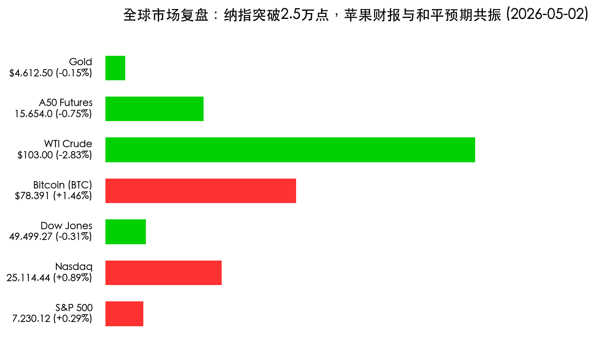
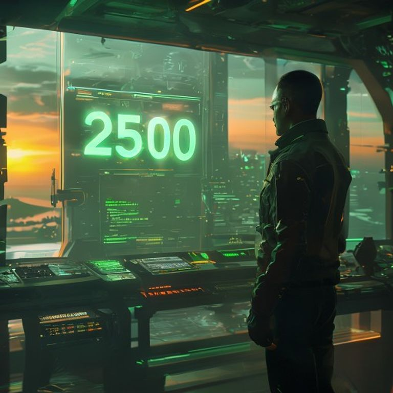

# 晨报：纳指首次突破 25,000 点大关，苹果财报与“中东和平预期”共振

**日期：2026年05月02日 (星期六)** &nbsp; **时段：早间行情复盘**

> **核心摘要**：隔夜美股涨跌不一，纳斯达克指数与标普 500 指数双双创下历史收盘新高，纳指史上首次突破 25,000 点里程碑。苹果公司超预期财报成为科技股强心针，而关于伊朗提出新和平建议的传闻令国际油价大幅回落，缓解了通胀担忧。

## 核心行情复盘

周五美股市场见证了科技股的又一里程碑时刻。尽管道指受波音等蓝筹股拖累微跌，但科技巨头的强劲表现推动纳指站上历史高位。

| 资产名称 | 收盘点位/价格 | 涨跌幅 | 市场简评 |
| :--- | :--- | :--- | :--- |
| **纳斯达克指数** | **25,114.44** | **+0.89%** | **创历史新高**，首次站上 25,000 点 |
| **标普 500 指数** | **7,230.12** | **+0.29%** | **创历史新高**，科技板块领涨 |
| **道琼斯指数** | **49,499.27** | **-0.31%** | 传统工业板块表现疲软 |
| **比特币 (BTC)** | **$78,391** | **+1.46%** | 风险偏好回暖，挑战 8 万大关 |
| **WTI 原油** | **$103.00** | **-2.83%** | 避险溢价消退，和平预期降温油价 |
| **富时 A50 期货** | **15,654.00** | **-0.75%** | 节内波动，反映部分获利了结情绪 |
| **现货黄金** | **$4,612.50** | **-0.15%** | 避险需求随地缘局势缓和略有下降 |

## 核心解读与市场逻辑

> **1. 苹果财报的“奇点效应”**：苹果公司昨日公布的财报不仅在营收和净利润上双双超越预期，其关于 AI 端侧设备的深度布局更是引发了市场对其“下一个十年”增长路径的认可。苹果股价盘中涨幅超 3%，直接拉动纳指突破 25,000 点心理关口。

> **2. “中东和平建议”的连锁反应**：周五盘中，关于伊朗提交新和平协议以缓解霍尔木兹海峡局势的传闻迅速扩散。这一消息使得布伦特原油与 WTI 原油应声跳水，跌落 $106 高点。油价的回调有效降低了二次通胀的隐忧，为美联储后续的货币政策提供了更多喘息空间。

> **3. 经济基本面的稳健支撑**：美国一季度 GDP 增长 2% 的终值数据，配合降至 1969 年以来低点的申请失业金人数，勾勒出一幅“金发姑娘”经济图景——增长足够强劲，且就业市场依然坚韧。

## 政策脉动

1.  **美联储内部分歧**：最新会议纪要显示美联储内部对利率路径出现 8-4 的显著票委分歧，鹰派声音依然担忧通胀粘性，这限制了市场对 6 月降息的定价。
2.  **伊朗外交信号**：据权威媒体报道，伊朗外交部提交了一份旨在确保区域航行安全的五点建议，全球外交斡旋进入关键期。
3.  **国内刺激政策预期**：五一假期期间，多地政府密集发布消费券计划，市场正密切关注 5 月中旬可能出台的进一步房产配套政策。

## 最新机构观点

*   **摩根士丹利**：将中国股票评级维持在“增配”（Overweight），认为 AI 正成为中国企业盈利增长的“结构性变局者”，预计 MSCI 中国指数 2026 年盈利增长将达 9%。
*   **高盛**：对美股短期过热表示担忧，认为在缺乏明确降息信号的情况下，25,000 点上方可能出现技术性调整，建议投资者关注高现金流防御性资产。
*   **中信证券**：离岸 A50 虽有小幅波动，但整体向上趋势未改。五一假期的强劲消费数据将为节后 A 股开门红提供坚实基础。

## 今日市场情绪：25,000 点上方的和平曙光

今日市场情绪交织着里程碑突破的狂喜与地缘局势缓和的宁静。纳指的绿光不仅是科技的胜利，更是对未来增长的背书；而 Persian Gulf 上的第一缕阳光，则预示着市场正从冲突的阴影中寻找新的平衡点。

> Prompt: Cyberpunk style, A human trader (real person) standing in a high-tech control room, looking at a giant holographic screen displaying a glowing green '25,000' milestone for Nasdaq. In the background, a digital silhouette of an apple is shimmering. Through the window, a peaceful sunrise over a calm Persian Gulf, symbolizing the hope of a peace proposal. Cinematic lighting, hyper-realistic, 8k., masterpiece, high detail, intricate composition, cinematic lighting, 8k resolution

---
免责声明：内容仅供参考，不构成投资建议。
