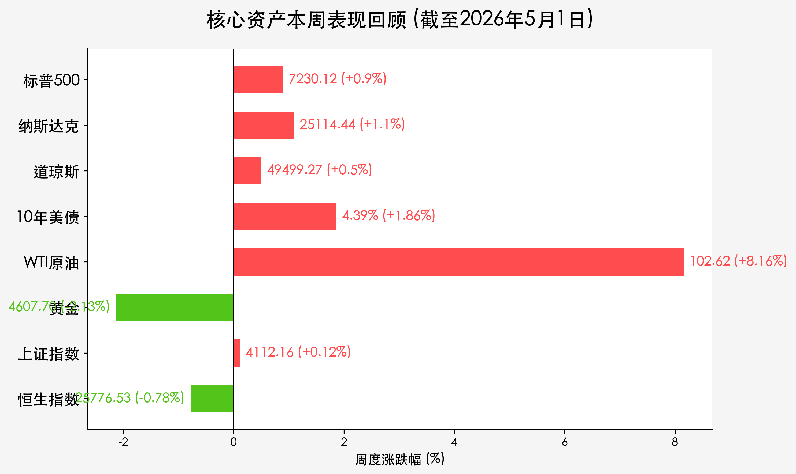
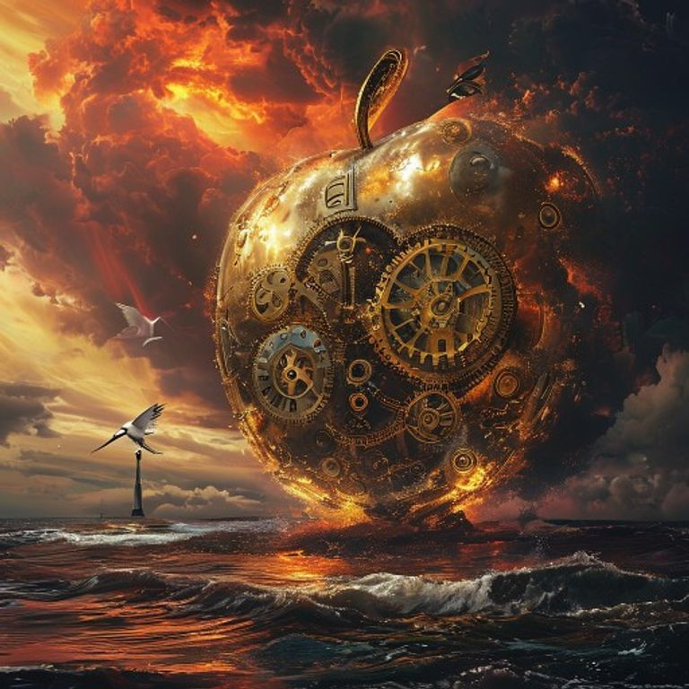

# 全球市场周度复盘：苹果季报点燃科技热情，能源风暴中寻觅长假宁静

**日期：2026年05月03日 (星期日)** &nbsp; **时段：早报 (Weekend Review)**

> **核心摘要**：本周全球市场呈现显著分化。美股在苹果强劲财报与巨额回购的带动下冲高，标普与纳指双双创下历史新高；然而，中东局势再度紧张导致原油单周飙升逾8%，通胀压力隐忧仍存。国内市场在PMI数据超预期中迎来五一长假，呈现出“静中带动”的蓄势态势。

## 核心资产周度/日度表现回顾

*   **标普500 (S&P 500)**：收于 **7,230.12** 点。**全周累计上涨 0.9%**。其中周五单日上涨 **0.3%**，创历史收盘新高。
*   **纳斯达克 (Nasdaq)**：收于 **25,114.44** 点。**全周累计上涨 1.1%**。周五单日大涨 **0.9%**，领跑全球主流指数。
*   **道琼斯 (Dow Jones)**：收于 **49,499.27** 点。**全周累计上涨 0.5%**。周五单日受价值股拖累微跌 **0.3%**。
*   **10年期美债收益率**：收于 **4.39%**。**全周上升 8 个基点**。市场对联储“Higher for Longer”的预期依然坚固。
*   **WTI原油**：收于 **102.62** 美元/桶。**全周暴涨 8.16%**。霍尔木兹海峡的局势担忧是主要推手。
*   **现货黄金**：收于 **4,607.70** 美元/盎司。**全周下跌 2.13%**。强美元与高利率环境令不生息资产承压。
*   **上证指数 (A股)**：收于 **4,112.16** 点（截至4月30日）。**全周累计上涨 0.12%**。目前处于五一长假休市中。
*   **恒生指数 (港股)**：收于 **25,776.53** 点（截至4月30日）。**全周累计下跌 0.78%**。

## 过去 48 小时重磅事件深度复盘

> **苹果财报与回购飓风**：苹果公司周五发布了超越预期的季度财报，并宣布了史无前例的 1,100 亿美元股票回购计划。股价单日飙升 **3.3%**，直接贡献了纳斯达克的主要涨幅。机构认为，苹果在 AI 端的战略逐渐清晰，缓解了市场对科技巨头增长放缓的担忧。

> **霍尔木兹海峡阴云**：中东局势突变，关于海峡可能面临封锁的传闻导致布伦特原油一度冲破 125 美元。虽然周五稍有回落，但全周逾 8% 的涨幅已对全球通胀预期产生冲击，抵消了部分业绩带来的乐观情绪。

> **中国经济复苏脉动**：国家统计局发布的 4 月制造业 PMI 为 **50.3**，而财新 PMI 更是达到 **52.2**，创下近年来新高。这显示出中国制造业在政策支持下正经历强劲修复，为节后 A 股开门红奠定了基本面基础。

> **日元保卫战**：市场普遍猜测日本央行在周后期进行了大规模干预，以支撑处于历史低位的日元。日元汇率的剧烈波动加剧了套利交易的平仓，对全球流动性产生了短暂冲击。

## 下周全球宏观大事预警

1.  **中国市场休市延续**：A 股将持续休市至 5 月 5 日（下周二），5 月 6 日（周三）起恢复正常交易。投资者需关注长假期间离岸 A50 指数及港股（下周一开市）的表现。
2.  **美国通胀预期调查**：下周将公布密歇根大学消费者信心及通胀预期，在油价飙升的背景下，数据的边际变化将直接引导市场对 6 月联储议息会议的定价。
3.  **地缘局势博弈**：继续密切监测中东能源通道的实地状况，任何冲突升级的信号都可能引发能源市场的二次跳涨。

## 顶级机构周末策略内参摘要

*   **高盛 (Goldman Sachs)**：尽管油价上涨带来挑战，但由 AI 带动的生产力提升周期已经开启。建议在科技板块回调时积极布局，特别是具备强大现金流能力的头部巨头。
*   **摩根士丹利 (Morgan Stanley)**：当前市场处于“业绩上行与估值压缩”的博弈期。在利率维持高位的情况下，选股逻辑应从“成长”转向“质量+收益”，关注具备定价权的能源与必选消费品。
*   **中金公司 (CICC)**：PMI 数据的持续向好验证了国内经济的韧性。长假后的 A 股有望在低估值板块的带动下开启补涨行情，关注“新质生产力”相关领域。

## 今日市场情绪：长假中的守望

> Prompt: Surrealism style, A giant clockwork apple made of glowing gold and intricate silver gears, floating serenely above a turbulent sea of deep obsidian oil. The golden light from the apple pushes back the red storm clouds in the background. In the far distance, a graceful white crane flies toward a calm, sunlit shore where a silent lighthouse stands, representing a peaceful holiday morning., masterpiece, high detail, intricate composition, cinematic lighting, 8k resolution

免责声明：内容仅供参考，不构成投资建议。
