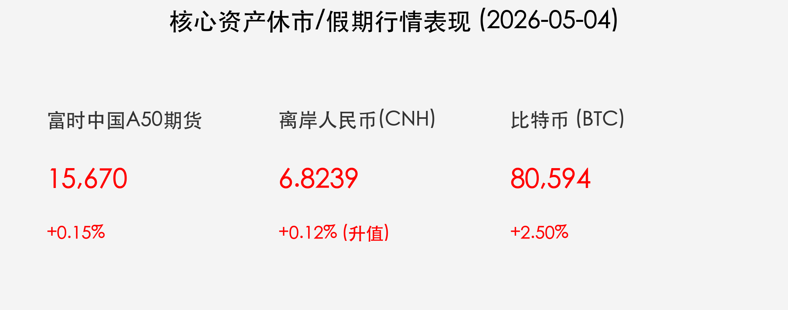

# 【收盘报】五一假期特辑：BTC 破 8 万大关，消费市场热力全开

**日期**：2026年05月04日 (星期一) &nbsp; **时段**：[收盘报]

> **核心摘要**：五一假期过半，国内消费市场呈现爆发式增长，出行人次创历史新高。金融市场虽休市，但替代指标异常活跃：比特币（BTC）历史性突破 80,000 美元大关，富时中国 A50 期货及离岸人民币汇率表现稳健，预示节后 A 股开盘情绪积极。

## 假期宏观热点：消费爆发与“十五五”开局

今年“五一”假期作为“十五五”规划开局之年的重要窗口，其消费数据备受关注。根据最新监测：

*   **整体热度**：商务部数据显示，假期前两天重点监测商圈客流量和营业额同比分别增长 **5.4%** 和 **5.1%**。
*   **消费细分**：演出消费大幅增长 **19%**，租车订单增长 **25%**。OTA 平台酒店团购销售额同比增长达 **86%**，显示出极强的长线旅游需求。
*   **政策红利**：文旅部发放超 **2.84亿元** 消费券，配合“以旧换新”政策，带动汽车、家电等大宗消费。截至 5 月 2 日，该政策带动销售额已超 **6193亿元**。

> **市场洞察**：2026年作为中国资产重估的关键年份，内需的强劲复苏为市场提供了坚实的宏观底座。机构普遍认为，此次假期数据的成色将直接影响节后资金对消费板块的加仓意愿。

## 核心行情复盘（休市期间替代指标）

由于 A 股与港股今日继续休市，市场关注点聚焦于仍在交易的全球资产：

*   **比特币 (BTC)**：今日强势突破 **80,000 美元** 心理关口，最高触及 **80,594 美元**，创逾三个月新高。机构买盘强劲是主因，美国比特币现货 ETF 的持续流入提供了核心动能。
*   **富时中国 A50 期货**：今日小幅高开后维持震荡，截至 16:30 报 **15,670 点**，微涨 **0.15%**，反映出海外资金对中国资产节后表现持乐观看法。
*   **离岸人民币 (CNH)**：表现强劲，维持在 **6.8150 - 6.8327** 区间运行，人民币资产吸引力持续抬升。

## 政策脉动与全球前瞻

*   **央行动态**：中国央行通过国债买卖与逆回购组合操作，确保假期及节后流动性平稳，支持政府债发行。
*   **十五五导向**：宏观政策重点转向“做强国内大循环”，全方位扩大内需，科技创新与先进制造仍是政策倾斜的重头戏。
*   **风险因子**：国际局势（如霍尔木兹海峡）仍有扰动，需关注能源价格波动对全球通胀逻辑的潜在影响。

## 最新机构观点

*   **中信证券**：五一假期出行景气度超预期，酒店与 OTA 平台受益明显。建议节后重点关注具备流量变现能力的互联网平台及消费龙头。
*   **中金公司**：重申“中国资产重估”逻辑，认为 A 股与港股牛市具备延续性，黄金与非美资产在当前货币秩序重构背景下更具吸引力。
*   **高盛**：2026 年非美市场表现有望优于美股，AI 投资正进入“第三阶段”（应用落地期），中国在 AI 应用层面的爆发潜力值得关注。

## 今日市场情绪：凤凰涅槃，新高见证

> Prompt: Surrealism style, A majestic golden phoenix made of glowing digital circuits (representing Bitcoin breaking $80,000) soaring over a vibrant, traditional Chinese garden where people are celebrating a holiday. The phoenix's trail turns into a rain of golden coins and green light. In the background, a massive digital clock shows 'MAY 4'. A human trader (real person) stands on a bridge, looking at the phoenix with awe., masterpiece, high detail, intricate composition, cinematic lighting, 8k resolution

---
**免责声明**：内容仅供参考，不构成投资建议。
