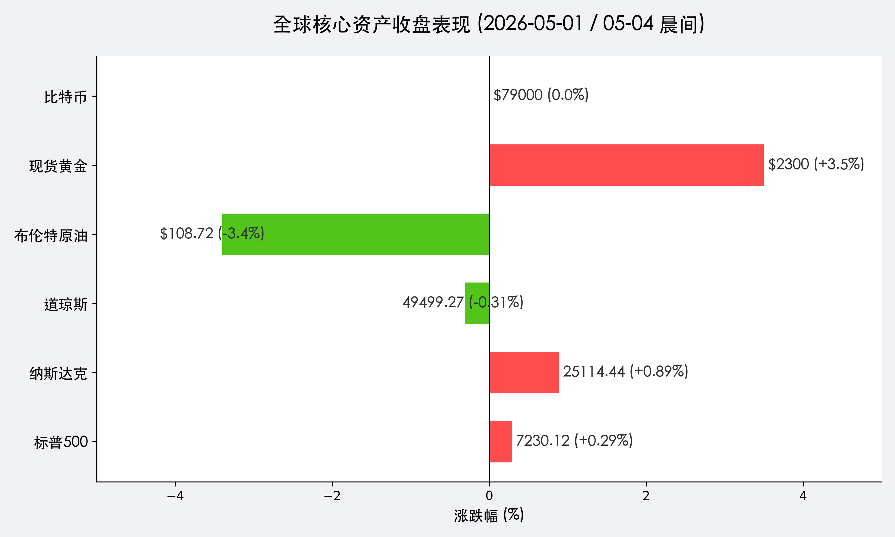

# 全球市场周初展望：科技股双引擎驱动，非农周博弈开启

**日期：2026年05月04日 (星期一)**  
**时段：晨间（国际市场）**

> **核心摘要**：美股标普与纳指在上周五再创历史新高，苹果财报强劲抵消了地缘政治引发的能源波动。本周市场进入“非农周”，极低的新增就业预期（60k）将成为降息博弈的核心导火索。

## 周末财经要闻终极汇总

*   **财报双子星**：苹果（Apple）上周五收涨 **3.3%**，其 AI 驱动的盈利前景获得市场一致认可；谷歌（Alphabet）此前单日暴涨 10% 后维持高位震荡，科技股“双引擎”效应显著。
*   **能源波动剧烈**：受伊朗港口封锁消息影响，布伦特原油一度冲高至 **$126**。但在特朗普总统表示“谈判正在推进”后，油价大幅回落，布伦特收报 **$108.72**，单日下跌 **3.4%**。
*   **巴菲特时间**：伯克希尔·哈撒韦（Berkshire Hathaway）周末发布 Q1 财报。尽管部分传统业务承压，但其巨额现金储备依然是市场关注的焦点。
*   **数字资产动态**：比特币（BTC）在 **$79,000** 关口展现极强韧性，市场正在消化上周的波动，等待新的宏观指引。

## 核心行情复盘

> **核心解读**：上周五市场呈现明显的“跷跷板”效应。科技股引领纳指大涨 **0.89%**，但道指受安进（Amgen）等权成分股拖累微跌。原油价格的高位回落极大地缓解了通胀担忧，推动现货黄金反弹 **3.5%** 突破 **$2300**。

## 新一周市场核心博弈逻辑

本周市场的核心博弈点在于 **“降息预期 vs 经济韧性”**。

1.  **非农数据的“金发姑娘”假设**：若非农数据如预期般冷却，将强化美联储在年内降息的理由；但若数据极度低迷（低于 50k），则可能引发衰退忧虑。
2.  **AI 资本开支的护城河**：摩根士丹利认为，AI 产业的资本开支浪潮（AI Capex Boom）将为美国经济提供强力缓冲，抵消劳动力市场降温带来的部分压力。
3.  **地缘政治的边际效应**：中东局势的任何微小变化都将直接传导至能源和黄金市场。目前市场已部分定价地缘风险，下一步需关注实际贸易流向。

## 本周重磅经济数据与会议前瞻

| 日期 | 事件/数据 | 市场影响度 |
| :--- | :--- | :--- |
| 5月5日 (周二) | 美国 4 月服务业 PMI、JOLTS 职位空缺 | ⭐⭐⭐ |
| 5月6日 (周三) | ADP 小非农就业人数 | ⭐⭐⭐ |
| 5月7日 (周四) | Palantir、AMD、Arm 财报 | ⭐⭐⭐⭐ |
| **5月8日 (周五)** | **美国 4 月非农就业报告 (NFP)** | ⭐⭐⭐⭐⭐ |

*   **非农预测**：经济学家普遍预计 4 月新增就业约为 **6-6.3万**（前值 17.8万），失业率或微降至 **4.2%**。

## 头部券商/投行开盘策略点睛

*   **高盛 (Goldman Sachs)**：维持 2026 年底标普 500 指数 **7600点** 的目标。建议关注从超大市值科技股向循环性行业（工业、金融）扩散的机会。
*   **摩根士丹利 (Morgan Stanley)**：观点更为激进，看好标普 500 指数冲击 **7800点**。认为 AI 引发的生产力革命正开启“新一轮牛市”。

## 今日市场情绪：希望与警惕并存

> Prompt: A majestic phoenix made of green digital code and glowing circuitry rising from a dark turbulent sea of black oil, golden coin sun in the background

---
免责声明：内容仅供参考，不构成投资建议。
