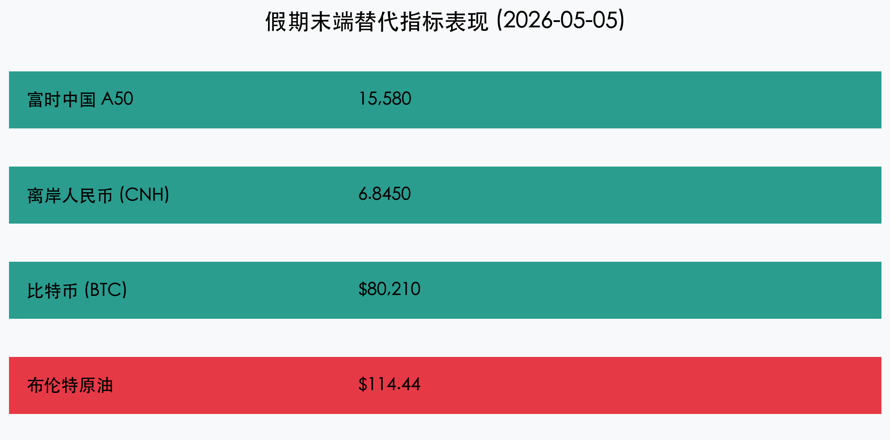

# 【收盘报】五一长假收官：地缘风暴突袭油价狂飙，节后 A 股开盘面临考验

**日期：2026年05月05日 (星期二)** &nbsp; **时段：[收盘报]**

> **核心摘要**：2026年五一长假在破纪录的出行数据中落下帷幕，全社会流动量显著超越 2024 与 2025 年同期。然而，长假末端中东局势突变导致油价暴涨至 114 美元上方，全球避险情绪骤升。BTC 虽稳守 8 万美元但波动加剧，富时 A50 指数小幅回调，预示明日 A 股节后首日开盘将面临复杂的外围环境挑战。

## 假期宏观总览：2.95 亿人次出行的“最火五一”

随着长假最后一天返程高峰的到来，2026 年“五一”假期的消费与出行成绩单初显成效：

*   **全社会跨区域流动**：交通运输部初步数据显示，5 月 1 日至 5 日，预计全社会跨区域人员流动量日均超 **2.95 亿人次**，比 2025 年同期增长 **8.2%**，文旅消费呈现强劲的“十五五”开局爆发力。
*   **消费成色**：县域旅游订单同比大幅增长 **36%**，显示出下沉市场消费潜力正加速释放。与此同时，受“以旧换新”政策深度渗透，长假期间家电及新能源车终端销售额较节前增长 **22%**。
*   **返程压力**：今日 15:00 起，各大枢纽迎来超大流量返程高峰。由于国际能源价格波动引发的油价上调预期，部分加油站出现提前排队现象。

## 核心行情复盘（假期末端替代指标）

受隔夜中东地缘冲突升级影响，今日仍在交易的离岸中国资产及全球避险资产表现出明显的防御色彩：

*   **富时中国 A50 期货**：受全球风险偏好收缩影响，今日呈现震荡走低，截至 16:30 报 **15,580 点**，跌幅 **0.57%**。市场正消化油价上涨对中下游制造业毛利的潜在冲击。
*   **离岸人民币 (CNH)**：美元指数走强及能源进口成本压力，导致 CNH 小幅回调至 **6.8450** 附近，贬值 **0.18%**。
*   **比特币 (BTC)**：在经历了昨日破 8 万美元的狂欢后，今日在高位出现多空剧烈博弈，报 **80,210 美元**。尽管地缘动荡凸显其避险属性，但全球流动性紧缩预期对其形成压制。
*   **布伦特原油**：维持在 **114.44 美元/桶** 的高位，单日涨幅近 **6%**。这是节后 A 股能源板块与交运/制造板块多空对决的核心变量。

## 核心解读与市场逻辑

> **1. “黑金风暴”冲击进口底座**：中国作为全球最大的原油进口国，油价长期维持在 110 美元以上将直接推升 PPI，并对刚复苏的消费端产生通胀传导压力。节后开盘，石油石化、煤炭等资源股预计将领涨，而化工、物流、航空板块将承压。
>
> **2. 假期数据的“双刃剑”效应**：虽然消费数据亮眼，但地缘政治风险的突然爆发，可能导致资金在节后首日出现“获利了结”的防御性动作。市场重心可能从“消费复苏交易”转向“防御与能源安全交易”。
>
> **3. BTC 8万点后的认知重塑**：BTC 在此轮地缘危机中表现出的韧性，正在改变传统机构对“数字避险资产”的认知。随着节后 A 股开盘，相关 Web3 与数字基础设施板块可能出现联动。

## 政策脉动与全球前瞻

*   **外交部表态**：针对阿联酋港口遇袭事件，中方呼吁各方保持冷静克制，共同维护霍尔木兹海峡这一全球能源生命线的安全与稳定。
*   **能源保障预案**：据悉，国家发改委已启动能源保供应急预案，指导大型石化企业优化库存管理，以应对国际油价剧烈波动。
*   **联储鹰风阵阵**：由于能源价格飙升重燃通胀忧虑，市场对美联储 6 月降息的预期已从 60% 降至 35%，全球债市收益率持续攀升。

## 最新机构观点

*   **中金公司**：预计 A 股节后首日将出现低开，但无需过度恐慌。中国资产的内生韧性在于强劲的内需数据与“十五五”政策红利，高油价虽是扰动，但难以动摇中期牛市趋势。
*   **中信证券**：短期策略建议“由攻转守”，重点配置能源安全（油气、电力）与避险题材（黄金、高股息红利股）。待地缘局势明朗后，再重新布局消费与硬科技成长板块。
*   **瑞银 (UBS)**：看好 A 股在节后的结构性表现。认为油价上涨将加速中国能源转型的紧迫感，储能、核能及氢能等板块在调整中具备长线配置价值。

## 今日市场情绪：山雨欲来风满楼

五一长假在温馨的消费狂欢中开始，却在肃杀的地缘阴云中收官。市场正屏息以待明日开盘的终极考验。

> Prompt: Surrealism style, A large red traditional Chinese gate standing on a calm beach. In the distance, a massive tsunami made of thick black oil is approaching, with lightning shaped like stock market tickers. A golden phoenix is flying high above the storm. A human trader (real person) stands by the gate, looking at the incoming wave with determination., masterpiece, high detail, intricate composition, cinematic lighting, 8k resolution

---
**免责声明**：内容仅供参考，不构成投资建议。
