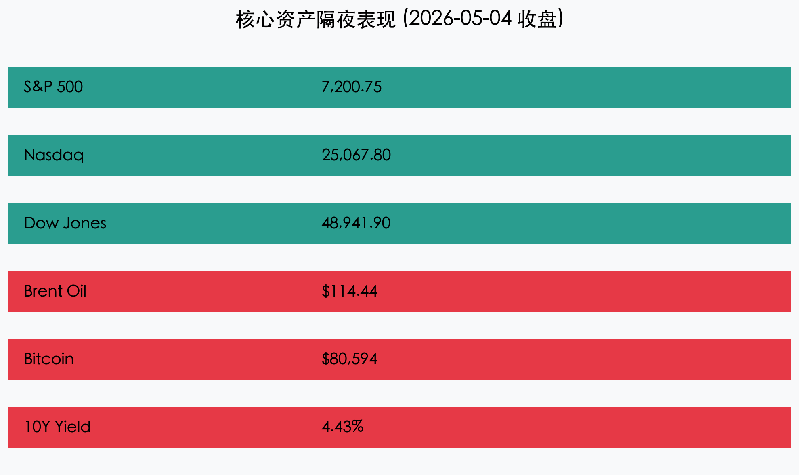
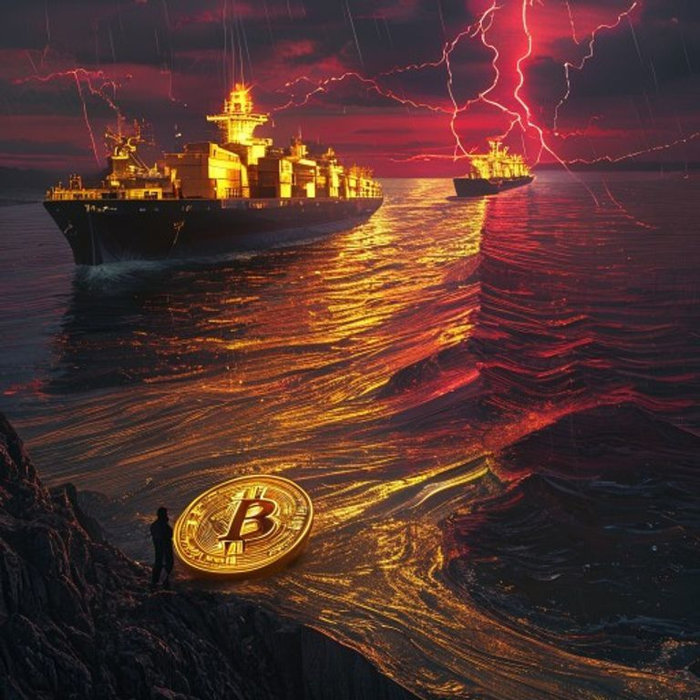

# 【早报】中东局势骤紧：阿联酋港口遭袭，油价飙升引发滞胀担忧

**日期**：2026年05月05日 (星期二) &nbsp; **时段**：[早报]

> **核心摘要**：隔夜美股全线收跌，伊朗无人机袭击阿联酋富查伊拉港引发中东局势剧烈动荡，布伦特原油暴涨近 6% 突破 114 美元。尽管传统市场承压，比特币（BTC）在监管预期改善下逆势突破 8 万美元大关，市场呈现极端的避险与风险资产并行的分化格局。

## 核心行情复盘

隔夜全球市场在避险情绪主导下出现剧烈波动，原油成为表现最强的资产，而传统成长股则因通胀担忧受压：

*   **美股三大指数**：全面回调。**道琼斯工业平均指数**领跌，主要受物流巨头（UPS、联邦快递）大幅下挫拖累；**纳斯达克**表现相对坚挺，主要得益于部分 AI 龙头（如 Palantir）强劲的财报表现。
*   **大宗商品**：**布伦特原油**收涨 5.8% 报 **114.44 美元/桶**。袭击事件不仅直接威胁原油供应，更引发了对霍尔木兹海峡可能长期封锁的恐惧。
*   **数字货币**：**比特币 (BTC)** 表现惊人，在隔夜一度触及 **80,594 美元**，创下历史新高。分析认为，华盛顿方面对数字资产监管的潜在妥协，以及 BTC 在地缘动荡中的“数字黄金”属性正在显现。
*   **债券市场**：**10年期美债收益率**攀升至 **4.43%**，反映出市场对能源价格上涨推高通胀路径的担忧。

## 核心解读与市场逻辑

> **1. 中东“火药桶”被点燃**：此次针对阿联酋富查伊拉港的袭击是自 4 月停火协议以来的最严重违约。阿联酋近期宣布退出欧佩克（OPEC）以寻求自主增产，这一政策转向与地缘风险交织，使得中东能源格局进入极度不透明期。
>
> **2. 物流版图的“亚马逊冲击”**：亚马逊宣布开放其物流网络给宝洁、3M 等企业，这一“物流云”化战略直接打击了传统包裹快递巨头。市场正在重新评估全球供应链末端的盈利模型。
>
> **3. 滞胀预期重燃**：由于全球石油库存处于 8 年低位，任何微小的供应扰动都会产生巨大的价格杠杆。若油价长期维持在 110 美元上方，主要经济体可能面临“高通胀、低增长”的滞胀风险。

## 政策脉动

*   **美国“自由行动”**：白宫已宣布启动“自由行动”（Operation Freedom），部署海军护航商船通过霍尔木兹海峡，地缘对峙风险进一步升级。
*   **数字资产立法**：华盛顿传出消息，两党有望在 6 月前就数字资产清算与托管达成框架协议，这被视为 BTC 此次突破 8 万美元的核心政策推动力。

## 最新机构观点

*   **高盛 (Goldman Sachs)**：将布伦特原油年底基准价上调至 **90 美元**，但在极端情况下（海峡封锁），不排除触及 **120 美元**。建议投资者配置抗通胀资产。
*   **摩根大通 (J.P. Morgan)**：警告称若冲突全面升级，油价可能被迫推高至 **150 美元** 以实现“需求破坏”。目前欧洲经济面临的衰退压力大于美国。
*   **摩根士丹利 (Morgan Stanley)**：建议采取防御性轮动，看好美股中的防御性板块（如医疗保健、公用事业），并认为美股盈利基本面依然稳固，除非发生直接针对大城市的外部冲击。

## 今日市场情绪：黑金风暴与数字曙光

> Prompt: Surrealism style, A narrow strait (Strait of Hormuz) where the water is made of flowing black crude oil, with massive glowing digital tankers navigating through it. The sky is a deep crimson with lightning shaped like stock market tickers. In the foreground, a large golden Bitcoin coin acts as a sun, rising behind the oil waves. A human trader (real person) stands on a cliff edge, holding a glowing compass., masterpiece, high detail, intricate composition, cinematic lighting, 8k resolution

---
**免责声明**：内容仅供参考，不构成投资建议。
