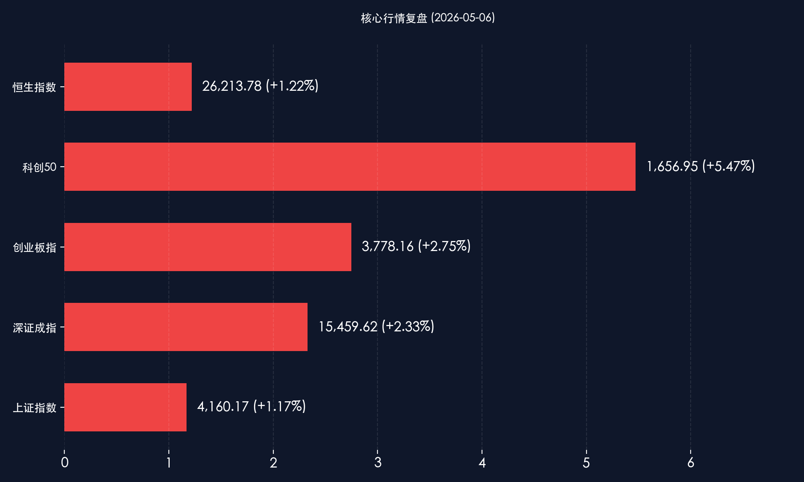
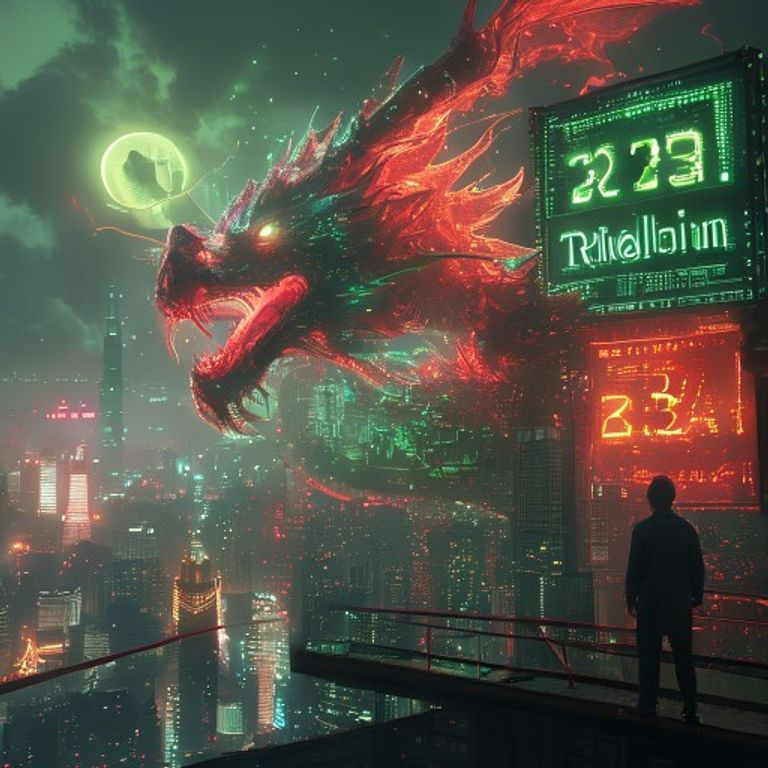

# 【收盘报】五一后首秀：两市成交破3.2万亿，科技之龙带飞 A 股“开门红”

**日期：2026年05月06日 (星期三)** &nbsp; **时段：[收盘报]**

> **核心摘要**：2026年五一长假后首个交易日，A股上演史诗级“开门红”。两市成交额惊人突破 **3.23 万亿元**，刷新历史纪录。科创 50 指数在存储芯片与 AI 算力龙头的带领下狂飙 **5.47%**。政策端“人工智能+”行动意见的发布与央行 3000 亿买断式逆回购的流动性呵护，共同开启了“十五五”二季度的红色攻势。

## 核心行情复盘

今日市场呈现典型的“普涨+极强板块效应”特征，资金疯狂涌入硬科技赛道，市场情绪近乎沸腾：

*   **上证指数**：收报 **4160.17点**，上涨 **1.17%**，站稳 4100 点关口。
*   **深证成指**：收报 **15459.62点**，大涨 **2.33%**，创逾 5 年新高。
*   **创业板指**：收报 **3778.16点**，涨幅 **2.75%**，彰显成长股弹性。
*   **科创50指数**：全天表现最强，收报 **1656.95点**，收涨 **5.47%**，盘中一度触及 9% 涨幅，半导体产业链爆发。
*   **恒生指数**：同步走强，收报 **26213.78点**，上涨 **1.22%**。
*   **成交量**：全天两市成交额达 **3.23 万亿元**，较节前显著放量，场外资金回流迹象明显。

**领涨板块：**
1.  **存储芯片/半导体**：江波龙、海光信息等集体涨停。全球存储热潮叠加国产化提速，板块进入业绩与估值双升期。
2.  **AI 算力与通信**：光模块、服务器厂商受“人工智能+”战略刺激，全线走强。
3.  **地产链/券商**：受多地限购松绑及市场放量提振，展现出极强的进攻属性。

**领跌板块：**
*   白酒（受个别权重股财报调整影响）、银行及石油等防御性红利板块今日表现相对低迷，反映资金明显的“避险转向进攻”风格。

## 核心解读与市场逻辑

> **1. “AI+”国家战略定调硬科技主线**：今日发布的《关于深入实施"人工智能+"行动的意见》明确了 AI 作为国家战略核心引擎的地位。这不仅是题材炒作，更是政策驱动下的产业趋势确立。科创板的暴涨反映了资金对“新质生产力”作为未来十年核心博弈逻辑的高度认可。
>
> **2. 央行“精准滴灌”对冲节后回笼**：央行 3000 亿元买断式逆回购的操作不仅为市场提供了充足的流动性，更释放了强烈的呵护信号，有效消除了投资者对节后资金面收紧的担忧。
>
> **3. 万亿成交背后的认知重塑**：3.23 万亿的成交额说明 A 股已进入增量资金驱动模式。随着五一消费数据的验证与外部风险偏好的回升，中国资产正成为全球资金配置的“新避风港”。

## 政策脉动

*   **流动性支持**：央行开展 3000 亿元 3 个月期买断式逆回购，规模创年内新高，定向呵护实体经济与金融市场。
*   **国家战略加码**：政策面明确将人工智能作为核心战略，科创再贷款规模扩容至 1.2 万亿元，重点支持半导体与前沿 AI 技术。
*   **设备更新资金**：发改委 915 亿元设备更新专项资金正式到位，直接利好工业母机、智能制造板块。

## 最新机构观点

*   **中信证券**：保持“**K型思维**”，聚焦优势环节。认为 AI 与能源/化工构成了当前全球动荡背景下的“新杠铃结构”。2026 年是 AI 原生网络架构规模化部署元年，坚定看好 AI 硬件产业链。
*   **中金公司**：科技板块毛利率拐点已现，预计 2026 年行业净利率将持续回升。建议全面布局 **AIGC 新质生产力**，同时关注券商 APP 国际化带来的 C 端增量空间。
*   **中信建投**：全球高景气巩固了科技作为市场核心主线的格局。配置思路应聚焦景气逻辑，重点看好 AI、新能源及具备防御属性的部分资源品。

## 今日市场情绪：飞龙在天，万亿狂欢

今日 A 股如同一条被点燃的科技巨龙，在万亿成交的巨浪中腾空而起。市场已完全走出节前的谨慎观望，全面转向积极进攻。

> Prompt: Cyberpunk style, A majestic red dragon made of glowing semiconductor circuits and liquid light rising from a futuristic Shanghai Lujiazui skyline, soaring towards a sun shaped like a golden AI chip. The dragon's scales are flickering with green stock tickers. In the background, a digital screen displays '3.23 Trillion' in bold neon green. A human trader (real person) stands on a balcony, looking at the dragon with triumph., masterpiece, high detail, intricate composition, cinematic lighting, 8k resolution

---
**免责声明**：内容仅供参考，不构成投资建议。
