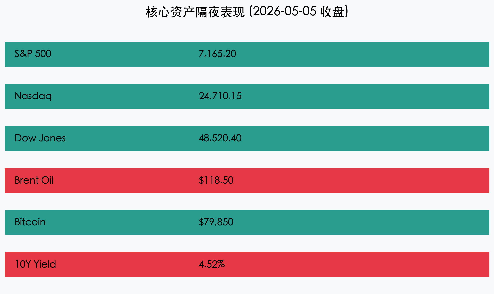

# 【早报】黑金风暴升级：油价飙升冲击美股，避险情绪笼罩全球市场

**日期：2026年05月06日 (星期三)** &nbsp; **时段：[早报]**

> **核心摘要**：隔夜中东地缘局势进一步恶化，布伦特原油受富查伊拉港袭击事件后续影响突破 118 美元，创下近年来新高。能源成本飙升引发通胀忧虑重燃，美股三大指数集体收跌，纳指领跌。市场正密切关注 A 股节后首日开盘如何消化外围多重利空。

## 核心行情复盘

隔夜全球市场在“黑金风暴”与滞胀担忧的双重压力下表现疲软。尽管 AI 板块仍有局部亮点，但难以抵消大盘整体的避写性撤退。

*   **美股指数**：**标普 500 指数**下跌 **0.49%** 报 **7,165.20** 点；**纳斯达克指数**下跌 **0.73%** 报 **24,710.15** 点；**道琼斯指数**下跌 **0.86%** 报 **48,520.40** 点。交通运输与制造业板块受成本压力影响跌幅居前。
*   **大宗商品**：**布伦特原油**大涨 **3.55%** 报 **118.50 美元/桶**。袭击事件后，霍尔木兹海峡的通航安全性降至冰点，保险费率飙升，原油供应弹性受到极大考验。
*   **数字货币**：**比特币 (BTC)** 在 8 万美元关口下方震荡，收报 **79,850 美元**。尽管地缘动荡凸显其“数字黄金”属性，但全球流动性紧缩预期对其形成短期压制。
*   **债市收益率**：**10年期美债收益率**冲高至 **4.52%**，反映出市场对二次通胀路径的担忧正在升温。

## 核心解读与市场逻辑

> **1. “黑金”重塑通胀路径**：油价突破 115 美元被视为全球通胀的“二次引信”。中国节后首日开盘，石化、能源开采等上游板块预计将成为避风港，而依赖低成本能源的化工、精密制造、航空等中下游板块将面临毛利挤压考验。
>
> **2. 地缘局势的“长期化”预期**：阿联酋港口袭击事件不仅是局部的供应扰动，更被国际机构解读为波斯湾能源通道进入“非稳态”的信号。这种不确定性溢价正在从原油扩散至液化天然气（LNG）及全球海运费率。
>
> **3. 科技股的“盈利锚”vs“估值锚”**：尽管 AI 龙头业绩依然稳健，但利率在高位的停留时间（Higher for Longer）预期再次拉长。在无风险利率逼近 4.6% 的背景下，科技股的高估值正面临严苛的贴现率重估。

## 政策脉动

*   **白宫紧急协调**：据悉，拜登政府正紧急联系主要产油国寻求释放战略储备（SPR），但市场对其边际影响持怀疑态度，认为地缘安全风险非单纯供应量可解。
*   **人行流动性投放**：为应对节后首日可能的波动，中国央行今日开展 3000 亿元 3 个月期买断式逆回购，此举展现了监管层维护市场平稳开局的决心。

## 最新机构观点

*   **高盛 (Goldman Sachs)**：将短期油价预测上调至 125 美元，并指出当前的“地缘风险贴水”尚未完全计入极端封锁场景。建议对冲能源通胀。
*   **桥水 (Bridgewater)**：认为全球市场正进入“极度敏感期”，投资组合的风险均衡（Risk Parity）面临挑战，大宗商品与现金的配置价值正在提升。
*   **中信证券 (CITIC)**：预计 A 股节后首日将经历“压力测试”，但 3000 亿买断式回购提供了充足的流动性缓冲，建议关注能源安全与自主可控板块的对冲机会。

## 今日市场情绪：黑金沉降与数字涅槃

> Prompt: Surrealism style, A massive hourglass standing in a desert made of golden sand. The upper bulb contains a burning oil derrick, and black oil is leaking into the lower bulb, where it turns into sharp obsidian shards. A digital phoenix made of glowing lines is trying to fly out from the oil-filled lower bulb., masterpiece, high detail, intricate composition, cinematic lighting, 8k resolution

---
**免责声明**：内容仅供参考，不构成投资建议。
