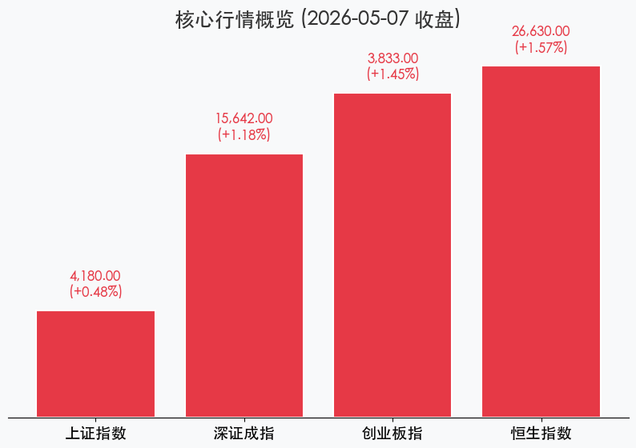
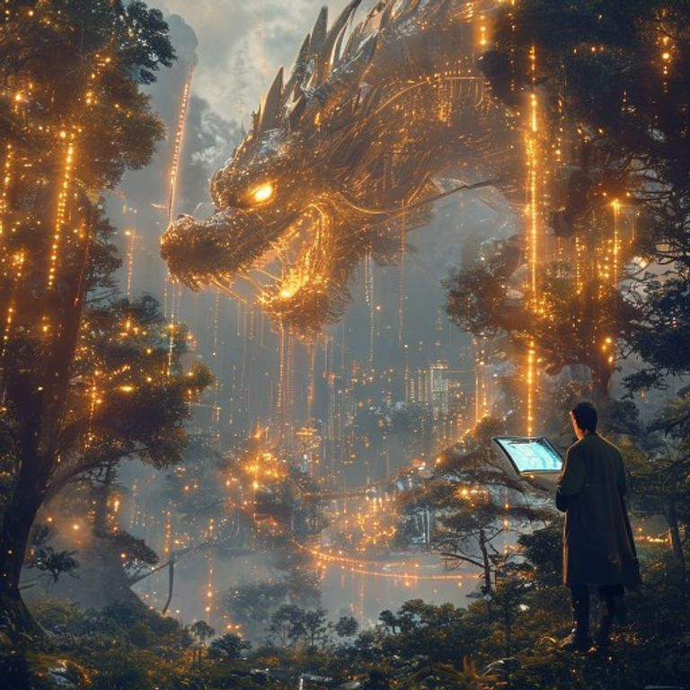

# 科技龙头共舞，成交再破三万亿：5月7日A股收盘复盘

**日期：2026年05月07日 (星期四)** &nbsp; **时段：下午 (收盘报)**

> **核心摘要**：5月7日市场延续强势，成交额连续两日突破3.1万亿元。科技赛道全线爆发，创业板指刷新11年新高，尽管权重股小幅承压，但市场多头氛围极度浓厚，科创债新政与制度开放为中长期上行注入强心针。

## 核心行情复盘
今日 A 股市场呈现典型的“科技主线领涨、权重板块压盘”格局。三大指数集体收涨，其中创业板指表现最为亮眼，盘中持续刷新近 11 年新高。

*   **上证指数**：报收 **4180.00点**，上涨 **0.48%**。
*   **深证成指**：报收 **15642.00点**，上涨 **1.18%**。
*   **创业板指**：报收 **3833.00点**，上涨 **1.45%**。
*   **恒生指数**：报收 **26630.00点**，上涨 **1.57%**。

> **市场洞察**：全天成交额突破 **3.1万亿元**，虽然较昨日略有回落，但仍处于历史高位区间，显示出场外资金入场意愿依然强烈。行业方面，光通信、机器人、消费电子等科技板块领涨，而煤炭、石油、银行等高股息板块则出现一定程度的获利回吐。

## 核心解读与市场逻辑
1.  **科技创新驱动力爆发**：随着科创债新政的深入推进，市场对于“硬科技”领域的信心大幅提振。特别是 AI 算力、机器人等板块，在政策与业绩预期的双重驱动下，成为吸引主力资金流向的核心高地。
2.  **流动性环境维持充裕**：尽管央行今日开展了 270 亿元逆回购并实现资金净回笼，但市场普遍将其视为“削峰填谷”的常规操作。在 3 万亿级别的成交规模面前，微观流动性的充盈程度远超预期。
3.  **制度开放释放长期红利**：证监会允许 QFII/RQFII 参与国债期货交易，不仅提升了资本市场的深度，也标志着中国资本市场制度型开放迈入新阶段，有助于吸引全球长线资金流入。

## 政策脉动
*   **央行逆回购**：5 月 7 日开展 270 亿元 7 天期操作，利率维持 1.40%。
*   **汇率动态**：人民币兑美元中间价调升 75 个基点，报 **6.8487**，显示出人民币资产的吸引力正在稳步回升。
*   **科创债提质扩容**：政策引导资金精准流向研发领域，支持非银金融机构作为发行主体，为硬科技企业提供多层次资金支持。

## 最新机构观点
*   **中信证券**：全球资产配置主线正从“避险”向“流动性周期回落、盈利周期上行”切换。建议关注 AI 算力驱动下的新赛道，并警惕债市情绪转弱风险。
*   **中信建投**：国内经济温和复苏，A 股配置价值凸显。中期看好小盘与价值风格，短期建议通过“哑铃配置”应对市场波动。
*   **中金公司**：持续看好生鲜零售龙头的连锁化演进，并指出权益类衍生品已成为头部券商扩张的核心动力。

## 今日市场情绪：科技巨龙腾飞，万亿巨浪涌动
今日 A 股如同一条在数字化森林中穿梭的科技巨龙，在万亿成交的巨浪中腾空而起。市场已完全转向积极进攻模式，科技赛道的爆发不仅是点位的上涨，更是市场对未来生产力变革的集体投赞成票。

> Prompt: Cyberpunk style, A futuristic digital forest where glowing mechanical trees are weaving intricate webs of golden data streams, symbolizing the surge of tech innovation and massive capital flow. In the background, a giant crystalline dragon composed of silicon chips and laser beams is soaring through a sky filled with floating holographic stock tickers. A human trader (real person) is standing at the edge of the forest, holding a glowing tablet showing a bullish chart., masterpiece, high detail, intricate composition, cinematic lighting, 8k resolution

---
**免责声明**：内容仅供参考，不构成投资建议。
