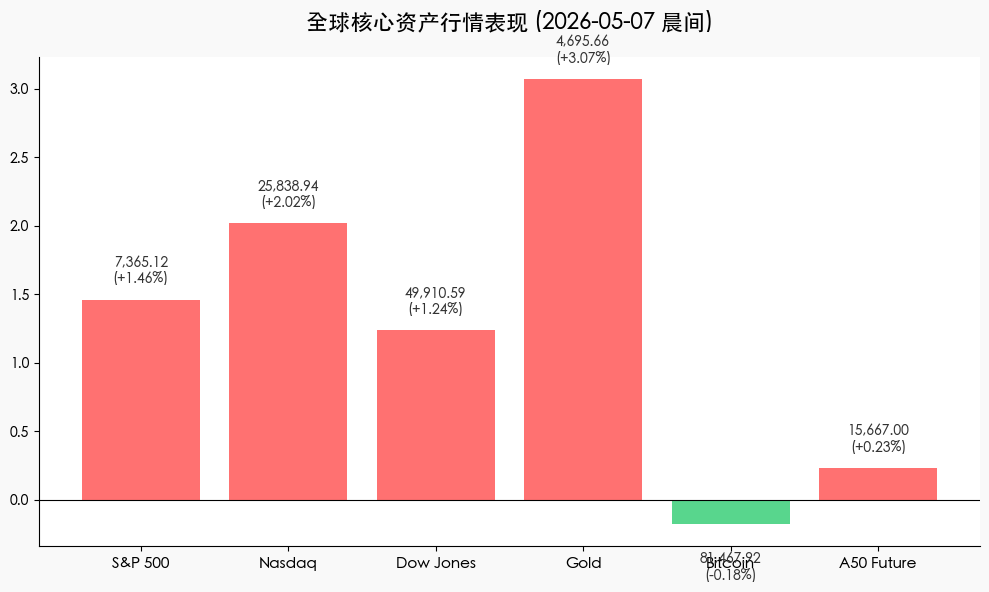

# 全球市场晨报：AI 狂欢与油价暴跌助推美股新高
**日期：2026年05月07日 (星期四)** &nbsp; **时段：[晨间/早报]**

> **核心摘要**：美股三大股指齐创收盘历史新高，AMD 财报惊艳引领半导体板块。尽管美联储官员言论偏鹰，但油价大跌及中东紧张局势缓解显著改善了市场情绪。

## 核心行情复盘
* **S&P 500**：上涨 **105.90 点 (1.46%)**，收于 **7,365.12**，创历史新高。
* **Nasdaq**：大涨 **512.82 点 (2.02%)**，收于 **25,838.94**，创历史新高。
* **Dow Jones**：上涨 **612.34 点 (1.24%)**，收于 **49,910.59**。
* **Russell 2000**：上涨 **41.77 点 (1.5%)**，至 **2,886.77**。
* **10年期美债收益率**：由 4.43% 降至 **4.35%**。
* **现货黄金**：上涨 **3.07%**，收于 **$4,695.66**。
* **比特币 (BTC)**：微跌 **0.18%**，报 **$81,467.92**。
* **富时中国 A50 期货**：微涨 **0.23%**，报 **15,667**。

## 核心解读与市场逻辑
> **AI 与半导体板块的爆发**：AMD 季度业绩及前景指引极其强劲，股价单日飙升超过 **18%**，极大地提振了市场对人工智能基础设施需求的信心。英伟达 (Nvidia) 亦随之大涨 **5.9%**。
>
> **能源价格与地缘政治缓解**：WTI 原油价格大幅下跌约 **7%** 至每桶 95 美元。消息称美国与伊朗接近就重启霍尔木兹海峡达成协议。油价回落缓解了通胀担忧，推动了美债收益率下行，为股市估值提供了有力支撑。
>
> **企业盈利稳健**：除科技股外，迪士尼 (Disney) 上涨 **7.6%**，辉瑞 (Pfizer) 等公司财报亦超预期，显示出美股盈利增长的广泛性。

## 政策脉动
> **美联储官员表态偏鹰**：圣路易斯联储主席 Musalem 表示货币政策风险已转向“更高通胀”，并暗示由于能源价格波动及关税政策，现行高利率可能需要维持更长时间。芝加哥联储主席 Goolsbee 则警告称，AI 带来的财富预期可能导致经济过热，美联储必须对此保持警惕。

## 最新机构观点
* **高盛 (Goldman Sachs)**：将未来 12 个月的衰退概率从 30% 下调至 **20%**，预计 2026 年美国 GDP 增长将达到 2.8%，并维持 6 月和 9 月降息的预测。
* **摩根士丹利 (Morgan Stanley)**：观点相对谨慎，下调了美国增长预期 0.4 个百分点，认为高油价（即便近日回调）仍将挤压消费者支出。

## 今日市场情绪：AI 驱动的乐观盛宴

> Prompt: Cyberpunk style, A futuristic mechanical phoenix woven from green laser light rising over a high-tech city skyline, while in the background, a giant hourglass leaking black oil is being outweighed by a golden scale of data chips. A human trader (real person) stands on a balcony watching the scene., masterpiece, high detail, intricate composition, cinematic lighting, 8k resolution

---
免责声明：内容仅供参考，不构成投资建议。
