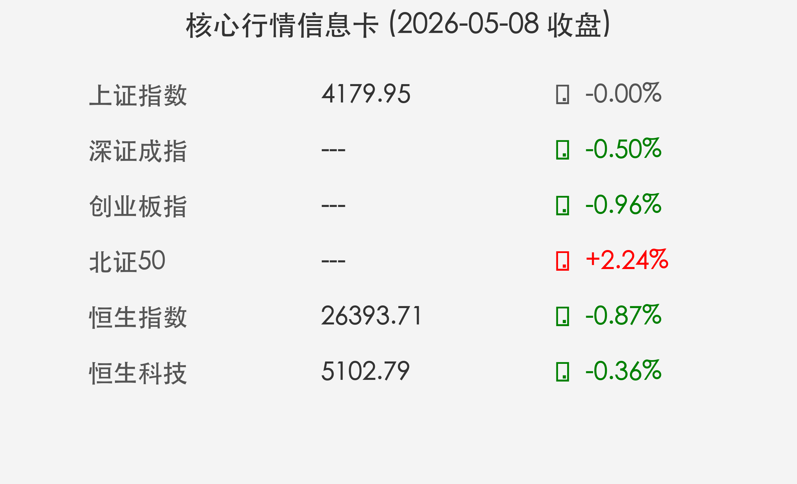

# 金融市场晚报：A股成交破3万亿，高低切换开启牛市中场休整

**日期：2026年05月08日 (星期五)** &nbsp; **时段：傍晚收盘**

> **核心摘要**：今日A股与港股呈现震荡分化格局，全市场成交额连续突破3.07万亿元天量。市场呈现明显的“高低切换”特征，半导体等高位题材股获利回吐，而房地产、人形机器人及商业航天等板块强势接力，牛市进入中场震荡与逻辑重塑期。

## 核心行情复盘

今日市场呈现“指数微调、个股活跃”的特征。尽管主要指数小幅收跌，但全市场上涨个股超过3600只，涨停家数突破120家，赚钱效应依然显著。

*   **上证指数**：收报 **4179.95点**，微跌 **0.00%**（仅下跌0.14点），全天在4180点关口反复震荡。
*   **深证成指**：下跌 **0.50%**，高位个股调整对深成指造成一定压制。
*   **创业板指**：下跌 **0.96%**，盘中曾创下近11年新高后受获利盘兑现影响回落。
*   **北证50**：表现最为抢眼，逆势大涨 **2.24%**，小盘成长股受到资金热捧。
*   **港股市场**：恒生指数下跌 **0.87%**，报收26393.71点；恒生科技指数下跌 **0.36%**，报5102.79点。
*   **成交量**：全市场成交额达到 **3.07万亿元**，持续维持在极高水位，显示场外资金入场惯性依然强烈。

## 核心解读与市场逻辑

> **解读：高低切换下的“良性换手”**
>
> 1.  **获利回吐与风格轮动**：前期涨幅巨大的半导体、存储芯片等硬件板块今日集体回调，显示出资金在连续上涨后的畏高情绪。资金流向了调整充分的房地产、AI应用端以及具有政策预期差的板块。
> 2.  **硬科技主线扩散**：人形机器人受到特斯拉Optimus量产提速的刺激，商业航天受电科蓝天等标杆个股带动，成为今日市场新的“吸金点”，显示出牛市主线正在向垂直细分领域扩散。
> 3.  **地缘政治影响避险资产**：中东局势的反复推高了国际油价，带动国内黄金、油气、航运等避险板块逆势走强，为市场提供了防御性的对冲选择。

## 政策脉动

> **关键信号：流动性呵护与融资功能修复**
>
> 央行于5月6日开展了3000亿元买断式逆回购操作，有效平抑了长假后的资金面波动。同时，4月份IPO节奏的适度回升（19家公司上市）显示监管层在维持二级市场稳定的基础上，正在积极引导投融资功能的平衡发展。上海证券由东方证券全资收购复牌，预示着券商行业整合进入深水区。

## 最新机构观点

*   **高盛 (Goldman Sachs)**：维持对中国资产的“超配”评级，认为随着宏观政策效果显现，沪深300指数仍有向4600点冲刺的空间。
*   **瑞银 (UBS)**：指出当前A股的估值仍具吸引力，尤其是那些具备全球竞争力的中国制造业和科技应用型企业。
*   **中信建投**：建议投资者在当前时点采取“杠铃策略”，一头配置算力、机器人等高弹性成长板块，另一头关注高股息、低估值的红利资产。

## 今日市场情绪：中场休整，热点切换

今日市场情绪虽有震荡，但整体仍处于活跃区间。3万亿的成交量证明了市场人气并未涣散，仅仅是资金在寻找新的进攻方向。

> Prompt: Surreal Digital Art style, A sophisticated humanoid robot planting a glowing seedling into a circuit-board garden, representing the market's pivot to robotics and AI applications amidst high-tech volatility on May 8th., masterpiece, high detail, intricate composition, cinematic lighting, 8k resolution

---
免责声明：内容仅供参考，不构成投资建议。
