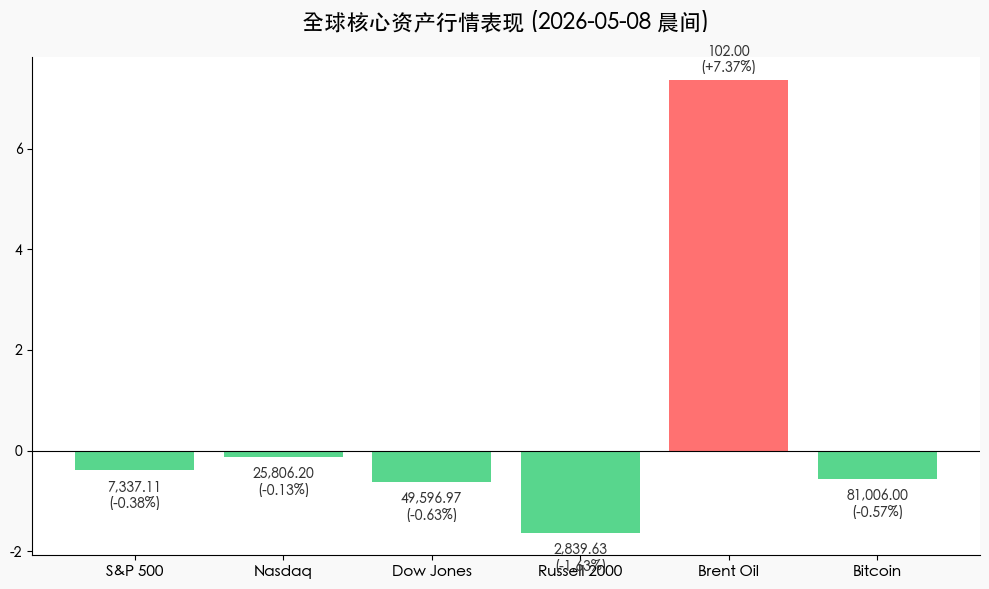
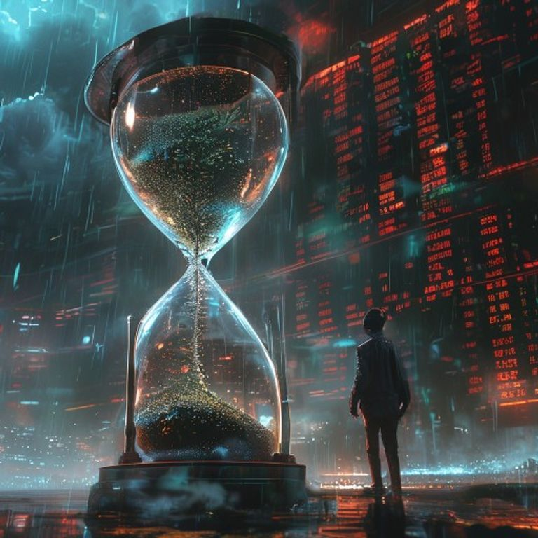

# 全球市场晨报：中东反转重创市场情绪，避险资金重回原油
**日期：2026年05月08日 (星期五)** &nbsp; **时段：[晨间/早报]**

> **核心摘要**：隔夜美股三大股指集体回撤，回吐周内部分涨幅。尽管早盘因伊美停火协议传闻冲高，但随后遭到伊朗方面的否认，导致油价大幅反弹并重新跨越 100 美元大关，通胀阴云叠加避险情绪令科技股承压，市场关注焦点转向即将公布的非农就业数据。

## 核心行情复盘
隔夜美股呈现“冲高回落”的走势。早盘受外交突破传闻提振，标普与纳指曾创下盘中历史新高，但随着地缘局势不确定性重燃，获利盘快速涌出，三大指数最终悉数收跌。

*   **S&P 500**：下跌 **28.01 点 (0.38%)**，收于 **7,337.11**。
*   **Nasdaq**：下跌 **32.74 点 (0.13%)**，收于 **25,806.20**。
*   **Dow Jones**：下跌 **313.62 点 (0.63%)**，收于 **49,596.97**。
*   **Russell 2000**：大跌 **1.63%**，至 **2,839.63**，显示小盘股对风险情绪更为敏感。
*   **布伦特原油 (Brent)**：大涨 **7.37%**，报收 **$102.00**，日内曾一度跌至 $96。
*   **比特币 (BTC)**：微跌 **0.57%**，报 **$81,006**，围绕 8 万关口剧烈震荡。

## 核心解读与市场逻辑
1.  **地缘政治的“过山车”效应**：周四早些时候，关于美伊达成 14 点停火谅解备忘录的消息一度令市场狂欢。然而，伊朗随后澄清称“尚未达成最终结论”，这一表态迅速反转了市场预期，导致原油价格报复性反弹，避险情绪迅速升温。
2.  **能源成本与通胀焦虑**：原油价格重新站稳 100 美元上方，直接推升了市场对未来通胀路径的担忧。在美联储官员近期表态偏鹰的背景下，能源成本的走高挤压了非科技板块的估值空间。
3.  **科技板块的韧性与分化**：尽管大盘回落，但 AI 相关企业依然表现突出。**Datadog** 因业绩超预期飙升 **31%**，**Qualcomm** 亦在 AI 芯片需求的推动下维持强势。然而，消费类股票如 **Whirlpool** (-14.5%) 和 **Shake Shack** (-28.3%) 则因财报表现疲软而遭遇重挫。

## 政策脉动
*   **通胀预期上修**：纽约联储报告称，消费者对未来一年的通胀预期上升至 **3.6%**，显示出高物价压力依然根深蒂固，这可能进一步推迟美联储的降息时点。
*   **非农就业前瞻**：市场正屏息以待今日即将公布的 4 月非农就业报告。在通胀压力反弹的背景下，就业市场的强弱将直接决定 6 月美联储政策会议的基调。

## 最新机构观点
*   **AMD (Lisa Su)**：尽管宏观环境波动，但“代理式 AI (Agentic AI)”对算力的需求正处于爆发式增长的前夜，公司已全面上调未来两年的 CPU 与加速器增长预期。
*   **高盛 (Goldman Sachs)**：认为当前市场的回调是“健康的获利了结”，地缘局势虽有反复但大趋势向好，维持对美股中长期看涨的判断，但建议增加能源股作为对冲。
*   **摩根士丹利 (Morgan Stanley)**：警告称，若油价持续维持在 100 美元以上，将对美国消费者支出产生显著的负面冲击，可能导致下半年经济增长超预期放缓。

## 今日市场情绪：幻灭的和平，躁动的原油
今日市场情绪如同沙漠中的海市蜃楼，短暂的和平预期被残酷的地缘现实所击碎。随着黑金巨浪重新卷起，投资者在希望与焦虑的博弈中选择了谨慎离场。

> Prompt: Cyberpunk style, A giant hourglass filled with bubbling black oil, inside which a delicate silver olive branch is slowly being submerged. In the background, a massive holographic stock ticker is flashing red and green in a stormy digital sky. A human trader (real person) stands in the foreground, looking at the hourglass with a mix of hope and anxiety., masterpiece, high detail, intricate composition, cinematic lighting, 8k resolution

---
**免责声明**：内容仅供参考，不构成投资建议。
