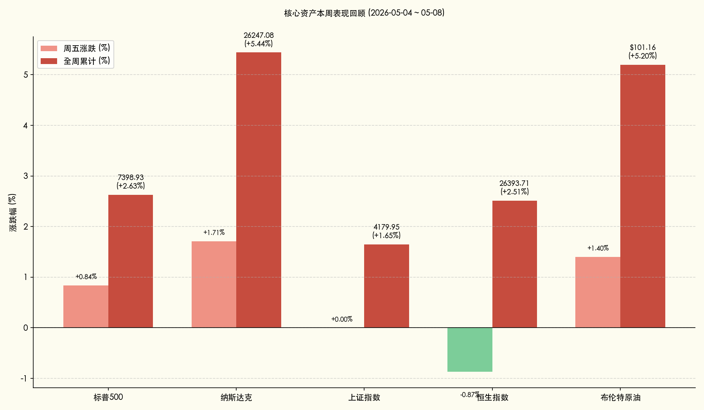

# 全球市场周报：AI 与能源的双重奏，纳指周涨 5% 领跑全球

**日期：2026年05月09日 (星期六)** &nbsp; **时段：[周末复盘]**

> **核心摘要**：本周全球市场呈现极致的“成长与对冲”并进态势。受 Intel 与 Apple 深度合作传闻及非农数据弹性支撑，纳指全周暴涨 5.44% 创历史新高；国内市场在 3 万亿成交天量下完成高低切换，沪指全周稳步上行 1.65%。地缘溢价支撑油价重回 100 美元上方，市场正在定价一个“高增长、高通胀、高利率”的新三高均衡态。

## 核心资产周度/日度表现回顾

本周（05-04 至 05-08）全球核心资产悉数走强，科技成长股成为绝对主线，能源资产随地缘局势共振。

*   **纳斯达克 (Nasdaq)**：周五上涨 **1.71%**，全周累计大涨 **5.44%**。AI 产业链盈利预期上修是核心动力。
*   **标普 500 (S&P 500)**：周五上涨 **0.84%**，全周上涨 **2.63%**，站稳 7300 点关口。
*   **上证指数 (SSE)**：周五收平（微跌 0.14 点），报 4179.95 点，全周累计上涨 **1.65%**。
*   **恒生指数 (HSI)**：周五受地缘风险担忧收跌 **0.87%**，但全周仍录得 **2.51%** 的涨幅。
*   **布伦特原油 (Brent)**：周五大涨 **1.40%**，报 $101.16，全周上涨约 **5.2%**，重返百元大关。
*   **比特币 (BTC)**：全周上涨 **3.72%**，在 8 万美元关口激烈博弈。

## 过去 48 小时重磅事件深度复盘

> **解读：非农“弹性”与芯片“联姻”的双重逻辑**
>
> 1.  **非农数据展现经济韧性**：4 月非农就业新增 11.5 万人虽略有放缓，但 4.3% 的低失业率与薪资增长的稳健，让市场确信美国经济正处于“软着陆”向“无着陆”切换的阶段，这抵消了降息推迟的利空。
> 2.  **Intel 与 Apple 战略传闻**：市场盛传 Intel 将为 Apple 代工新一代 AI 系列芯片，Intel 股价周五飙升近 14%。该事件标志着全球半导体产业链从“效率优先”转向“安全与本土化优先”，引发了半导体板块的估值重塑。
> 3.  **地缘政治风险溢价**：霍尔木兹海峡局势持续紧绷，能源供应链的潜在中断风险促使资金在周末前涌入原油及相关避险资产，对抗通胀的不确定性。

## 下周全球宏观大事预警

下周将迎来多个通胀关键数据，市场焦点将从“增长”再次回归“物价”。

*   **5月13日 (周三)**：**美国 4 月 CPI 数据**。这是决定美联储 6 月是否会释放更鹰派信号的关键。
*   **5月14日 (周四)**：**美国 4 月 PPI 数据**。关注企业端通胀压力是否已传导至下游。
*   **5月15日 (周五)**：**中国 4 月经济数据（规模以上工业增加值、社会消费品零售）**。市场将借此验证 A 股 3 万亿成交量背后的基本面修复强度。
*   **全周**：多位美联储官员将密集发声，重点关注其对“2026 年底前不降息”这一极端预期的态度。

## 顶级机构周末策略内参摘要

*   **高盛 (Goldman Sachs)**：维持标普 500 年底 **7,600 点** 目标。其认为 AI 正在改变生产力函数，这意味着历史上的利率与估值关系可能已失效。
*   **摩根士丹利 (Morgan Stanley)**：上调预期至 **7,800 点**，建议“超配”能源安全与 AI 硬件，认为这是当前动荡世界中确定性最高的避险资产。
*   **中金公司 (CICC)**：认为中国资产目前的“估值洼地”属性极具吸引力。A 股的 3 万亿成交量是资金在寻求避风港的信号，建议关注受益于“内需回补”与“出海红利”的双轮驱动板块。

## 今日市场情绪：时代的沙漏，基因的螺旋

本周的市场情绪展现出一种宏大的宿命感：在时间的沙漏中，传统能源（石油）与未来技术（AI）不再是单纯的替代关系，而是在数据与能量的旋涡中螺旋上升，编织成新时代的经济基因。

> Prompt: Surrealism style, A colossal golden hourglass standing on a digital coastline. Inside, instead of sand, glowing emerald microchips and dark oil droplets are swirling together, forming a DNA helix. In the background, a twin sun rises over a sea of binary waves, one sun bearing a bull symbol, the other a bear. A human trader (real person) is sketching the scene on a holographic tablet from a cliff., masterpiece, high detail, intricate composition, cinematic lighting, 8k resolution

---
**免责声明**：内容仅供参考，不构成投资建议。
