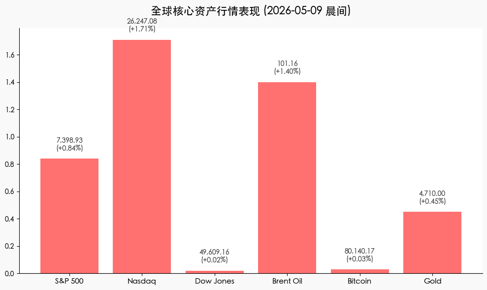
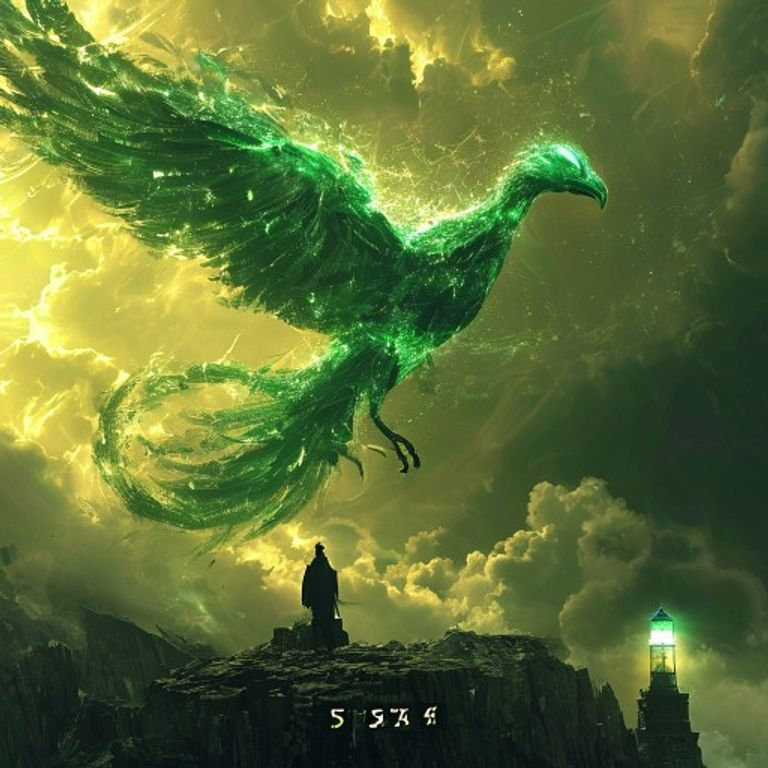

# 全球市场晨报：AI 狂潮再起，纳指标普齐创历史新高

**日期：2026年05月09日 (星期六)** &nbsp; **时段：[晨间/早报]**

> **核心摘要**：隔夜美股在强劲非农数据与 AI 产业重磅利好的双重驱动下强劲爆发，纳指与标普 500 指数双双创下收盘历史新高。尽管美联储“更高更久”的利率预期进一步固化，但 Intel 与 Apple 的深度合作再次点燃了半导体板块的投资热情，避险资金在科技成长与能源对冲之间寻找新平衡。

## 核心行情复盘
隔夜美股呈现稳步单边上行的态势。科技股表现异常强劲，抵消了债市收益率高位震荡带来的压力，市场情绪在非农数据的“超预期弹性”中找到了新的支撑点。

*   **S&P 500**：上涨 **61.82 点 (0.84%)**，收于 **7,398.93**，创历史收盘新高。
*   **Nasdaq**：大涨 **440.88 点 (1.71%)**，收于 **26,247.08**，创历史收盘新高。
*   **Dow Jones**：微涨 **12.19 点 (0.02%)**，收于 **49,609.16**。
*   **布伦特原油 (Brent)**：上涨 **1.40%**，报收 **$101.16**，地缘溢价支撑油价站稳 100 美元。
*   **比特币 (BTC)**：微涨 **0.03%**，报 **$80,140.17**，结束连跌重返 8 万关口。
*   **现货黄金**：上涨 **0.45%**，报 **$4,710.00**，避险属性依然凸显。

## 核心解读与市场逻辑
1.  **非农数据展现“非典型弹性”**：4 月非农就业新增 11.5 万人，远超市场预期。在失业率维持在 4.3% 低位的背景下，劳动力市场的强劲表现虽然削弱了降息的可能性，但也大幅提升了市场对经济“硬着陆”风险的免疫力。
2.  **Intel 与 Apple 的“芯片联姻”**：Intel 股价飙升 **13.9%**，主要受与 Apple 达成芯片代工及 AI 底层架构合作的传闻推动。这一事件被市场解读为美国半导体产业链整合、共同抵御外部供应链风险的重要信号，带动 Micron 等半导体股集体暴涨。
3.  **地缘政治与能源溢价的博弈**：霍尔木兹海峡的局势依然紧绷，美伊海上对峙令油价维持在 100 美元上方。高盛等机构指出，虽然能源成本抬升了通胀底色，但目前科技板块的盈利溢价足以覆盖利率风险，市场已进入“高利率、高增长、高通胀”的奇特三高共存期。

## 政策脉动
*   **美联储“鹰派继任”预期**：随着 Kevin Warsh 即将接替 Powell，市场正在定价一个更加关注结构性通胀而非短期就业波动的联储。目前的掉期合约显示，市场已基本放弃了 2026 年底前降息的希望。
*   **关税政策博弈**：美国国际贸易法院对新关税政策的限制性裁决，为受地缘风险影响的跨境贸易商提供了一线喘息机会，有助于降低部分消费品进口成本，略微对冲了能源价格带来的通胀压力。

## 最新机构观点
*   **高盛 (Goldman Sachs)**：维持标普 500 年底 **7,600 点** 的目标。高盛认为，AI 基础设施的投入正进入“变现期”，即便利率维持在 3.75% 附近，顶级科技企业的现金流产生能力仍将支撑估值扩张。
*   **摩根士丹利 (Morgan Stanley)**：上调 S&P 500 预期至 **7,800 点**。其策略师指出，全球进入“多极化”世界后，能源独立与技术自主将成为核心溢价来源，建议超配“AI 基础设施”与“能源安全”板块。
*   **中金公司 (CICC)**：建议关注跨境贸易流动的结构性变化，认为中国资产在外部波动中展现出较强的“估值洼地”吸引力，尤其是在全球能源通胀背景下。

## 今日市场情绪：AI 涅槃与黑金怒涛
今日市场情绪展现了极强的防御性进攻特征。即便在美联储加息阴影与中东风暴的双重挤压下，AI 技术所带来的增长愿景如同在黑金怒涛中振翅的凤凰，指引资金不断向高质量资产集中。

> Prompt: Surrealism style, A majestic phoenix made of glowing emerald data streams soaring into a golden sky, while below it, a dark and turbulent ocean of black crude oil tosses a heavy iron anchor labeled '3.75%'. In the background, a crystalline lighthouse shaped like a microchip beams light through a thick fog. A human trader (real person) stands on a rocky cliff watching the phoenix rise., masterpiece, high detail, intricate composition, cinematic lighting, 8k resolution

---
**免责声明**：内容仅供参考，不构成投资建议。
