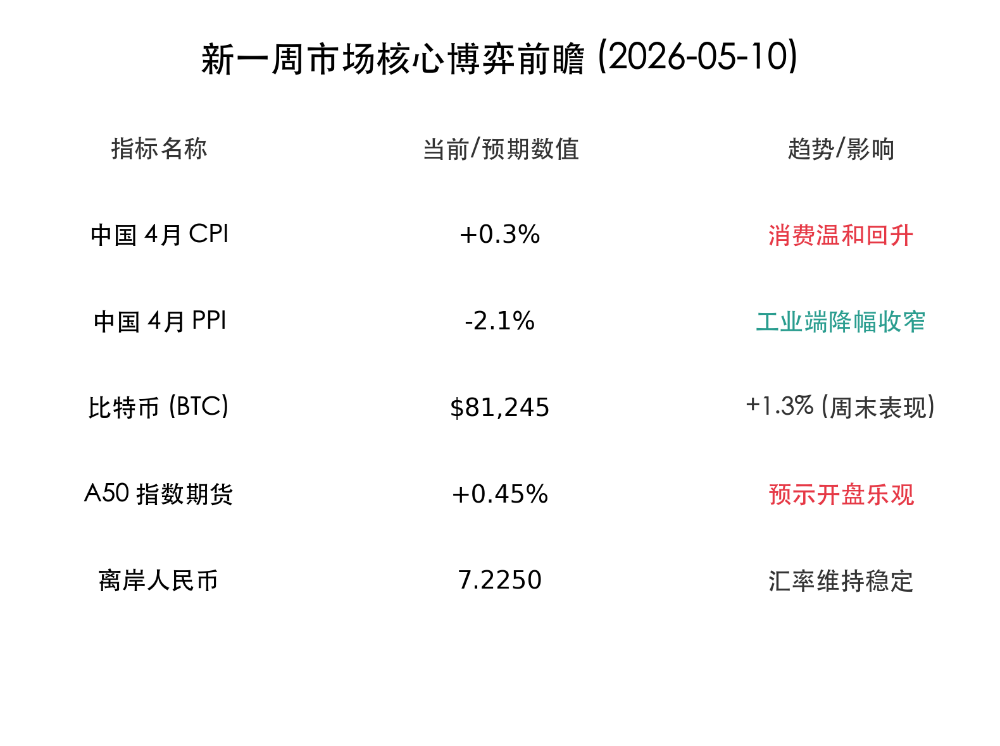
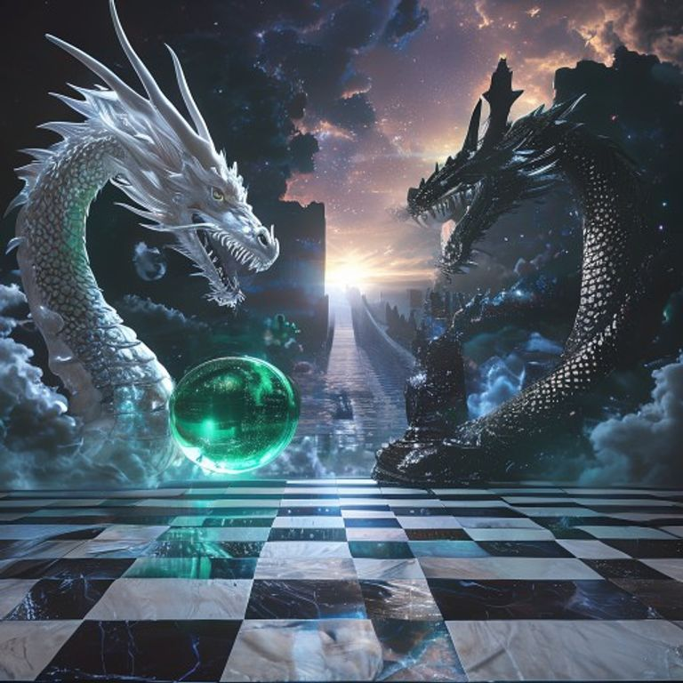

# 新周展望：中国通胀数据企稳，AI 巨头联手重塑全球供应链

**日期：2026年05月10日 (星期日)** &nbsp; **时段：[新周展望]**

> **核心摘要**：周末披露的中国 4 月物价数据释放回暖信号，CPI 同比增长 0.3% 超出预期，显示内需正逐步复苏。全球市场焦点转向下周即将公布的美国 CPI 与 PPI 组合拳，同时 Intel 与 Apple 的“硅基盾牌”计划传闻持续发酵，有望在周一开盘点燃半导体与 AIGC 板块的二次热潮。

## 周末财经要闻终极汇总

本周末，全球政经局势与宏观数据呈现出多个关键变量的共振。

*   **中国 4 月物价数据释放回暖信号**：国家统计局周末数据显示，4 月 **CPI 同比上涨 0.3%**，环比由降转增，反映出假期消费对内需的拉动效应显著。**PPI 同比下降 2.1%**，降幅较上月收窄 0.4 个百分点，工业端通缩压力进一步缓解，企业利润修复预期增强。
*   **“硅基盾牌”计划呼之欲出**：针对 Intel 为 Apple 代工 AI 芯片的传闻，周末有消息称双方已达成初步排他性协议，旨在绕开地缘敏感地区建立“全本土化”高端供应链。该计划被业内称为“Project Silicon Shield”，周一美股盘前相关 ADR 已有异动。
*   **霍尔木兹海峡局势进入“静默观察期”**：美伊官员传闻在阿曼进行非正式会晤，原油市场对地缘溢价的定价开始向“降温”倾斜，原油期货在周末场外交易中微跌，为下周全球风险资产释放了估值压力。
*   **比特币突破 8.1 万美元关口**：加密市场在周末表现强劲，比特币最高触及 **$81,245**，创历史新高后的震荡上行趋势未改，反映出机构资金在面临通胀数据前，依然将其视为核心避险/抗通胀资产。

## 新一周市场核心博弈逻辑

> **解读：从“预期差”到“数据证伪”的博弈切换**
>
> 1.  **内需复苏的成色检验**：随着 3 万亿成交天量的出现，A 股已从“政策预期”驱动转向“基本面验证”驱动。周末 CPI 的转正为这一逻辑提供了首个坚实支撑，下周一市场将验证资金是否愿意在 4200 点上方继续加仓顺周期品种。
> 2.  **美国通胀的“最后里路”**：下周二的 CPI 将决定美联储是否会彻底关闭年内降息的大门。由于此前非农数据展现韧性，若 CPI 同比超过 3.5%，市场将面临剧烈的“再通胀”交易冲击。
> 3.  **科技板块的“供应链重构”**：Intel/Apple 的联姻不仅仅是一个企业的利好，它代表了 AI 时代全球算力版图的重新洗牌。这将刺激国内算力国产化、封测以及先进制程材料板块的对冲性投资热潮。

## 本周重磅经济数据与会议前瞻

下周是典型的“通胀周”，数据密度极高，市场波动率预计将显著上升。

*   **5月11日 (周一)**：**中国 4 月社融、M2 金融数据（预计）**。关注信贷结构是否真正改善，特别是中长期贷款占比。
*   **5月12日 (周二)**：**美国 4 月 CPI 数据**。市场共识预期同比 3.4%，若读数 >3.6% 则为重大利空。
*   **5月13日 (周三)**：**美国 4 月 PPI 数据**。观察生产端对后续消费端通胀的传导压力。
*   **5月15日 (周五)**：**中国 4 月国民经济运行数据（工业、零售、投资）**。这是本周最重要的基本面压轴戏，将直接决定 A 股中期反弹的持续性。

## 头部券商/投行开盘策略点睛

*   **中信证券**：建议密切关注“中国物价转正”后的消费与资源类资产弹性。在 3 万亿成交量的支撑下，任何回调都是布局“硬科技”与“红利低波”资产的机会。
*   **高盛 (Goldman Sachs)**：维持对全球半导体板块的“超配”建议。认为“Silicon Shield”计划将引发全球半导体资本支出的新一轮军备竞赛，建议重点关注先进制程设备供应商。
*   **摩根大通 (JP Morgan)**：警告市场对美国 CPI 下行的预期可能过于乐观。建议在周二数据公布前，适当增加黄金与比特币的配置权重，以对冲潜在的通胀超预期风险。

## 今日市场情绪：星云棋盘上的双龙博弈

下周的市场如同一场在深邃星云中展开的博弈：代表流动性的银色长龙与代表风险的黑石之龙在权力的棋盘上对垒。在这片宏大的博弈场中，唯有掌握核心技术与政策密钥的智者，才能在双龙吐纳间看清未来的轮廓。

> Prompt: Surrealism style, A vast chessboard floating in a nebula. On one side, a white dragon made of liquid silver is making a move against a black dragon made of obsidian. Between them, a glowing emerald crystal ball shows the reflection of the Great Wall and the Silicon Valley skyline. A human grandmaster (real person) is watching from a distance., masterpiece, high detail, intricate composition, cinematic lighting, 8k resolution

---
**免责声明**：内容仅供参考，不构成投资建议。
