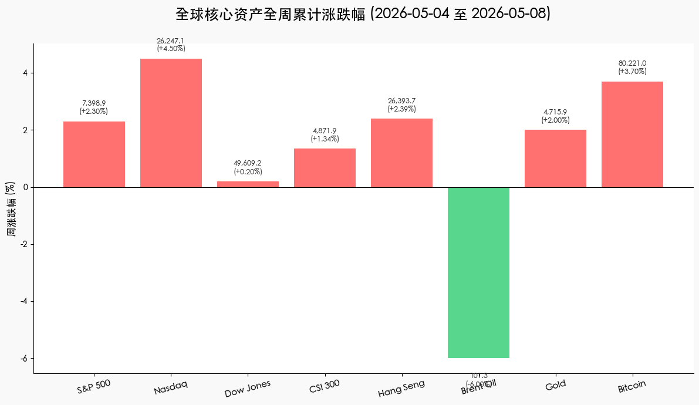

# 全球市场周报：AI 超级周期遭遇地缘天平，纳指全周大涨 4.5% 创纪录

**日期：2026年05月10日 (星期日)** &nbsp; **时段：[周末复盘]**

> **核心摘要**：本周全球市场在强劲就业数据与地缘局势缓解的双重驱动下显著走强。纳指凭借 AI 芯片板块的爆发全周累计上涨 4.5%，领跑全球；美联储领导层交接之际，市场正重新评估“无着陆”背景下的利率路径。霍尔木兹海峡的脆弱停火虽压低油价 6%，但通胀粘性仍是机构关注的长期焦点。

## 核心资产周度/日度表现回顾

全周（05-04 至 05-08）全球核心资产呈现“成长共振、能源退潮”的格局，科技股在利好传闻刺激下突破关键压力位。

*   **纳斯达克 (Nasdaq)**：收于 **26,247.08**，全周累计上涨 **4.5%**。Intel 与 Apple 的潜在代工合作传闻成为板块点火器。
*   **标普 500 (S&P 500)**：收于 **7,398.93**，全周上涨 **2.3%**，连续六周收阳。
*   **道琼斯指数 (Dow Jones)**：收于 **49,609.16**，全周微涨 **0.2%**，传统行业表现相对滞后。
*   **恒生指数 (HSI)**：全周上涨 **2.39%**，受益于互联网巨头在 AI 领域的估值修复。
*   **沪深 300 (CSI 300)**：全周上涨 **1.34%**，地产政策托底与“硬科技”板块轮动支撑大盘。
*   **布伦特原油 (Brent)**：收于 **$101.29**，全周大跌 **6.0%**。地缘溢价随停火协议传闻迅速回落。
*   **黄金 (Gold)**：收于 **$4,715.85**，全周上涨 **2.0%**。尽管油价下跌，但抗通胀与避险需求依然强劲。
*   **比特币 (BTC)**：全周上涨 **3.7%**，目前在 **$80,221** 附近震荡，重新夺回关键移动平均线。

## 过去 48 小时重磅事件深度复盘

> **解读：增长韧性与政策确定性的博弈**
>
> 1.  **4 月非农数据“超预期”弹性**：周五公布的非农就业人数增加 11.5 万（预期 6.5 万），失业率稳定在 4.3%。这表明尽管高利率持续，美国劳动力市场仍具惊人韧性，市场开始定价“2026 年底前不降息”的极端情境，但股市因盈利增长预期而选择上行。
> 2.  **美联储“沃什时代”前瞻**：随着鲍威尔任期进入最后阶段，继任者凯文·沃什（Kevin Warsh）的立场成为焦点。由于其一贯的鹰派色彩，市场对中长期流动性的收紧已有心理准备，但这被 AI 驱动的生产力革命所抵消。
> 3.  **地缘局势的“脆弱平衡”**：美伊在霍尔木兹海峡达成初步停火意向，虽然周五出现小规模摩擦引发油价反弹，但整体供应中断风险的降低让全球能源价格暂时告别高烧，为成长股释放了估值压力。

## 下周全球宏观大事预警

下周市场将从“情绪驱动”转向“数据驱动”，重点关注通胀指标对利率路径的指引。

*   **5月12日 (周二)**：**美国 4 月 CPI 数据**。市场普遍预计核心通胀将保持粘性，任何超预期的反弹都可能引发市场对利率“更高更久”的担忧。
*   **5月13日 (周三)**：**美国 4 月 PPI 数据**。观察生产端价格压力是否已传导至消费端。
*   **5月15日 (周五)**：**中国 4 月重要经济指标汇总**（工业、消费、投资）。这是验证 A 股节后反弹成色的关键基本面数据。
*   **全周**：美联储多位官员将就领导层交接后的政策连续性发表讲话，需关注其对通胀目标的最新口径。

## 顶级机构周末策略内参摘要

*   **高盛 (Goldman Sachs)**：将 2026 年首次降息预期推迟至 **12 月**。认为在能源价格波动的背景下，PCE 通胀将维持在 3% 左右，建议超配具备强现金流特征的 AI 软硬件板块。
*   **摩根士丹利 (Morgan Stanley)**：首席策略师 Mike Wilson 指出，市场已进入“盈利周期驱动”阶段，即便利率维持高位，只要 EPS 增长超预期（Q1 均值为 6%），S&P 500 有望看向 **7,800 点**。
*   **摩根大通 (JP Morgan)**：认为 2026 年是“纪律之年”，由于财政刺激效应减退，下半年增长可能放缓。将 **Alphabet (GOOGL)** 设为年度首选，看好其在 AI 商业化进程中的领先地位。

## 今日市场情绪：金桥之上的硅基凤凰

本周的市场情绪在停火的晨曦与技术的烈焰间找到了平衡：一座脆弱的金桥横跨在原油汇成的动荡海面上，而代表未来生产力的硅基凤凰正破茧而出，以创纪录的涨幅在金融天际划下坚实的绿线。

> Prompt: Surrealism style, A serene landscape where a giant golden bridge spans across a turbulent ocean of liquid crude oil. On the bridge, a magnificent phoenix made of glowing emerald microchips is landing, its wings illuminating a path of record-high stock tickers. In the background, two suns are rising, one bearing a Bull symbol and the other a Bear, over a horizon where silicon towers meet traditional pagodas. A human trader (real person) is observing the scene with a telescope from a cliff., masterpiece, high detail, intricate composition, cinematic lighting, 8k resolution

---
**免责声明**：内容仅供参考，不构成投资建议。
