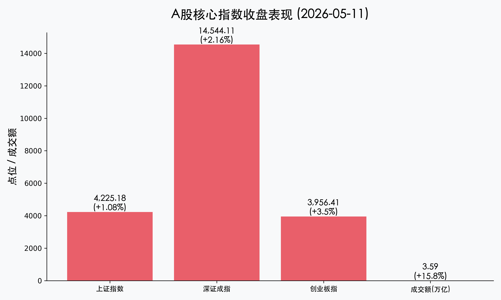

# A股沸腾：沪指突破4200点，万亿科创贷款点燃“红五月”

**日期：2026年05月11日 (星期一)** &nbsp; **时段：收盘报**

> **核心摘要**：A股今日上演史诗级大涨，沪指成功站上4200点关口，全天成交额突破3.5万亿元。在央行1.2万亿元科创再贷款的强力支持下，半导体、AI算力等硬科技板块全线爆发，创业板指更是创下2015年以来的历史新高，市场多头情绪被彻底点燃。

## 核心行情复盘

今日全天市场呈现单边拉升态势，三大指数集体创下阶段性高点。

*   **上证指数**：收报 **4225.18点**，上涨 **1.08%**。
*   **深证成指**：收报 **14544.11点**，上涨 **2.16%**。
*   **创业板指**：收报 **3956.41点**，大涨 **3.50%**，领跑全场。
*   **全场成交额**：突破 **3.59万亿元**，较前一交易日大幅放量近4900亿元，创下近期天量。
*   **北向资金**：单日大幅净流入 **186.5亿元**，已连续9个交易日抢筹，外资看多中国核心资产意图明显。

## 核心解读与市场逻辑

> 今日市场的爆发绝非偶然，而是“政策+基本面+流动性”三效合一的结果。
>
> 1. **科技成长股的估值重塑**：随着AI大模型在各行业的深度落地，算力和半导体作为底层基座，订单透明度极高。今日创业板指的暴涨，本质上是市场对“科技强国”逻辑的极致定价。
> 2. **流动性预期反转**：万亿级别的精准滴灌，彻底消除了市场对于“流动性边际收紧”的担忧。3.5万亿的成交额说明场外资金正在加速入场。
> 3. **权重股与题材共振**：除了科技股，券商板块今日也起到到了很好的护盘和带路作用，市场赚钱效应极佳。

## 政策脉动

*   **央行定向“大放水”**：周末重磅推出的 **1.2万亿元科创再贷款** 成为今日行情的最强催化剂。1.75%的低利率定向支持半导体、AI算力、6G通信等领域，相当于为科技企业提供了极低成本的“弹药”。
*   **证监会严监管与促改革并举**：发布《私募投资基金信息披露监督管理办法》，在维护市场公平的同时，继续推动科创板、创业板制度优化，为优质科技公司提供融资便利。

## 最新机构观点

*   **中金公司**：认为当前AI行情仍处于“硬件先行”阶段，芯片环节估值相比于未来的业绩弹性仍具吸引力，看好科技成长股的持续性。
*   **中信证券**：尽管中期坚定看好AI和能源主线，但提示投资者短期市场情绪已接近顶点，需警惕ETF逢高赎回带来的波动，建议“主动降波”。
*   **中信建投**：明确指出AI算力主线远未到全面泡沫化阶段，目前的放量上涨是资金对下半年“结构性慢牛”的提前布局。

## 今日市场情绪：科技长牛的开启

今日市场呈现出一种“久旱逢甘霖”般的亢奋。万亿资金的入场，标志着市场从之前的存量博弈正式转向增量推动。

> Prompt: Cyberpunk style, A massive golden key with glowing digital patterns unlocking a colossal gateway made of silicon wafers and integrated circuits. In the background, a futuristic city skyline with green lasers shooting into the sky, symbolizing growth and technological breakthrough. A human trader (real person) stands in the foreground, looking at the gateway with awe., masterpiece, high detail, intricate composition, cinematic lighting, 8k resolution

---
免责声明：内容仅供参考，不构成投资建议。
