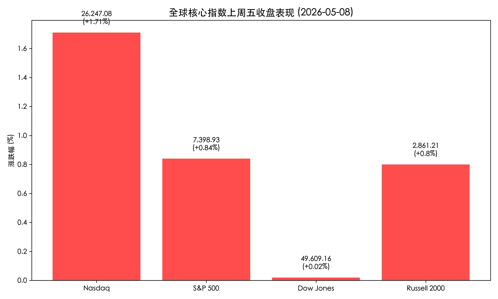

# 全球市场新周展望：能源冲击下的5万点博弈与通胀迷局

**日期：2026年05月11日 (星期一)** &nbsp; **时段：早报 (新周展望)**

> **核心摘要**：随着中东局势升级及“自由行动”展开，全球能源价格持续走高。美股上周五虽在科技股带动下创出新高，但市场正屏息以待周二公布的4月CPI数据。道指距离50,000点大关仅一步之遥，本周将是多空博弈的关键节点。

## 周末财经要闻终极汇总
*   **中东局势升级**：美国正式启动“自由行动”（Project Freedom）以应对霍尔木兹海峡封锁。尽管美伊双方均表示停火协议仍在，但局部交火传闻已推高布伦特原油至100美元附近。
*   **能源成本飙升**：受海事封锁影响，全美平均汽油价格升至 **4.53美元/加仑**，连续两周大幅跳涨，通胀压力再度通过能源端向全行业传导。
*   **消费者信心受挫**：最新公布的5月密歇根大学消费者信心指数降至 **48.2**，触及历史低点。高通胀与战争阴云导致家庭端感受与机构端牛市出现严重“K型”背离。

## 新一周市场核心博弈逻辑
*   **道指50,000点保卫战**：道琼斯指数上周五收于 **49,609.16** 点。作为重大的心理与技术关口，5万点的得失将主导本周开盘情绪，多头急需更多宏观利好支撑。
*   **“AI引擎”vs“能源重压”**：虽然 Rocket Lab (RKLB) 等科技/航天股凭借强劲业绩单日暴涨 **34.3%**，但能源价格上涨正逐步压缩消费者支出。科技股的盈利增长能否抵消能源驱动的估值压缩，将是本周博弈的核心。
*   **降息预期再修正**：美联储新任领导层维持鹰派立场。高盛与摩根士丹利已将降息预期推迟至2026年底甚至2027年，市场正在定价“更高、更久”的利率环境。

## 本周重磅经济数据与会议前瞻
*   **5月12日 (周二) 08:30 ET**：**美国4月CPI数据**。市场预期年化增速将由3.3%反弹至 **3.8%**，核心CPI预计维持在2.7%左右。这是本周最重要的宏观“原子弹”。
*   **5月13日 (周三) 08:30 ET**：美国4月PPI数据，将提供上游成本转嫁的早期信号。
*   **美联储动向**：本周多位联储官员将就金融稳定报告发表讲话，需关注对科技股高估值与私募信贷风险的警告。

## 头部券商/投行开盘策略点睛
*   **高盛 (Goldman Sachs)**：预计核心PCE将在2026年保持“粘性”，维持“美股韧性”判断，但警告由于地缘政治溢价，短期波动性将显著加剧。
*   **摩根士丹利 (Morgan Stanley)**：建议“超配股票、低配债券”。分析师认为，在能源通胀背景下，具备强大定价能力的AI资本开支相关企业是最佳对冲标的。

## 今日市场情绪：能源重压下的5万点冲锋

> Prompt: Surrealism style, A giant hourglass where the top half is filled with thick black crude oil dripping onto a pristine white desert. In the bottom half, a golden mechanical bull is charging up a steep dune towards a glowing neon sign that reads '50,000'. In the background, a dark storm cloud shaped like a dollar sign looms over the horizon. A human trader (real person) stands in the foreground, holding a compass and looking at the bull with intense focus., masterpiece, high detail, intricate composition, cinematic lighting, 8k resolution

免责声明：内容仅供参考，不构成投资建议。
