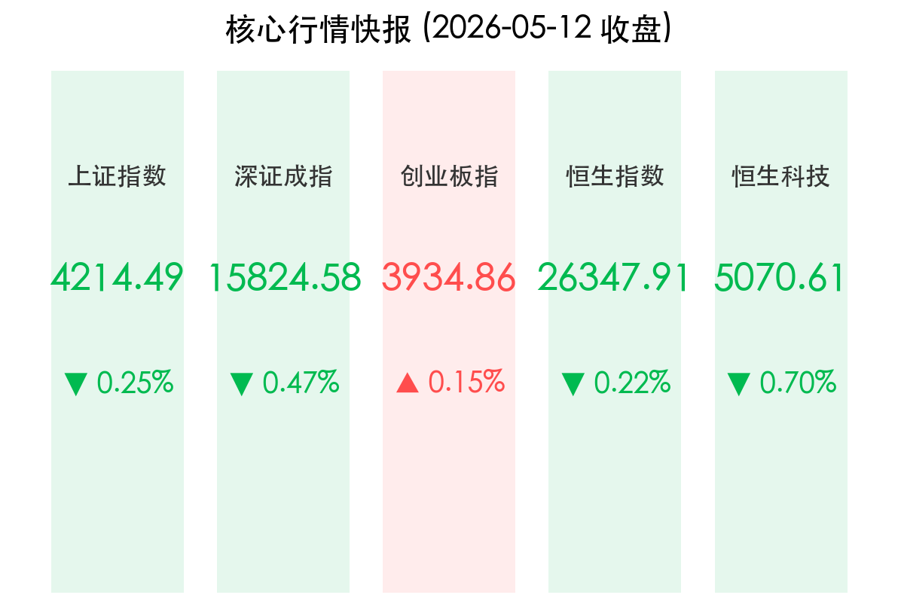

# A股缩量震荡：特朗普访华预期点燃科技火种，两融余额首破2.8万亿

**日期：2026年05月12日 (星期二)** &nbsp; **时段：晚报**

> **核心摘要**：A股今日维持弱势震荡，沪指小幅收跌于 4214 点。尽管市场呈现结构性分化，但成交额依然维持在 3.27 万亿元的高位，且两融余额历史性突破 2.8 万亿元大关。特朗普即将访华的消息为科技板块注入强心针，电力与半导体板块领涨。

## 核心行情复盘

*   **上证指数**：报收 **4214.49点**，下跌 **-0.25%**。
*   **深证成指**：报收 **15824.58点**，下跌 **-0.47%**。
*   **创业板指**：报收 **3934.86点**，上涨 **+0.15%**，尾盘成功翻红。
*   **两市成交额**：沪深京三市合计成交约 **3.27万亿元**，较前一交易日略有缩量，但仍处于极高活跃水平。
*   **主力资金动向**：电力、半导体及券商板块获资金青睐；农业、零售及医药板块资金净流出明显。中际旭创、新易盛等光模块龙头获大幅净流入。
*   **港股表现**：
    *   **恒生指数**：收报 **26347.91点**，下跌 **-0.22%**。
    *   **恒生科技指数**：收报 **5070.61点**，下跌 **-0.70%**。

## 核心解读与市场逻辑

> **杠杆资金热潮涌动**：A股融资余额首次突破 **2.8万亿元**，这一里程碑式的数值反映出市场风险偏好依然极高。即便在指数震荡期，投资者利用杠杆进场的意愿并未减退，这为市场提供了充足的流动性支撑，但也预示着波动率可能进一步放大。
>
> **科技外交新预期**：外交部宣布美国总统特朗普将于明日（5月13日）访华，这一消息极大改善了市场对于中美科技领域竞争缓和的预期。特别是半导体和 AI 产业链，市场期待在本次访问中能达成部分技术标准或供应链合作的共识，带动相关权重股逆市走强。
>
> **基本面支撑显现**：央行 Q1 货币政策报告确认了适度宽松的基调，叠加瑞银等外资机构上调 A股盈利预测，显示出市场已从纯粹的“估值驱动”转向“盈利+估值”双驱动模式。

## 政策脉动

*   **中美外交重头戏**：美国总统特朗普将于 5 月 13 日至 15 日对中国进行国事访问。这是近期全球外交最重磅事件，市场普遍关注其在关税、技术出口及清洁能源合作方面的表态。
*   **货币政策定调**：央行发布的《2026年第一季度中国货币政策执行报告》强调，将继续保持货币政策的灵活性和针对性，引导社会融资成本稳中有降，为经济高质量发展营造适宜的货币金融环境。

## 最新机构观点

*   **瑞银证券 (UBS)**：将 2026 年 A股盈利同比增速预测上调至 **11%**。瑞银认为当前 4200 点只是阶段性平台，随着企业盈利的实质性复苏，市场上行空间将进一步打开。
*   **中信建投**：认为 A股行情将从“急转弯”进入“慢坡路”，未来行情将呈现更明显的结构分化，建议聚焦“算力牛”和“复苏牛”两条主线。
*   **摩根士丹利 (Morgan Stanley)**：特别点名看好中国人形机器人产业，认为其发展轨迹正复刻十年前的新能源汽车，中国供应链优势将助其在全球竞争中占据主导。

## 今日市场情绪：外交憧憬与杠杆博弈的共振

> Prompt: Ukiyo-e style, A high-tech conference room with a large window overlooking the Forbidden City at sunset, a professional Chinese diplomat and a sleek American diplomat are shaking hands, while a humanoid robot stands politely in the background holding a digital tablet, symbolizing technological and diplomatic synergy, masterpiece, high detail, intricate composition, cinematic lighting, 8k resolution

免责声明：内容仅供参考，不构成投资建议。
