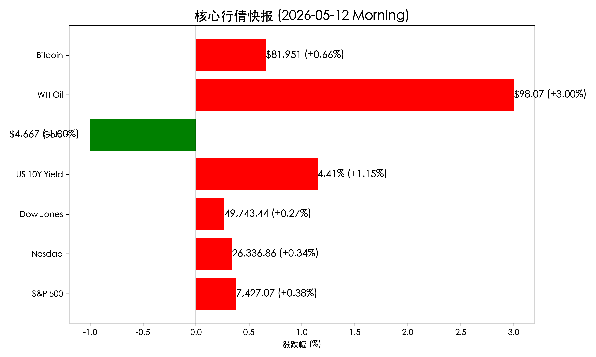

# 全球市场晨报：AI 浪潮力挺标普纳指双创新高，地缘乌云推升油价

**日期：2026年05月12日 (星期二)** &nbsp; **时段：早报**

> **核心摘要**：隔夜美股在 AI 芯片股带动下小幅走高，标普与纳指双双刷新收盘历史新高。然而，中东局势恶化引发原油供应担忧，油价飙升 3%，通胀预期抬升推高美债收益率，市场呈现“科技进、蓝筹忧”的结构性博弈。

## 核心行情复盘

*   **标普 500 指数**：收于 **7,427.07** 点，上涨 **+0.38%**，创下历史新高。
*   **纳斯达克综合指数**：收于 **26,336.86** 点，上涨 **+0.34%**，同样刷新最高纪录。
*   **道琼斯工业平均指数**：收于 **49,743.44** 点，上涨 **+0.27%**。
*   **美债 10 年期收益率**：上涨 5 个基点，报 **4.41%**，反映了市场对长期通胀的担忧。
*   **大宗商品**：
    *   **国际黄金**：报 **$4,667** 盎司，下跌 **-1.00%**，受美债收益率和美元走强抑制。
    *   **WTI 原油**：大幅飙升 **+3.00%**，收报 **$98.07** 桶，因霍尔木兹海峡局势紧张。
*   **加密货币**：**比特币 (BTC)** 报 **$81,951**，上涨 **+0.66%**，表现相对稳健。

## 核心解读与市场逻辑

> **AI 信仰依然坚定**：科技股特别是半导体板块继续扮演领头羊角色。**英伟达 (Nvidia)** 上涨 **2.08%**，收于 $219.67，**高通 (Qualcomm)** 更是飙升 **8.42%** 创下历史新高。这反映出市场对第一季度 AI 基础设施投资持续变现的强烈信心。
>
> **地缘风险重燃通胀担忧**：中东局势的僵持，特别是霍尔木兹海峡的航道安全疑虑，直接导致原油价格跳涨。高盛警告全球原油库存可能在 5 月底降至临界水平。能源成本的上升不仅压制了航空等对油价敏感的板块，也让市场开始担心即将公布的通胀数据是否会迫使联储将高利率维持更久。

## 政策脉动

*   **降息预期大幅推迟**：高盛在最新的策略报告中，将其对美联储首次降息的时间点预测推迟到了 **2026 年 12 月**。分析师认为，“粘性”通胀（接近 3%）以及强劲的劳动力市场，使得美联储在当前环境下缺乏提前降息的动力。

## 最新机构观点

*   **高盛 (Goldman Sachs)**：尽管面临波动，仍看好 2026 年全球股市，预计全球 GDP 增速将达到 **2.8%**。但提醒投资者注意“估值过热”以及原油供应冲击带来的潜在风险。
*   **摩根士丹利 (Morgan Stanley)**：首席投资官 Mike Wilson 指出，尽管宏观环境（战争、通胀）看似凶险，但微观层面的企业盈利修正依然是强有力的多头支柱。同时，他警示美股前十大权重股已占据总市值 **33%**，市场集中度风险处于极端水平。

## 今日市场情绪：科技狂欢与地缘隐忧的博弈

> Prompt: Cyberpunk style, A futuristic mechanical phoenix soaring above a turbulent sea of black oil, while digital ticker tapes weave through the clouds, masterpiece, high detail, intricate composition, cinematic lighting, 8k resolution

免责声明：内容仅供参考，不构成投资建议。
