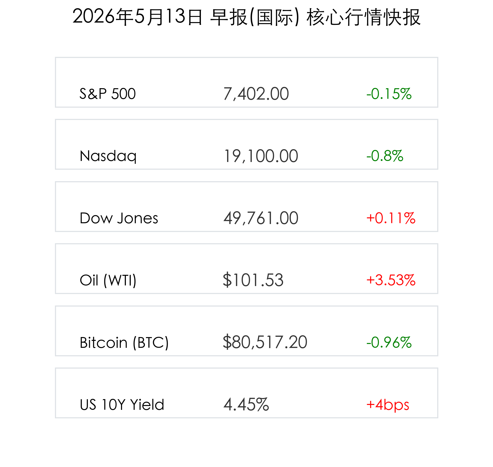
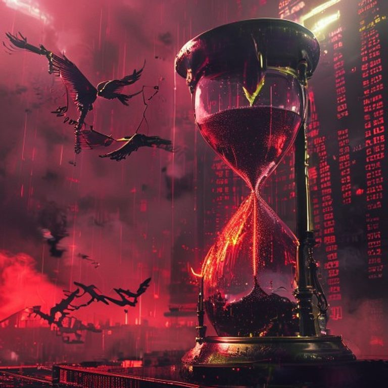

# 全球市场晨报：通胀黑天鹅突袭，纳指遭遇技术性回调，能源价格飙升

**日期：2026年05月13日 (星期三)** &nbsp; **时段：早报**

> **核心摘要**：4月CPI数据超预期反弹至3.8%，彻底粉碎了市场的近期降息幻梦。美股三大股指呈现分化，纳指受科技股抛售拖累大幅回调，而道指在防御性权重的支撑下艰难收红。地缘局势持续紧张推升油价，通胀压力正从能源端向全行业加速传导。

## 核心行情复盘

*   **标普 500 指数**：收于 **7,402.00** 点，下跌 **-0.15%**。
*   **纳斯达克综合指数**：收于 **19,100.00** 点，下跌 **-0.80%**，半导体板块领跌。
*   **道琼斯工业平均指数**：收于 **49,761.00** 点，微涨 **+0.11%**。
*   **美债 10 年期收益率**：上涨 4 个基点，报 **4.45%**，触及近期高位。
*   **大宗商品**：
    *   **WTI 原油**：大幅飙升 **+3.53%**，收报 **$101.53**/桶，因地缘局势引发供应担忧。
    *   **现货黄金**：报 **$4,708.00**，下跌 **-0.21%**，受强势美元和收益率上升双重挤压。
*   **加密货币**：**比特币 (BTC)** 报 **$80,517.20**，下跌 **-0.96%**。

## 核心解读与市场逻辑

> **CPI数据重创降息预期**：隔夜公布的4月CPI同比上涨 **3.8%**，高于预期的3.3%。这一“粘性”通胀数据表明，尽管美联储已长时间维持高利率，但物价压力依然根深蒂固。掉期交易市场已开始定价“2026年底前不降息”的极端情境，甚至有激进观点认为联储可能需要重启加息以抑制通胀。
>
> **科技股遭遇“杀估值”**：作为利率最敏感的板块，半导体和AI成长股遭遇重挫。**高通 (Qualcomm)** 跌幅达 **11.5%**，**英特尔 (Intel)** 下跌 **7%**。市场逻辑已从“博弈增长”转向“规避风险”，资金正从高估值科技股撤出，流向具备强大防御能力的传统板块。
>
> **能源价格与地缘博弈**：特朗普政府拒绝伊朗停火提议的消息点燃了能源市场。油价突破100美元大关，不仅加剧了通胀焦虑，也直接威胁到下游制造业的盈利空间。高盛警告称，若地缘冲突升级至霍尔木兹海峡，油价可能面临进一步上行风险。

## 政策脉动

*   **联储立场进一步鹰化**：CPI数据公布后，多位美联储官员在非正式场合暗示，当前的利率政策可能还不足以将通胀带回2%的目标路径。市场正密切关注下一次议息会议是否会修改“中性利率”的定义。
*   **财政赤字关注度提升**：随着收益率曲线持续在高位徘徊，市场开始对美国庞大的利息支出负担表示担忧，这也为美元的长期走势增加了一层不确定性。

## 最新机构观点

*   **高盛 (Goldman Sachs)**：正式将首次降息的预测时间推迟至 **2026年第四季度**，并警告投资者在能源成本高企的背景下，应关注具备“通胀转嫁能力”的蓝筹企业。
*   **中金公司 (CICC)**：认为全球市场正进入“宏观数据强耦合期”，建议在配置上采取“哑铃策略”，即一手握有核心AI基建股，另一手配置能源与黄金等实物资产对冲风险。
*   **中信证券**：关注地缘局势对供应链的二次冲击，认为中国资产在估值层面具备较强的安全边际，但在短期内需警惕外部风险偏好下行带来的波动。

## 今日市场情绪：通胀阴云下的黑金怒涛

> Prompt: Cyberpunk style, A giant hourglass filled with bubbling black crude oil, with its weight tilting a golden scale against a backdrop of a crimson digital stock ticker screen showing sharp downward spikes. In the sky, a mechanical phoenix is struggling to fly through a thick smog of dollar signs., masterpiece, high detail, intricate composition, cinematic lighting, 8k resolution

免责声明：内容仅供参考，不构成投资建议。
