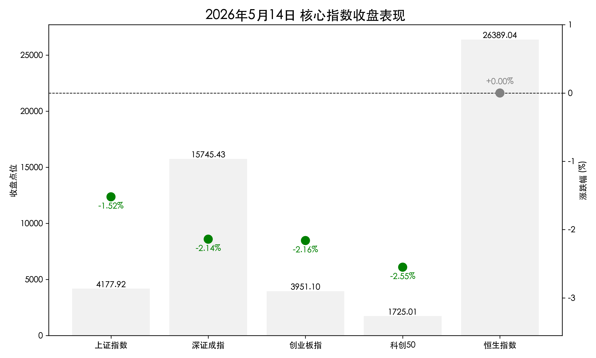
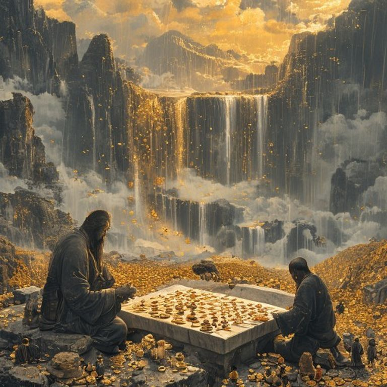

# A股收盘：天量成交续写，高开低走后的洗盘与布局

**日期：2026年05月14日 (星期四)** &nbsp; **时段：收盘报**

> **核心摘要**：今日市场在前期连续大涨后迎来显著的技术性回调。A股指数高开低走，虽收盘集体下跌，但成交额依然维持在 **3.39万亿元** 的极高水平。外部环境方面，美国总统访华释放经贸回暖信号，人民币汇率强劲升破6.8关口。市场呈现出明显的高位获利了结特征，资金开始向低估值防御板块切换。

## 核心行情复盘

*   **上证指数**：收报 **4177.92点**，下跌 **1.52%**。
*   **深证成指**：收报 **15745.43点**，下跌 **2.14%**。
*   **创业板指**：收报 **3951.10点**，下跌 **2.16%**。
*   **成交额**：沪深京三市合计成交额约 **3.39万亿元**，连续第7个交易日突破3万亿元。
*   **主力资金**：全天呈现净流出态势，电子、半导体等前期高位板块抛压较重。
*   **个股表现**：全市场超4300只个股下跌，**猪肉、工业气体、白酒、银行**等板块逆市走强；**商业航天、AI应用、能源金属**等板块跌幅居前。
*   **港股市场**：表现相对稳健，**恒生指数**收报 **26389.04点**，微涨0.6点（+0.00%）；**恒生科技指数**收报 **5076.20点**，下跌 **0.35%**。

## 核心解读与市场逻辑

> **高位获利了结与技术性洗盘**：在经历了初期的快速上行后，市场今日出现了明显的“多杀多”现象。特别是电子和AI赛道，由于积累了大量获利盘，在早盘冲高后诱发了大规模的止盈离场。3.39万亿的天量成交显示出换手极为充分，这既是调整的压力所在，也为后市筹码的重新分布打下了基础。
>
> **风格切换至低估值避险**：在指数承压的过程中，资金明显向白酒、银行等低估值和大消费板块靠拢。这种“防御性切换”反映了投资者在不确定性增强时的审慎心态，同时也说明场内资金并未大规模离场，而是在板块间进行“高低切换”。
>
> **外部暖意与汇率支撑**：美国总统访华的国事访问正在进行中，这不仅缓解了市场对地缘政治风险的担忧，更直接推动了人民币汇率走强（中间价上调并升破6.8）。外部经贸环境的改善将持续提升人民币资产的全球吸引力，为市场的长期修复提供坚实的宏观底座。

## 政策脉动

*   **货币政策转向“适度宽松”**：央行第一季度货币政策执行报告正式定调下阶段实施“适度宽松”的政策。这一提法较此前的“稳健”有显著边际变化，预示着未来流动性将保持充裕，社会融资成本有望进一步下降。
*   **“5·15”投资者保护日**：证监会即将举办全国投资者保护宣传日活动，强调严监管与投保并重。近期对信息披露违规的立案调查，显示了监管层净化市场生态、落实新“国九条”的坚定决心。
*   **“两新”政策精准导流**：央行等部门扩大科技创新贷款支持范围至AI、电子信息等14个领域。政策导向已从传统基建全面转向“新质生产力”，通过结构性工具精准支持产业升级。

## 最新机构观点

*   **中金公司**：坚定看好市场震荡上行趋势，认为本轮行情虽已持续近两年，但整体估值仍处合理区间。建议配置关注“景气成长”与“周期改善”双主线，利用震荡机会进行结构性布局。
*   **中信证券**：关注科技高景气赛道的持续性，并特别提到2026年或将成为“算力金融化元年”。建议5月增配权益及黄金资产，风格上维持对小市值和成长风格的偏好。
*   **申万宏源**：认为当前处于“牛市2.0”的酝酿期，增量资金的正循环已经具备。短期的技术性调整是为下半年的“全面牛”蓄势，建议关注复苏交易、AI产业链及制造业全球影响力提升等结构线索。

## 今日市场情绪：博弈中的平衡

> Prompt: Ukiyo-e style, Two ancient stone giants sitting across a vast mountain range, playing a game of Go on a board made of light. In the background, a massive waterfall of golden coins flows into a valley where thousands of tiny workers are harvesting light. The sky is a dramatic mix of stormy grey and dawn gold. A sense of historical significance and strategic balance., masterpiece, high detail, intricate composition, cinematic lighting, 8k resolution

免责声明：内容仅供参考，不构成投资建议。
