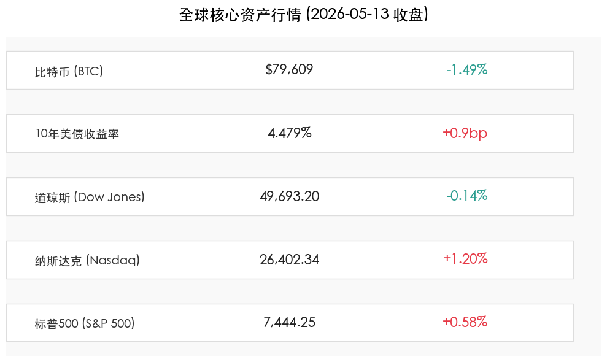

# AI 韧性对冲通胀阴霾，美股标普纳指再创历史新高

**日期：2026年05月14日 (星期四)** &nbsp; **时段：上午 (Morning)**

> **核心摘要**：尽管 4 月 PPI 涨幅因地缘政治导致能源价格飙升而超预期，但 AI 芯片板块的强劲反弹带动纳指与标普 500 指数双双刷新历史收盘纪录。参议院确认 Kevin Warsh 为下任美联储主席，市场关注政策延续性。

## 核心行情复盘

周三美股表现分化，科技股在经历周初调整后展现出极强的修复动力：

*   **标普 500 指数**上涨 **0.58%**，收于 **7,444.25** 点，创历史新高。
*   **纳斯达克综合指数**表现亮眼，上涨 **1.20%**，收于 **26,402.34** 点，同样刷新纪录。
*   **道琼斯工业指数**微跌 **0.14%**，收于 **49,693.20** 点，受制于传统工业及能源成本压力。

## 核心解读与市场逻辑

> **通胀“高烧”与 AI “热浪”的博弈**
> 
> 1. **PPI 意外爆表**：劳工部报告显示，上月生产者价格指数（PPI）环比上涨 **1.4%**，创四年来最大增幅。主要诱因是霍尔木兹海峡关闭引发的油价剧烈波动。这一数据一度令市场对降息的预期降至冰点。
> 2. **AI 芯片股的“救场”**：尽管通胀压力巨大，但美光科技（Micron, +4.8%）、安森美（On Semi, +11.1%）及英伟达（Nvidia, +2.3%）的大幅拉升对冲了宏观负面情绪。这反映出市场资金在通胀环境下更倾向于寻求确定性极高的成长性资产。
> 3. **债市反馈**：10 年期美债收益率攀升至 **4.479%**，反映了市场对高利率环境更持久的担忧。

## 政策脉动

*   **美联储换帅定论**：美国参议院正式确认 **Kevin Warsh** 接替鲍威尔担任下任美联储主席。Warsh 一向被视为鹰派色彩较浓的经济学家，他的上任可能意味着联储在对抗通胀方面将维持更加强硬的姿态。
*   **官员发声**：波士顿联储主席柯林斯（Susan Collins）警告称，如果通胀压力不减，美联储甚至可能需要考虑再次加息。

## 最新机构观点

*   **高盛 (Goldman Sachs)**：我们正处于 AI 投资的第二阶段，基础设施的资本支出尚未触顶，科技巨头的盈利韧性将继续支撑标普 500 的估值。
*   **摩根士丹利 (Morgan Stanley)**：地缘政治引发的能源价格上涨是当前最大的变量。如果霍尔木兹海峡局势持续僵持，滞胀风险将从理论走向现实。
*   **中金公司**：美联储新主席的政策框架将是下半年的核心博弈点，目前看来“抗通胀”的权重明显高于“保增长”。

## 今日市场情绪：凤凰涅槃

> Prompt: A majestic metallic phoenix made of glowing silicon circuits rising from a sea of dark crude oil. Golden balance scale in background. Green laser light. High detail, surrealism style.

---
免责声明：内容仅供参考，不构成投资建议。
