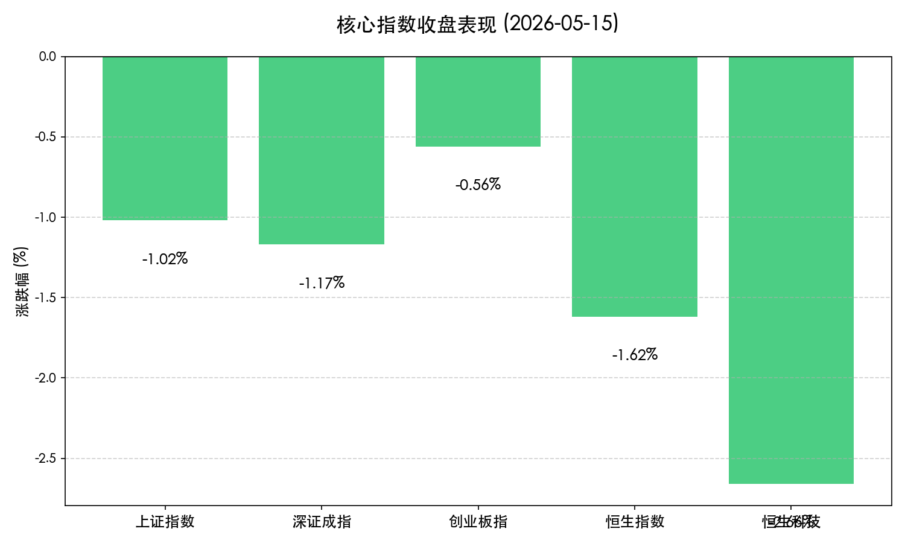
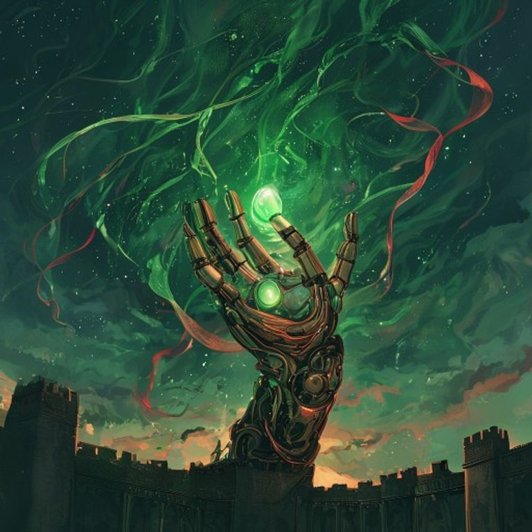

# A股收盘：3.37万亿天量震荡，机器人与氟化工逆势突围

**日期：2026年05月15日 (星期五)** &nbsp; **时段：收盘报 (Evening Report)**

> **核心摘要**：今日 A 股与港股全线回调，全市场成交额维持在 **3.37万亿元** 的极高水平。在市场整体洗盘的过程中，机器人概念与氟化工板块受利好刺激逆势走强。随着美国总统访华行程结束及美联储新主席凯文·沃什（Kevin Warsh）确认就职，投资者正处于对宏观政策落地的消化期。

## 核心行情复盘

*   **上证指数**：报收 **4135点**，下跌 **1.02%**，盘中震荡加剧，4200点关口失守。
*   **深证成指**：下跌 **1.17%**，主要受科技成长股高位获利抛压影响。
*   **创业板指**：下跌 **0.56%**，表现相对稳健，权重股宁德时代等支撑力度尚存。
*   **恒生指数**：报收 **25962.73点**，下跌 **1.62%**；恒生科技指数大跌 **2.66%**。
*   **成交额**：全市场成交额达 **3.37万亿元**，为连续第8个交易日站上3万亿大关。
*   **资金动向**：虽然市场普跌，但南向资金逆势净买入近 **250亿港元**，显示机构对港股核心资产的长期看好。

## 核心解读与市场逻辑

> 1. **天量成交下的筹码大换手**：3.37万亿的成交规模预示着多空博弈已进入白热化。在前期快速拉升后，今日的下跌更多体现为高位获利盘的集中兑现。这种“放量下跌”虽然短期承压，但有助于市场夯实底部，为下一阶段的风格切换腾挪空间。
> 2. **中美关系进入“落地观察期”**：美国总统特朗普结束访华，双方在 AI 与半导体领域达成多项共识，包括美方批准部分中企购买英伟达 H200 芯片。这一消息短期内已在昨日有所定价，今日市场进入对合作细节与长期影响的深入评估。
> 3. **AI 热点向算力分支扩散**：机器人概念股全线走强，三丰智能、巨轮智能等批量涨停。逻辑在于 AI 赋能具身智能的趋势日益清晰。同时，受韩国厂商采购转向刺激，氟化工板块异军突起，显示出存量资金对具备确定性利好板块的极高敏锐度。

## 政策脉动

*   **人工智能国家行动**：江苏省与武汉市相继发布 2026 年 AI 产业支持政策，明确“人工智能+”行动路径。地方政府的密集表态预示着新质生产力将获得持续的资金与政策加持。
*   **美联储“沃什时代”启幕**：凯文·沃什正式出任美联储主席，其稳健倾向导致 2027 年加息预期升温。这对全球流动性形成短期脉冲式扰动，尤其对高估值科技股构成压力。
*   **全球供应链扰动**：三星电子罢工风险加剧全球存储芯片供应担忧，间接刺激了国内存储产业链的国产替代逻辑。

## 最新机构观点

*   **摩根士丹利 (Morgan Stanley)**：维持对沪深 300 指数的超配评级，认为盈利修复而非单纯的估值扩张将主导下半年的行情。
*   **招商证券**：指出算力需求已从核心计算节点向存储、封装及材料端扩散，建议投资者重点关注国产算力链中的细分龙头。
*   **浦银国际**：提示港股近期面临限售股解禁潮压力，但在 25000 点附近具备极强的估值安全边际。

## 今日市场情绪：【天量震荡中的静谧定力】

> Prompt: Watercolor style, A giant intricate robotic hand made of brass and glass gently holding a glowing jade seed in the middle of a swirling storm of green and red silk ribbons. In the background, a silhouette of a Great Wall under a twilight sky with a few stars beginning to shine., masterpiece, high detail, intricate composition, cinematic lighting, 8k resolution

---
**免责声明**：内容仅供参考，不构成投资建议。市场有风险，投资需谨慎。
