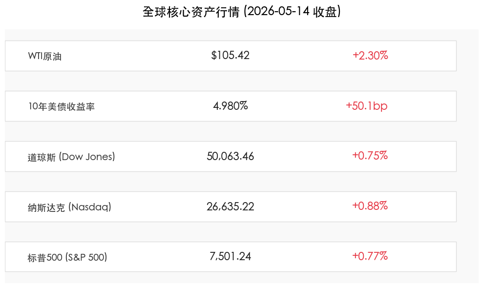
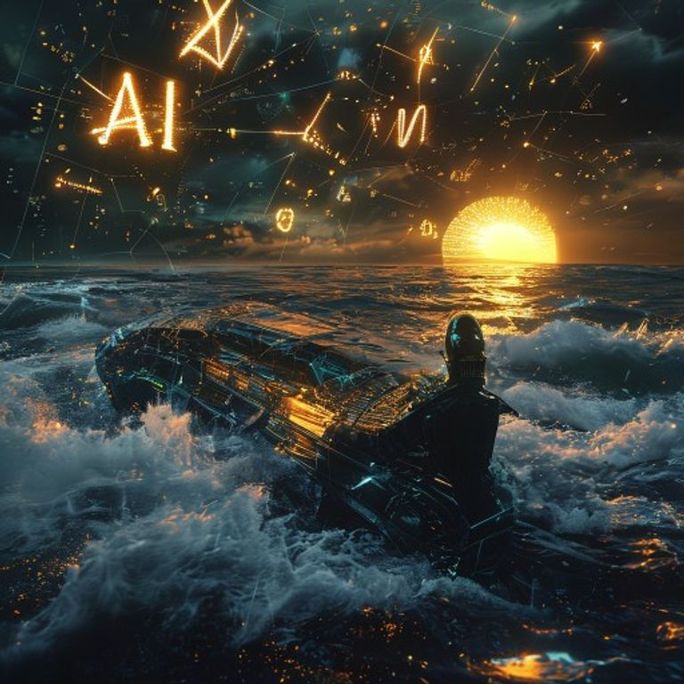

# 全球市场：沃什时代开启，AI狂欢助标普首次突破7500点

**日期：2026年05月15日 (星期五)** &nbsp; **时段：早间展望 (Morning Outlook)**

> **核心摘要**：随着凯文·沃什（Kevin Warsh）正式确认接任美联储主席，市场开启“沃什交易”模式，美股三大指数集体狂飙，标普500历史性站上7500点。尽管中东局势推升油价至105美元上方，但思科与英伟达带来的AI增长动力抵消了通胀忧虑。

## 核心行情复盘

*   **标普500指数 (S&P 500)**：收于 **7,501.24** 点，上涨 **0.77%**。历史性首次站稳 7500 点大关。
*   **纳斯达克综合指数 (Nasdaq)**：收于 **26,635.22** 点，上涨 **0.88%**。受 AI 权重股强劲财报驱动。
*   **道琼斯工业平均指数 (Dow Jones)**：收于 **50,063.46** 点，上涨 **0.75%**。重返 50,000 点整数关口。
*   **10年期美债收益率**：飙升至 **4.980%**，单日上涨约 **50.1个基点**。市场正在重新定价沃什领导下的货币政策路径。
*   **WTI原油期货**：收于 **$105.42** 桶，上涨 **2.30%**。伊朗局势动荡维持地缘溢价。

## 核心解读与市场逻辑

> 1. **“沃什交易”正式确立**：凯文·沃什被确认为第17任美联储主席，其“偏好缩表、稳健利率”的声誉让市场预期联储将进入一个更加透明且注重金融稳定性的新时代。尽管这推高了长端利率，但股市选择了拥抱增长前景。
> 2. **AI成长动力强劲**：思科（Cisco）大涨 **13.4%**，其 AI 重组计划获得认可；英伟达（Nvidia）因 H200 芯片出口消息上涨 **4.4%**。AI 依然是抵消宏观波动最核心的“减震器”。
> 3. **美中关系回暖预期**：特朗普总统访问北京的乐观预期，以及潜在的非核心商品关税削减传闻，显著提升了全球风险资产的配置意愿。

## 政策脉动

*   **美联储人事变动**：凯文·沃什将于5月15日正式就职。鲍威尔预计将留任理事会成员，确保政策平稳过渡。
*   **通胀压力持续**：4月 CPI (3.8%) 与 PPI (6%) 依然高企。市场普遍预期，在油价站稳 100 美元的背景下，新任主席的首个挑战将是如何平衡白宫的降息需求与抗通胀的专业性。

## 最新机构观点

*   **高盛 (Goldman Sachs)**：认为当前市场正经历“空头挤压”。尽管将下次降息预期推迟至 2026 年 12 月，但仍建议超配科技股，认为 AI 带来的生产率提升最终将为通胀降温。
*   **摩根士丹利 (Morgan Stanley)**：上调标普 500 年底目标价至 **8,000** 点。分析师 Mike Wilson 认为，盈利增长而非估值扩张将是下一阶段的主旋律。
*   **中金公司 (CICC)**：预测沃什将采取“缩表先行、降息居后”的策略，这可能导致美元短期走强，但会为长期利率下降腾出空间。

## 今日市场情绪：【“沃什”曙光下的破浪前行】

> Prompt: Cyberpunk style, A human navigator (real person) in a high-tech crystal ship steering through a stormy sea of thick black oil, while in the dark sky, massive glowing digital constellations shaped like 'AI' and stock indices (7500, 26000, 50000) illuminate the horizon. On the horizon, a new golden sun (representing Kevin Warsh's confirmation) is beginning to rise, casting a hopeful light on the turbulent waves., masterpiece, high detail, intricate composition, cinematic lighting, 8k resolution

---
**免责声明**：内容仅供参考，不构成投资建议。市场有风险，投资需谨慎。
