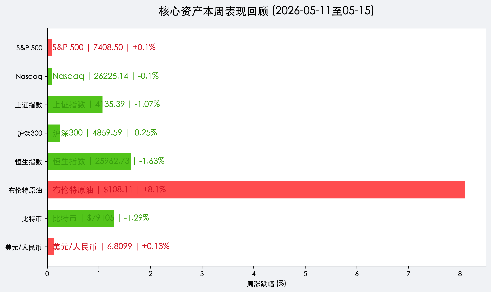

# 全球市场周报：中美巅峰对话启幕，能源危机阴云再起

**日期：2026年05月16日 (星期六)** &nbsp; **时段：周末复盘 (Weekend Review)**

> **核心摘要**：本周全球市场在震荡中寻找方向。美股虽在周中创下历史新高，但周五因 AI 板块调整而回吐涨幅。中美领导人北京峰会正式开启，市场处于“期待与观察”的博弈期。受霍尔木兹海峡局势影响，布伦特原油全周暴涨 8.1%，成为表现最强劲的资产。

## 核心资产周度/日度表现回顾

*   **S&P 500**：收报 **7408.50点**，周涨幅 **+0.1%**。周中曾突破 7500 点大关，随后受高估值压力回落。
*   **Nasdaq Composite**：收报 **26225.14点**，周跌幅 **-0.1%**。英伟达、苹果等科技巨头在周五遭遇显著抛售。
*   **上证指数**：收报 **4135.39点**，周跌幅 **-1.07%**。市场在 4200 点下方进行筹码交换，整体呈现强势震荡态势。
*   **恒生指数**：收报 **25962.73点**，周跌幅 **-1.63%**。周五的大幅下跌反映了投资者在周末重磅消息前夕的避险情绪。
*   **布伦特原油**：飙升至 **$108.11/桶**，全周大涨 **8.1%**。地缘政治溢价已成为当前原油定价的核心权重。
*   **比特币 (BTC)**：收报 **$79105**，周跌幅 **-1.29%**。在突破 9 万美元关口失败后进入阶段性修整。

## 过去 48 小时重磅事件深度复盘

> 1. **中美北京峰会（Trump-Xi Summit）**：作为本周乃至本年度最重要的外交事件，中美领导人在北京的会晤牵动全球神经。初步释放的信号显示双方在 AI 安全与半导体供应链方面存在合作空间，但具体协议的达成仍需时间。市场对此持“谨慎乐观”态度，这在 A 股本周的韧性中得到了体现。
> 2. **中东“能源咽喉”危机**：霍尔木兹海峡的航行受阻导致全球原油供应担忧剧增。尽管仅有极少数船只通过，但市场已开始定价长期化供应中断的可能性。原油的暴涨也间接推升了全球通胀预期，导致美债收益率在高位震荡。
> 3. **AI 板块的“恐高症”**：周五美股科技股的集体下挫，标志着市场对 AI 叙事的审美疲劳或阶段性见顶。由于 S&P 500 的 P/E 已达 20.9 倍，任何关于盈利增速放缓的传闻都会引发剧烈波动。

## 下周全球宏观大事预警

*   **美联储货币政策纪要**：市场将寻找凯文·沃什就职后美联储是否会转向更为激进的抗通胀立场的蛛丝马迹。
*   **中国 5 月 LPR 报价**：在当前经济修复期，市场关注央行是否会通过引导利率下行来进一步提振内需。
*   **全球制造业 PMI 初值**：关注能源成本飙升是否已开始侵蚀制造业的景气度。

## 顶级机构周末策略内参摘要

*   **高盛 (Goldman Sachs)**：建议采取“防御性成长”策略。虽然 AI 估值偏高，但具备现金流支撑的科技龙头仍是抵御通胀的首选。
*   **中金公司 (CICC)**：认为 A 股当前的震荡是“牛市中继”的典型特征。随着政策底与市场底的夯实，下半年重心有望向二线蓝筹与红利资产切换。
*   **瑞银 (UBS)**：大幅上调布伦特原油 2026 年三季度目标价至 $120，提醒投资者关注航空与物流行业的成本风险。

## 今日市场情绪：【峰会前夕的静谧与远方的惊雷】

> Prompt: Oil painting style, A majestic golden dragon and a powerful bald eagle sitting on opposite sides of a grand ancient stone table in a serene traditional garden. In the distance, a dark stormy sky with orange fire-like clouds representing a global energy crisis rises over a calm blue ocean., masterpiece, high detail, intricate composition, cinematic lighting, 8k resolution

---
**免责声明**：内容仅供参考，不构成投资建议。市场有风险，投资需谨慎。
