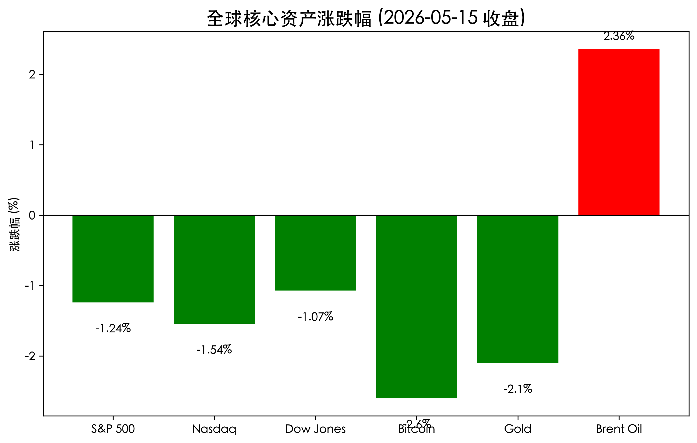
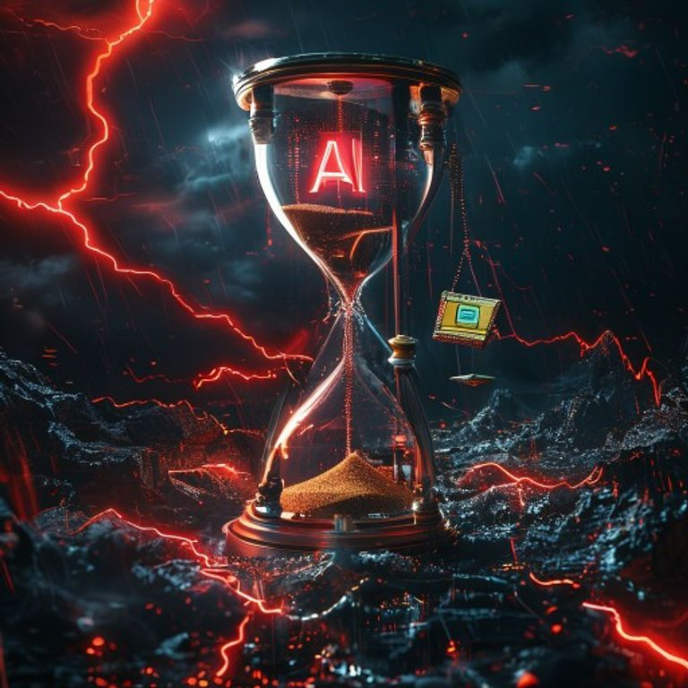

# 全球市场：通胀忧虑再起，万亿AI狂欢暂歇，标普道指高位回撤

**日期：2026年05月16日 (星期六)** &nbsp; **时段：早报 (Morning Report)**

> **核心摘要**：受超预期 PPI 与 CPI 数据冲击，市场对美联储降息的预期再度受挫，10年期美债收益率攀升至 4.6%。地缘局势持续紧张推升油价，AI 板块出现显著疲态，英伟达领跌 4.4%，美股三大指数从历史高位集体回撤。

## 核心行情复盘

*   **标普 500 指数 (S&P 500)**：收于 **7,408.50** 点，下跌 **1.24%**。
*   **纳斯达克综合指数 (Nasdaq)**：收于 **26,225.14** 点，下跌 **1.54%**。领跌主要指数，受半导体板块拖累。
*   **道琼斯工业平均指数 (Dow Jones)**：收于 **49,526.17** 点，下跌 **1.07%**。回撤至 50,000 点下方。
*   **10年期美债收益率**：攀升至 **4.6%** 附近，创下一年来新高。
*   **布伦特原油 (Brent)**：报收 **$110/桶**，上涨 **2.36%**。中东局势及霍尔木兹海峡封锁风险维持油价高位。
*   **比特币 (Bitcoin)**：报 **$79,800** 附近，下跌 **2.6%**。在 8 万美元关口面临抛售压力。
*   **黄金 (Gold)**：报 **$4,555/盎司**，下跌 **2.1%**。受美元走强及收益率上涨压制。

## 核心解读与市场逻辑

> 1. **通胀阴云不散**：本周公布的 PPI 与 CPI 数据均高于市场预期，直接击碎了美联储在下半年开启降息窗口的幻想。市场定价正转向“长期高利率 (Higher for Longer)”，甚至开始担忧美联储可能重启加息。
> 2. **AI 题材阶段性退潮**：在经历了一轮狂热上涨后，AI 板块出现显著回撤。英伟达下跌 **4.4%**，AMD 下跌 **3%**。虽然思科 (Cisco) 因 AI 订单暴增逆市上涨 **15%**，但难以支撑整体板块走弱。
> 3. **地缘政治与能源压力**：特朗普与中方领导人的峰会虽有“停火”共识，但缺乏实质性贸易协议。与此同时，伊朗局势导致能源供给担忧加剧，油价站稳 100 美元上方，进一步推高了全球通胀预期。

## 政策脉动

*   **美联储动向**：新任主席凯文·沃什 (Kevin Warsh) 面临严峻考验。市场正密切关注其对高企通胀的表态。沃什的“鹰派”背景让投资者预期美联储将优先考虑物价稳定。
*   **地缘政策**：霍尔木兹海峡的通航受阻依然是全球市场的“黑天鹅”。美国财政部及国际能源署 (IEA) 正评估释放战略储备的可能性。

## 最新机构观点

*   **高盛 (Goldman Sachs)**：市场情绪指标 (RAI) 达到 **1.1**，处于极度乐观区间。高盛警告，虽然经济韧性强（衰退概率降至 25%），但极端的情绪往往预示着短期调整风险。
*   **摩根士丹利 (Morgan Stanley)**：维持标普 500 年底 **8,000** 点的目标不变，建议“增持”优质股票，但警告信贷成本上升可能压制企业盈利。
*   **瑞银 (UBS)**：指出若 10 年期美债收益率持续站稳 4.5% 以上，成长股估值将面临 5-10% 的系统性重估。

## 今日市场情绪：【油砂重压下的天平博弈】

> Prompt: Surrealism style, A massive hourglass in a dark cosmic void, where thick black crude oil flows instead of sand, slowly tipping a giant golden scale on which a glowing 'AI' chip is balanced against a stack of treasury bonds. In the background, red lightning bolts shaped like stock chart lines strike a turbulent dark sea., masterpiece, high detail, intricate composition, cinematic lighting, 8k resolution

---
**免责声明**：内容仅供参考，不构成投资建议。市场有风险，投资需谨慎。
