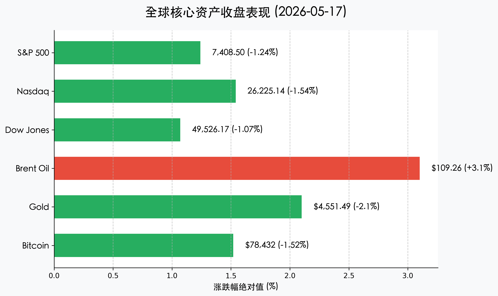
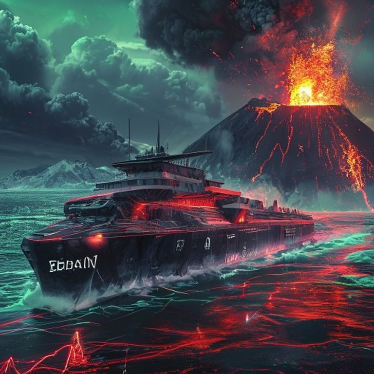

# 全球市场前瞻：中美关系“破冰”注入暖意，下周迎来英伟达“终极审判”

**日期：2026年05月17日 (星期日)** &nbsp; **时段：新周展望 (New Week Outlook)**

> **核心摘要**：中美北京峰会达成的多项务实协议（200架波音、农产品大增购）为全球贸易环境有效“降温”，然而美国 3.8% 的通胀阴影与美联储“沃什时代”的开启，使得下周的英伟达财报与 FOMC 纪要成为多空博弈的生死线。

## 周末财经要闻终极汇总

> 1. **中美“北京共识”超预期，贸易战警报解除**：特朗普与中方高层在为期两天的会晤中，不仅确立了“贸易与投资委员会”的新型管理机制，更签下了涉及200架波音飞机、数十亿美元大豆及液化天然气（LNG）的采购大单。虽然在台湾及俄乌问题上依然维持现状，但双边关系的“底线”已经探明，市场对地缘溢价的定价权正从风险厌恶转向风险中性。
> 2. **美国通胀“硬着陆”风险陡增**：本周五披露的 3.8% CPI 涨幅像一记重锤打击了市场。随着凯文·沃什（Kevin Warsh）正式接任美联储主席，其历来的“鹰派”底色加剧了市场对 2026 年底前重启加息的恐慌。目前 30 年期美债收益率已站稳 5.0% 关口，创下近 20 年来的极端水平。
> 3. **中东“霍尔木兹海峡”危机僵局持续**：尽管中美同意维护航道安全，但以色列与伊朗的直接对抗并未实质性消退。布伦特原油收盘飙升至 **$109.26**，正通过能源链条向全球制造业下游传导压力。

## 新一周市场核心博弈逻辑

*   **“英伟达效应”的最后一跃还是高位派发？**：下周三（5月20日）英伟达将发布 Q1 财报。目前市场一致预期营收约为 **$790亿**。随着 CEO 黄仁勋近期随特朗普访华的“特殊身份”曝光，投资者将高度关注 NVIDIA 是否能在中美新协议下获得针对中国市场（H20/B20）的出口限制豁免。
*   **美联储纪要中的“沃什色彩”**：下周三公布的纪要将首次揭示在通胀重回 3.8% 背景下，FOMC 内部对于“长期高利率（Higher for Longer）”的最新共识。如果纪要释放出对 2% 目标已“失去控制”的担忧，全球债市或将迎来二次探底。
*   **中国 LPR 报价的“以稳为主”**：市场普遍预计下周一（5月20日）公布的 1 年期及 5 年期 LPR 将维持在 **3.0%** 和 **3.5%**。在国内经济温和复苏（Q1 GDP 5.0%）与外部利差压力（美元强势）的双重挤压下，央行短期内动用利率工具的概率极低。

## 本周重磅经济数据与会议前瞻

| 日期 | 关键事件/数据 | 市场影响权重 |
| :--- | :--- | :--- |
| **5月18日 (周一)** | 中国 4 月规模以上工业增加值、社会消费品零售总额 | ⭐⭐⭐⭐ |
| **5月20日 (周三)** | **中国 LPR 报价**；英国 4 月 CPI 数据 | ⭐⭐⭐ |
| **5月20日 (深夜)** | **英伟达 (NVIDIA) 财报**；美联储 4 月会议纪要 | ⭐⭐⭐⭐⭐ |
| **5月21日 (周四)** | 美国、欧元区 5 月 Flash PMI (采购经理人指数) | ⭐⭐⭐ |
| **5月22日 (周五)** | 日本 4 月核心 CPI；英国 4 月零售销售 | ⭐⭐ |

## 头部券商/投行开盘策略点睛

*   **中信证券 (CITIC)**：认为中美峰会的成果将显著提振 A 股中具有“自主可控”及“出口替代”特征的板块。建议关注受益于波音订单潜在国产化替代的航空供应链，以及受益于贸易关税减免的农业出海链。
*   **高盛 (Goldman Sachs)**：强调当前美股处于“通胀预期”与“AI 信仰”的殊死博弈中。若英伟达无法给出超预期的 Q2 指引，标普 500 可能在 $7,400 点附近面临技术性破位。
*   **摩根士丹利 (Morgan Stanley)**：指出原油价格是下周最大的宏观变量。若布伦特原油站稳 $110，全球通胀交易将全面重启，建议增配能源股与黄金作为对冲。

## 今日市场情绪：【破冰船与熔岩岛】

> Prompt: A futuristic, giant icebreaker ship with 'TRADE' written on its hull is smashing through a frozen ocean of red and green stock candle charts. In the distance, a massive volcanic island labeled 'INFLATION' is erupting with thick black oil and glowing orange sparks. Cyberpunk style, cinematic lighting, high contrast, 8k resolution.

---
**免责声明**：内容仅供参考，不构成投资建议。市场有风险，投资需谨慎。
