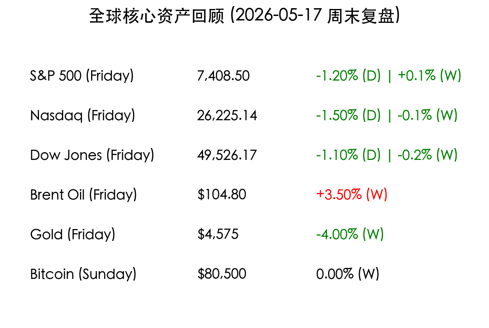
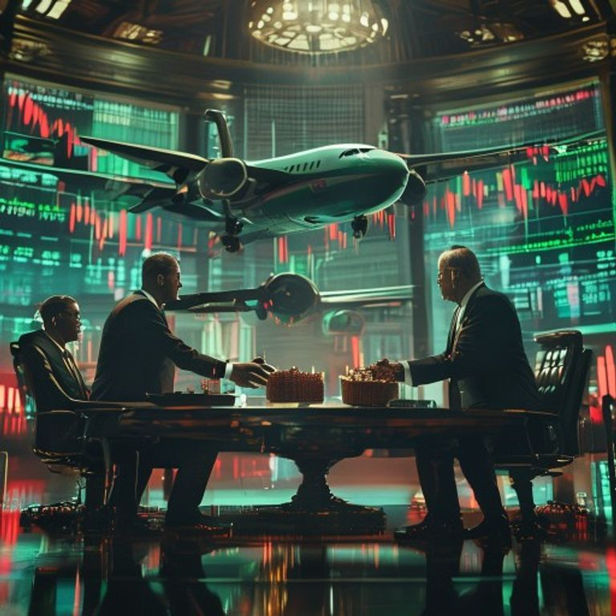

# 全球市场周报：中美峰会落幕释暖意，通胀忧虑下美股高位回调

**日期：2026年05月17日 (星期日)** &nbsp; **时段：周末复盘 (Weekend Review)**

> **核心摘要**：中美北京峰会圆满落幕，双方同意建立贸易与投资委员会并实施互惠关税减让，中方承诺增购波音飞机及农产品。尽管外交层面释放重磅利好，但美股周五受 3.8% 的超预期 CPI 影响出现高位回撤。地缘局势致布伦特原油全周上涨 3.5%，市场目光现已转向下周的英伟达财报。

## 核心资产周度/日度表现回顾

*   **S&P 500**：周五收报 **7,408.50点** (-1.2%)，全周微涨 **+0.1%**，勉强维持连续第七周上涨的记录。
*   **Nasdaq Composite**：周五收报 **26,225.14点** (-1.5%)，全周微跌 **-0.1%**，科技股在高位出现获利了结压力。
*   **Dow Jones**：周五收报 **49,526.17点** (-1.1%)，全周下跌 **-0.2%**。
*   **布伦特原油**：全周大涨 **3.5%** 至 **$104.80/桶**，霍尔木兹海峡局势僵持不下，供应溢价持续维持。
*   **黄金 (Gold)**：全周暴跌 **-4%** 至 **$4,575/盎司**，受印度提高进口关税（由 6% 至 15%）及美联储加息预期升温双重打击。
*   **比特币 (BTC)**：收报 **$80,500**，全周基本持平。$82,000 关口表现出极强抛压，形成典型的“三重顶”技术形态。

## 过去 48 小时重磅事件深度复盘

> 1. **中美北京峰会达成务实成果**：特朗普总统与习近平主席在北京的会晤超预期达成多项协议。双方宣布建立“贸易委员会”与“投资委员会”，并原则上同意对包括大豆、玉米在内的农产品实施互惠关税减让。中国承诺购买至少 200 架波音客机，美方则保证通用电气等厂商对中方民航发动机的供应。尽管细节仍待敲定，但这为全球经贸稳定性注入了急需的强心针。
> 2. **美国通胀“二度抬头”挑战美联储**：4 月 CPI 同比加速至 3.8%，核心指标亦高于预期。市场目前对美联储 2026 年底前再次加息 25 个基点的定价概率已升至 64%。这一预期变化直接导致周五美债收益率飙升，30 年期美债触及 2007 年以来最高水平。
> 3. **霍尔木兹“能源咽喉”危机僵持**：特朗普拒绝了伊朗的和平方案，中东航道依然受阻。布伦特原油站稳 100 美元上方，正在成为全球通胀的主要推手。油价的持续高企不仅打击了消费信心，也让即将发布的制造业 PMI 数据蒙上阴影。

## 下周全球宏观大事预警

*   **英伟达 (NVIDIA) 财报 (5月20日)**：被视为“AI 狂欢”的终极试金石。在标普 500 涨幅高度集中于“巨头七姐妹”的背景下，英伟达的业绩将决定美股能否结束当前的疲软。
*   **美联储 4 月会议纪要 (5月21日)**：市场将通过纪要窥探官员们对 3.8% 通胀率的真实态度，以及内部对于重启加息的讨论激烈程度。
*   **中国 5 月 LPR 报价**：关注央行在出口韧性与消费疲软之间如何通过利率杠杆进行结构性调节。

## 顶级机构周末策略内参摘要

*   **高盛 (Goldman Sachs)**：指出当前市场“头重脚轻”特征明显，前七大科技股贡献了标普 500 今年一半以上的涨幅。建议投资者在英伟达财报前适度配置防御性板块，警惕 AI 叙事的回撤风险。
*   **中金公司 (CICC)**：认为中美峰会的成果对 A 股半导体及农业板块构成实质性利好。随着中国 PPI 创 45 个月新高，中国可能正走出通缩阴影，建议关注受益于再通胀逻辑的工业蓝筹。
*   **摩根大通 (J.P. Morgan)**：强调原油价格是下半年全球宏观的核心变量。若布伦特原油持续在 $100 以上震荡，全球主要央行的减息路径将彻底被封死。

## 今日市场情绪：【峰会后的宁静与数据的轰鸣】

> Prompt: Cyberpunk style, A high-stakes summit in a grand hall with two powerful leaders (real persons) shaking hands across a table. On the table are models of Boeing planes and baskets of soybeans. In the background, large digital screens show fluctuating stock market charts with red and green candles., masterpiece, high detail, intricate composition, cinematic lighting, 8k resolution

---
**免责声明**：内容仅供参考，不构成投资建议。市场有风险，投资需谨慎。
