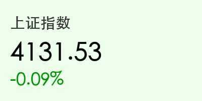
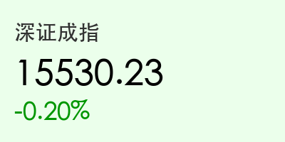
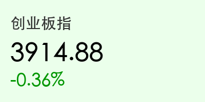
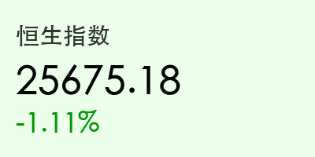
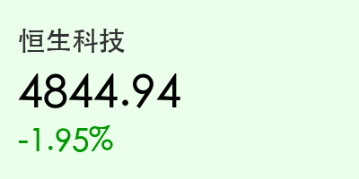

# 每日市场观察：收盘博弈与政策脉动
**日期：2026年05月18日 (星期一)** &nbsp; **时段：晚间收盘**

> **核心摘要**：今日 A 股市场震荡整理，科创板逆市走强，存储芯片板块受利好刺激爆发。港股受美债收益率上升及地缘政治影响录得三连跌。央行维持公开市场利率平稳，中俄元首会晤在即，市场聚焦新质生产力与高水平开放。

## 核心行情复盘
今日 A 股与港股走势分化。A 股主要指数小幅回落，但成交依然活跃，科创 50 指数在存储芯片带动下表现亮眼。

*   **上证指数**：收报 **4131.53 点**，微跌 **0.09%**。
*   **深证成指**：收报 **15530.23 点**，下跌 **0.20%**。
*   **创业板指**：收报 **3914.88 点**，下跌 **0.36%**。
*   **科创 50**：收报 **1709.96 点**，上涨 **0.81%**。
*   **成交额**：三市合计成交 **2.92 万亿元**，较前一交易日缩量约 4500 亿元。

港股市场表现疲软：
*   **恒生指数**：收报 **25675.18 点**，下跌 **1.11%**。
*   **恒生科技**：收报 **4844.94 点**，下跌 **1.95%**。

## 核心解读与市场逻辑
> 今日市场呈现“沪强深弱、科创领涨”的特征。存储芯片板块受行业缺货预期及长鑫科技 IPO 相关消息刺激集体爆发，成为全场焦点。
> 港股方面，受美债收益率飙升及外部地缘政治因素影响，科网股与内房股普遍承压。
> 尽管成交额跌破 3 万亿大关，但市场人气依然维持在高位，板块轮动加快，显示出资金在寻找新的进攻方向。

## 政策脉动
*   **央行操作**：今日开展 10 亿元 7 天期逆回购，利率维持在 **1.40%**。货币政策执行报告强调“适度宽松”与“价格型调控”。
*   **证监会动态**：副主席李超强调深化北交所改革，支持上市公司补链强链，引导资源向**新质生产力**领域集聚。
*   **高水平开放**：证监会国际司表示将稳步扩大制度型开放，增强跨境监管合作。

## 最新机构观点
*   **中信建投**：认为 A 股牛市行情仍将继续，建议重点关注 **AI、光模块、电网设备及人形机器人**。
*   **华西证券**：提出“夏季攻势”预期，认为震荡蓄势后 A 股将迎来新一轮上行。
*   **中信证券**：看好“AI+能化”及“AI+资源”的结构性机会，提醒警惕海外长端利率联动风险。

## 今日市场情绪：科技引领，蓄势待发
今日市场情绪虽受外部因素干扰略有波动，但科创板的强势表现为市场注入了强心针。中俄元首会晤的预期以及新质生产力政策的持续落地，为投资者提供了明确的布局方向。

> Prompt: Cyberpunk style, A high-tech silicon orchard where glowing storage chip flowers are blooming with neon blue light. In the background, a majestic golden dragon and a powerful bear are walking side by side on a path made of silver circuit boards under a twilight sky filled with floating stock market data particles. A human trader (real person) is observing the scene from a balcony.

免责声明：内容仅供参考，不构成投资建议。
