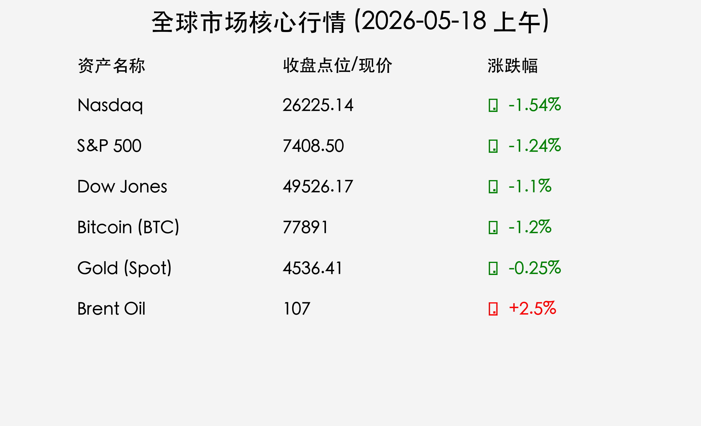

# 2026年5月18日国际市场早报：地缘风险与 AI 浪潮的博弈
**日期：2026年05月18日 (星期一)** &nbsp; **时段：上午 (新周展望)**

> **核心摘要**：中东局势升级与霍尔木兹海峡封锁风险推升油价至 107 美元，上周五美股集体收跌。本周市场聚焦 NVIDIA Q1 财报，作为全球首家 5 万亿美元市值公司，其业绩将决定 AI 赛道的下一步走向。

## 周末财经要闻终极汇总

> **核心行情数据回顾 (截至5月15日收盘)**
> * **Nasdaq Composite**：**26,225.14** (-1.54%)
> * **S&P 500**：**7,408.50** (-1.24%)
> * **Dow Jones**：**49,526.17** (-1.10%)
> * **Bitcoin (BTC)**：**$77,891** (-1.20%)
> * **Gold (黄金现货)**：**$4,536.41** (-0.25%)
> * **Brent 原油**：**$107/桶** (+2.5% 估算)

> **地缘政治：中东局势与能源冲击**
> 过去 48 小时，中东地缘政治危机显著升级，市场对霍尔木兹海峡可能关闭的担忧加剧。布伦特原油价格已攀升至 **107 美元/桶**。能源成本的激增正在引发新一轮的全球通胀担忧，尽管近期美国 CPI 数据显示通胀依然具有粘性。

> **美中关系：北京峰会结果参杂**
> 特朗普总统与习主席在北京的会晤结束，虽然双方在波音飞机订单上达成协议，但在解决地区冲突和长期贸易紧张局势方面进展有限，市场情绪保持谨慎。

## 新一周市场核心博弈逻辑

1. **NVIDIA 财报定调**：NVIDIA 即将公布 Q1 财报。作为 AI 基础设施的领头羊，其业绩表现不仅关乎半导体行业，更是全球 AI 投资热潮的“定海神针”。
2. **通胀与利率预期**：由于 10 年期美债收益率逼近 **4.5%**，且能源价格高企，市场对美联储 2026 年降息的预期进一步推后。
3. **避险资产需求**：黄金价格维持在 **4536 美元/盎司** 的历史高位，反映出投资者对冲突升级和通胀失控的对冲需求。

## 本周重磅经济数据与会议前瞻

*   **财报**：**NVIDIA (Q1)**、Marks & Spencer、easyJet。
*   **经济数据**：英国 4 月通胀数据、英国 GDP 修正值、美国零售销售数据。
*   **市场动态**：关注布伦特原油是否突破 110 美元心理关口。

## 头部券商/投行开盘策略点睛

*   **高盛 (Goldman Sachs)**：认为当前市场正处于“右尾风险”极高的状态。尽管短期受油价压制，但若 NVIDIA 财报超预期，可能触发空头挤压，带动纳指强劲反弹。
*   **中金公司 (CICC)**：建议关注“避险+成长”的双主线。在地缘风险未消除前，持有黄金与能源股；同时利用回调机会布局具有确定性业绩支撑的 AI 核心龙头。

## 今日市场情绪：危机中的博弈与期待

> Prompt: Surrealism style, A majestic mechanical phoenix made of glowing green laser circuits soaring high above a dark, turbulent ocean with massive stormy waves shaped like red stock market candles. In the background, a distant silhouette of a tanker ship navigating the storm. Dramatic lighting, epic scale, cinematic composition., masterpiece, high detail, intricate composition, cinematic lighting, 8k resolution

---
免责声明：内容仅供参考，不构成投资建议。
