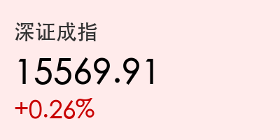
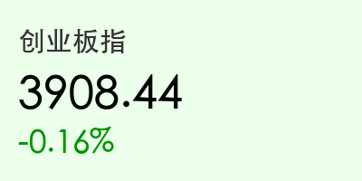
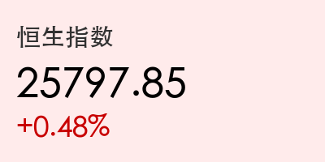
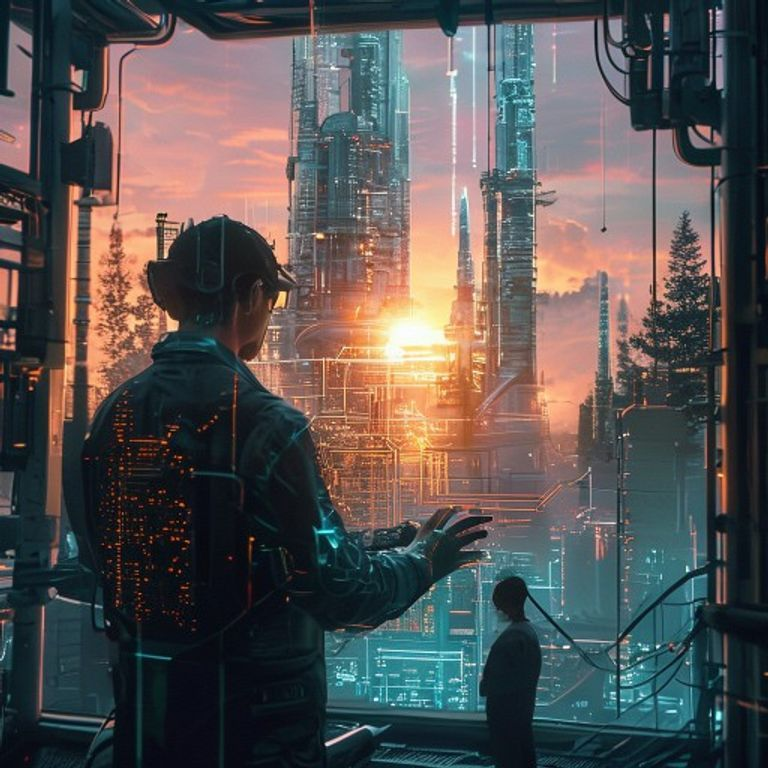

# 每日市场观察：科创领涨与政策红利
**日期：2026年05月19日 (星期二)** &nbsp; **时段：晚间收盘**

> **核心摘要**：今日 A 股上演午后大逆转，科创 50 指数在半导体与电力板块带动下暴涨 3.81%，创下收盘历史新高。李强总理调研 AI + 先进制造业，叠加发改委法治护航民营经济政策，市场信心显著回升，两市成交额维持在 2.89 万亿元的高位。

## 核心行情复盘
今日 A 股与港股集体走强。A 股午后在科创板的带领下展开强劲反弹，沪指成功收复 4100 点并站上 4160 点。

*   **上证指数**：收报 **4169.54 点**，上涨 **0.92%**。
*   **深证成指**：收报 **15569.91 点**，上涨 **0.26%**。
*   **创业板指**：收报 **3908.44 点**，下跌 **0.16%**。
*   **科创 50**：收报 **1775.13 点**，大涨 **3.81%**。
*   **成交额**：两市全天成交约 **2.89 万亿元**。

港股市场稳步上行：
*   **恒生指数**：收报 **25797.85 点**，上涨 **0.48%**。
*   **恒生科技**：收报 **4857.46 点**，上涨 **0.26%**。

## 核心解读与市场逻辑
> 今日市场的主旋律是“科技创新与政策加码”。科创 50 的爆发主要受两方面驱动：一是李强总理在北京调研时强调推动人工智能与先进制造业深度融合，直接点燃了市场对 AI 硬件、半导体及机器人板块的热情；二是半导体行业自身景气度回升，主力资金大规模流入芯片产业链。
> 此外，电力板块作为 AI 算力的基础保障，今日也掀起涨停潮。尽管锂矿、石油等周期板块表现较弱，但全场超 3600 只个股上涨的态势反映了极强的赚钱效应。

## 政策脉动
*   **民营经济保护**：国家发改委印发《“法治护航民营经济”行动方案》，明确将通过法治手段优化企业环境，提振企业家信心。
*   **小微金融服务**：金融监管总局发布通知，要求 2026 年做好小微企业金融服务，确保信贷投放稳步增长。
*   **算力网建设**：丁薛祥副总理调研强调加快形成全国“一张网”算力体系，为科技强国夯实底座。
*   **资本市场改革**：证监会表态将加大力度推进北交所深化改革。

## 最新机构观点
*   **中信证券**：维持“结构性牛市”判断，认为 AI 算力主线远未泡沫化。建议遵循“景气为纲”，关注半导体、光通信及复苏驱动的新能源赛道。
*   **中金公司**：深度看好“算电协同”趋势。上调华虹半导体等硬科技龙头目标价，并指出市场风格轮动将因 AI 革命而更加频繁。
*   **高盛**：虽然对全球宏观风险持审慎态度，但对中国互联网巨头的 AI 代理策略感到鼓舞，认为券商行业在结构性变化中具备显著机遇。

## 今日市场情绪：智造领航，科创巅峰
今日市场情绪高涨，科创板的史诗级表现显示出资金对硬科技方向的高度共识。政策面在法治保护、金融支持和前沿调研等多维发力，预示着市场正进入由“政策红利+科技突破”双驱动的上升新阶段。

> Prompt: Cyberpunk style, A digital divine architect with crystalline hands is weaving glowing semiconductor circuits into the steel frame of a giant futuristic factory. In the background, a sunrise illuminates a forest of high-tech spires, symbolizing the fusion of intelligence and industry. A human trader (real person) is observing the scene from a control room. Cinematic lighting, cyberpunk aesthetic, high detail., masterpiece, high detail, intricate composition, cinematic lighting, 8k resolution

免责声明：内容仅供参考，不构成投资建议。
