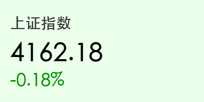
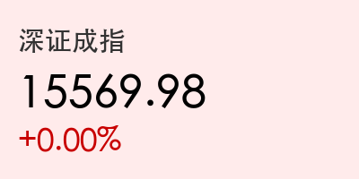
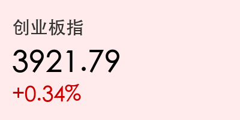
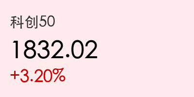
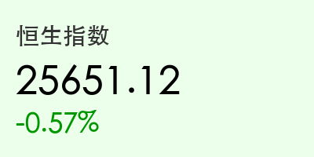
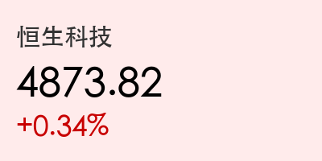

# A股分化：科创50暴涨3.2%创历史新高，半导体掀涨停潮，电力板块高位杀跌

**日期：2026年05月20日 (星期三)** &nbsp; **时段：晚间收盘 (国内市场复盘)**

> **核心摘要**：今日 A 股上演极端结构性行情，科创 50 指数在半导体与存储芯片产业链带动下狂飙 3.2%，刷新历史新高。中芯国际大涨 12%，大基金三期预期与阿里平头哥新 AI 芯片发布点燃硬科技热情。沪指受电力板块集体调整压制小幅走弱，两市成交额维持在 2.95 万亿元的天量水平。

## 核心行情复盘
今日 A 股三大指数走势分化，港股小幅回调。科创板成为全场焦点，半导体板块掀起涨停潮。

*   **上证指数**：收报 **4162.18 点**，下跌 **0.18%**。
*   **深证成指**：收报 **15569.98 点**，上涨 **0.00%**。
*   **创业板指**：收报 **3921.79 点**，上涨 **0.34%**。
*   **科创 50**：收报 **1832.02 点**，大涨 **3.20%**。
*   **成交额**：沪深两市全天成交约 **2.95 万亿元**。

港股市场表现相对疲软，受美债收益率攀升压制：
*   **恒生指数**：收报 **25651.12 点**，下跌 **0.57%**。
*   **恒生科技**：收报 **4873.82 点**，上涨 **0.34%**。

## 核心解读与市场逻辑
> 今日市场的主旋律是“算力主权与存储崛起”。科创板的爆发受三重利好共振：首先，国家大基金三期落地预期进一步强化，资金疯狂涌入中芯国际、华虹公司等晶圆代工巨头；其次，阿里平头哥发布新一代训推一体 AI 芯片“真武M890”，性能实现跨代飞跃，直接刺激了国产算力链；最后，长江存储与长鑫科技 IPO 进程加速，标志着国产存储芯片进入全球竞争新阶段。
> 与之形成鲜明对比的是，前期涨幅巨大的电力板块今日遭遇剧烈洗盘，多只电力股触及跌停，反映了高位抱团资金的松动与调仓。市场呈现明显的“弃旧迎新”特征。

## 政策脉动
*   **大基金三期落地**：市场传闻国家大基金三期募资已基本完成，规模超预期，重点投向先进制程及存储芯片。
*   **AI 硬件支持**：相关部门重申将加大对算力中心关键零部件本土化的支持力度，确保供应链安全。
*   **资本市场改革**：证监会表态支持符合条件的科技创新企业在科创板上市，长江存储 IPO 辅导工作正式启动。

## 最新机构观点
*   **中信证券**：认为 AI 浪潮下服务器功率提升及 800V 等技术升级，正驱动 MLCC 及存储芯片进入新一轮涨价和景气上行周期，继续看好本土硬科技龙头。
*   **中金公司**：深度看好“算电协同”下的算力调度软件价值，并指出券商行业并购重组（如东兴与信达证券合并）将为资本市场注入长期流动性。
*   **高盛**：对 AI 主题维持“买入”评级，但提醒投资者警惕低质量 AI 相关股票的估值泡沫，建议聚焦具备实质性业绩支撑的算力基础标的。

## 今日市场情绪：创世织机，科技涅槃
今日市场情绪处于高度兴奋状态，科创板的史诗级新高象征着国产半导体产业链的“成人礼”。投资者在电力股的撤退与半导体的狂欢中完成了筹码的华丽置换，科技自主化已成为当前市场的核心共识。

> Prompt: A majestic celestial architect in traditional Chinese robes, glowing with digital light, is weaving intricate golden semiconductor circuits into the fabric of space. In the background, massive crystalline memory towers are rising from a sea of data clouds. Cyberpunk aesthetic, cinematic lighting, 8k resolution, intricate details.

---
免责声明：内容仅供参考，不构成投资建议。
