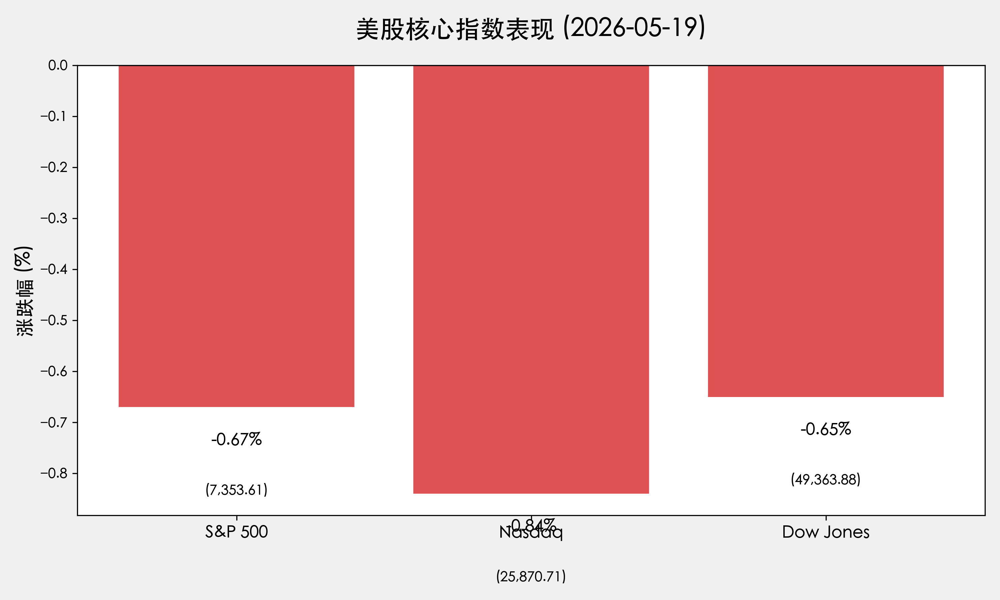
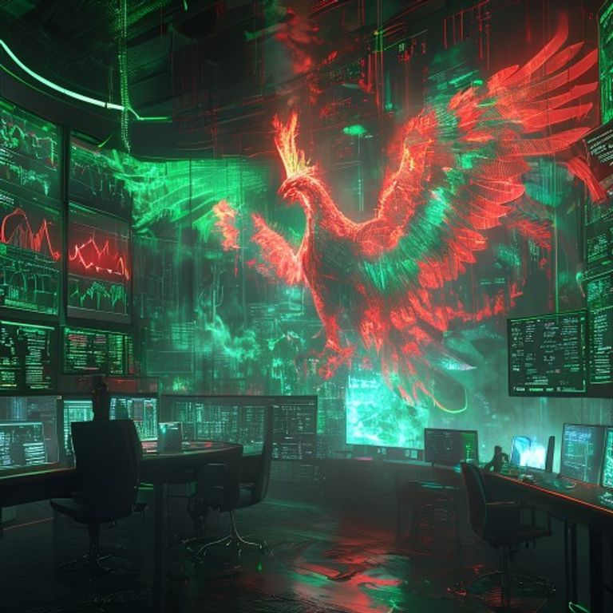

# 全球市场早报：债市风暴压制科技股，英伟达财报成最后稻草

**日期：2026年05月20日 (星期三)** &nbsp; **时段：早报 (国际市场复盘)**

> **核心摘要**：美债收益率飙升至16个月高位，压制纳指连续三日回调。地缘政治紧张局势推高油价，通胀忧虑加剧。全市场静待英伟达财报，AI板块出现显著“调仓”迹象。

## 核心行情复盘

周二美股全线收跌，三大指数跌幅均超过0.6%。受美债收益率持续攀升影响，科技股承受较大抛压。

* **S&P 500**：收于 **7,353.61** 点，下跌 **0.67%**。
* **Nasdaq Composite**：收于 **25,870.71** 点，下跌 **0.84%**。
* **Dow Jones**：收于 **49,363.88** 点，下跌 **0.65%**。
* **10年期美债收益率**：一度触及 **4.7%** 的16个月高点。
* **大宗商品**：WTI原油报 **108.59** 美元/桶，布伦特原油报 **111** 美元/桶，地缘政治溢价显著。

> **行情洞察**：债市的“噪音”正在转化为股市的“信号”。随着30年期美债收益率突破5.19%，市场对“更高更久”的利率环境已形成共识。昨日盘中，威瑞森（Verizon）与默克（Merck）等防御型标的表现坚挺，而思科（Cisco）与3M则领跌道指。

## 核心解读与市场逻辑

1. **债市风暴再起**：10年期美债收益率攀升至4.7%，直接冲击成长股估值。在通胀数据（4月CPI 3.8%）超预期后，投资者开始修正对美联储减息的预期。
2. **“英伟达大考”**：英伟达将于今日（周三）收盘后公布财报。作为AI牛市的“定海神针”，其表现将决定短期内市场是延续回调还是重拾升势。昨日AI板块出现获利回吐，反映了市场在重大不确定性前的谨慎态度。
3. **地缘政治与通胀**：中东局势的持续动荡使得油价维持在110美元关口附近，这被视为对全球经济的一种“隐形征税”，并加剧了通胀的粘性。

## 政策脉动

* **美联储人事更替**：市场正密切关注从鲍威尔到 **凯文·沃什 (Kevin Warsh)** 的领导层过渡。沃什的鹰派预期正在升温，部分交易员已开始押注7月或12月可能出现意外加息。
* **通胀目标韧性**：费城联储主席安娜·保尔森（Anna Paulson）昨日重申，通胀依然“过高”，美联储必须保持限制性政策以达成2%的长期目标。

## 最新机构观点

* **高盛 (Goldman Sachs)**：对后市持“建设性但谨慎”态度。分析师指出当前标普500的席勒市盈率已达39.6倍，风险偏好处于历史高位，虽然牛市格局未变，但短期回调概率正在增加。
* **摩根士丹利 (Morgan Stanley)**：首席投资官迈克·威尔逊（Mike Wilson）继续唱多2026年美股，给予标普500年终目标位 **7,800** 点。他认为AI驱动的生产力提升将抵消能源价格上涨的影响，并预测2026年美股盈利将增长23%。

## 今日市场情绪：英伟达阴影下的涅槃期待

今日市场情绪处于极度紧绷的状态。投资者一方面被红色的行情图和高企的利率所压制，另一方面又对AI龙头的业绩抱有最后一丝逆转乾坤的希望。

> Prompt: A high-tech futuristic trading room filled with holographic screens displaying red market charts. In the background, a giant emerald-green digital phoenix is emerging from a sea of data clouds, its wings glowing with artificial intelligence patterns. Tense atmosphere, cyberpunk aesthetic, high detail.

---
免责声明：内容仅供参考，不构成投资建议。
