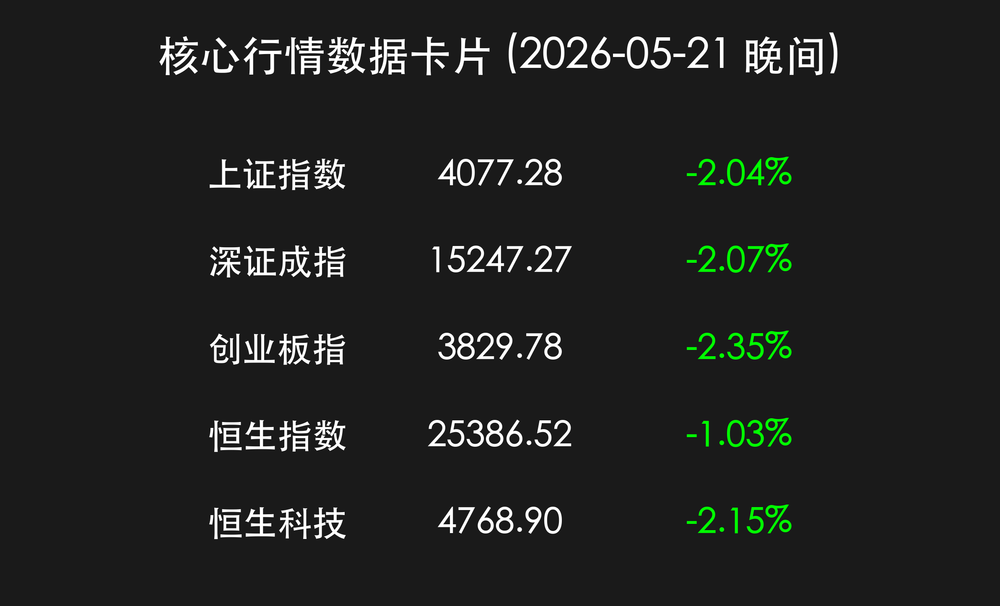
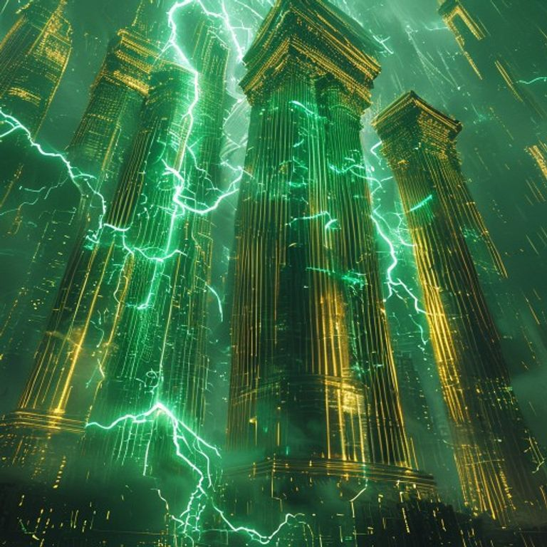

# A股重挫：科创50大跌4.4%回吐前期涨幅，3.5万亿成交创天量，银行避险板块独秀

**日期：2026年05月21日 (星期四)** &nbsp; **时段：晚间收盘 (国内市场复盘)**

> **核心摘要**：今日 A 股与港股市场遭遇剧烈回调，科创 50 指数在半导体板块主力资金大举撤离下重挫 4.42%。两市成交额放大至史无前例的 3.51 万亿元，呈现高位放量普跌态势。尽管中美经贸磋商达成初步减税成果，且证券印花税收大增，但仍难抵获利回吐压力。避险资金流向大型银行，建设银行股价创历史新高。

## 核心行情复盘

今日市场在经历了前期的持续狂热后，迎来了一场深度的“获利盘大清洗”。三大指数集体低开低走，尾盘跌幅进一步扩大。

*   **上证指数**：收报 **4077.28 点**，下跌 **2.04%**。
*   **深证成指**：收报 **15247.27 点**，下跌 **2.07%**。
*   **创业板指**：收报 **3829.78 点**，下跌 **2.35%**。
*   **科创 50**：表现最弱，收盘大跌 **4.42%**，基本回吐本周前两日涨幅。
*   **成交额**：沪深京三市成交额总计达 **3.51 万亿元**，较前一交易日放量 5300 亿元。

> **行情洞察**：今日市场的极端放量下跌，标志着前期过度拥挤的硬科技赛道进入了剧烈的筹码置换期。尽管指数层面看起来惨淡，但三市超过 3.5 万亿的成交额证明场外资金接力欲望依然存在，只是风格正从单一的“进攻”转向“防御+结构性博弈”。

## 核心解读与市场逻辑

1.  **半导体板块高位“大放血”**：受昨日英伟达财报利好出尽及获利盘了结影响，今日半导体板块主力资金净流出达 **280.8 亿元**。科创板作为前期硬科技的领涨阵地，今日承受了最强的抛压。
2.  **“避险圣杯”银行股**：在科技股哀鸿遍野之际，银行板块逆势走强，发挥了市场稳定器的作用。**建设银行**股价在今日震荡中创下历史新高，反映了长线避险资金对高股息红利资产的青睐。
3.  **中美经贸曙光初现**：政策面传来重大进展，中美原则同意对等规模（各300亿美元或更多）产品进行降税，且中方将引进200架波音飞机。这一消息在早盘一度带动外向型板块回升，但随后被大盘整体的卖压吞没。
4.  **财政数据透底市场热度**：财政部最新数据显示，1-4月证券交易印花税收入 **935 亿元**，同比大增 **74.8%**，从数据端坐实了 2026 年以来资本市场交投热度的跨越式提升。

## 政策脉动

*   **央行流动性投放**：中国人民银行今日开展 **1000 亿元** 7 天期逆回购操作，利率维持 1.40%，确保市场流动性平稳度过波动期。
*   **证监会“重拳出击”**：证监会宣布启动新“国九条”以来第三轮“打假”专项行动，重点打击虚假信息披露与操纵市场，旨在维护这一轮“科技牛”的制度底色。
*   **并购重组加速**：证监会支持上市公司通过并购重组“补链强链”，制度效率显著提升，多起科技类重组在 10 个工作日内获批。

## 最新机构观点

*   **中信证券 (CITIC)**：认为 AI 算力产业链尚未进入泡沫期，今日的回调更多是由于前期涨势过快带来的技术性修正。建议关注具备业绩支撑的“复苏牛”品种。
*   **中金公司 (CICC)**：强调可持续发展与绿色金融的重要性。同时指出，MSCI 中国指数半年度检讨将于 5 月 29 日生效，预计将吸引新的海外增量资金对冲今日的抛压。
*   **申万宏源**：指出 3.5 万亿成交额预示着市场分歧达到顶峰，短期建议规避高位题材股，寻找有防御属性的红利价值资产进行对冲。

## 今日市场情绪：惊雷四起，金石为开

今日市场情绪由昨日的“高度亢奋”瞬间转为“极度谨慎”。半导体板块的剧烈震荡如同夏日惊雷，而银行股的坚挺则如顽石，在数字化风暴中屹立不倒。

> Prompt: A landscape of towering golden banking pillars standing resiliently in a digital storm. Swirling green lightning bolts shaped like circuit boards are striking the ground, representing the semiconductor sell-off. The pillars are steadfast and majestic. Cyberpunk aesthetic, cinematic lighting, 8k resolution, intricate details.

---
免责声明：内容仅供参考，不构成投资建议。
