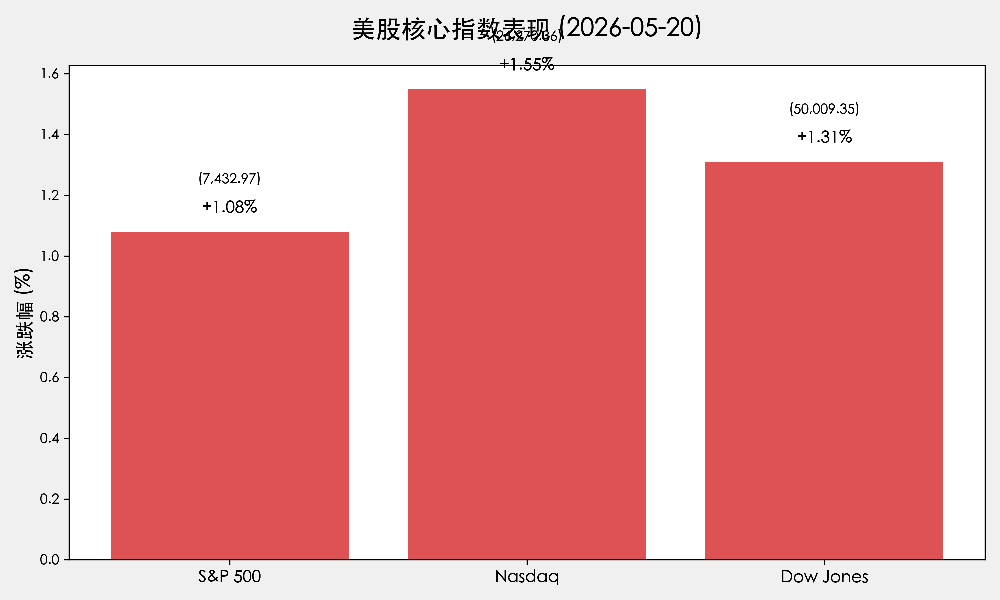

# 全球市场早报：英伟达财报狂欢与中东和平曙光双击，美股三大指数止步三连跌

**日期：2026年05月21日 (星期四)** &nbsp; **时段：早报 (国际市场复盘)**

> **核心摘要**：英伟达 Q1 财报全面碾压预期，营收激增 85% 开启“智能体 AI”时代；同时，特朗普宣布美伊谈判进入最后阶段，油价应声暴跌 5%，债市收益率回落，全球风险偏好显著回升。

## 核心行情复盘

周三美股走出三连跌阴霾，三大指数集体强力反弹。地缘政治局势的意外转机与科技龙头的亮眼财报形成了完美的“多头共振”。

* **S&P 500**：收于 **7,432.97** 点，上涨 **1.08%**。
* **Nasdaq Composite**：收于 **26,270.36** 点，上涨 **1.55%**。
* **Dow Jones**：收于 **50,009.35** 点，上涨 **1.31%**，历史首次收于 5 万点大关之上。
* **10年期美债收益率**：大幅回落 10 个基点至 **4.569%**，债市压力显著缓解。
* **大宗商品**：WTI 原油报 **98.26** 美元/桶，跌破 100 美元关口；黄金反弹至 **4,543.35** 美元/盎司。
* **加密货币**：比特币站稳 **77,219** 美元，涨幅 **1.2%**。

> **行情洞察**：市场在经历了一周的阴云密布后，终于迎来了“拨云见日”的时刻。5 万点的道指不仅是心理关口的突破，更是对美伊冲突可能降温的“解脱交易”体现。

## 核心解读与市场逻辑

1. **英伟达“核弹级”财报**：英伟达盘后公布财报，营收 **816 亿美元**（预期 792 亿），数据中心收入 **752 亿美元**。公司宣布股息翻倍并授权 **800 亿美元** 回购。黄仁勋强调 **“智能体 AI (Agentic AI)”** 将驱动下一波工业革命，并推出 **Vera Rubin 平台**。这一表现彻底扫清了市场对 AI 增长见顶的疑虑。
2. **“和平红利”突袭**：特朗普宣布美伊谈判进入“最后阶段”，这是昨日市场最大的意外利好。原油价格的剧烈向下波动（-5.7%）直接缓解了全球通胀担忧，推动美债收益率快速下行，为成长股释放了估值压力。
3. **5万点时代的开启**：道指站上 50,000 点反映了资金从单一科技股向价值蓝筹的扩散。随着能源成本下降预期增强，工业、航空及消费板块昨日表现优异。

## 政策脉动

* **通胀预期降温**：随着油价大跌，市场对下月 CPI 数据的预期开始下调。
* **美联储观察**：凯文·沃什（Kevin Warsh）领导下的联储独立性受到关注，但随着地缘风险降低，市场开始押注联储可能会在三季度释放更明确的“软着陆”信号。

## 最新机构观点

* **摩根大通 (J.P. Morgan)**：分析师认为，英伟达的财报证明了 AI 投资并非泡沫，而是真正的生产力革命。将英伟达目标价上调至 **$1,400**。
* **布莱克石 (Blackstone)**：地缘政治的缓和将为全球供应链提供喘息之机，预计二季度全球 GDP 增长将因能源成本下降而额外贡献 0.2%。
* **中信证券**：外盘风险偏好的修复将利好 A 股开盘，特别是“算电协同”相关资产有望迎来补涨。

## 今日市场情绪：和平与算力的交响乐

今日市场情绪由“紧绷”转为“亢奋”。地缘政治阴霾的消散与科技龙头的强势表现，让投资者重燃对 2026 年牛市下半场的期待。

> Prompt: A futuristic peaceful desert landscape where two colossal stone hands are finally shaking each other amidst swirling sandstorms that are starting to clear. In the sky, a constellation shaped like a circuit board representing AI is glowing brightly, casting a soft blue light on the scene. Cinematic lighting, hope and relief, high detail, digital art.

---
免责声明：内容仅供参考，不构成投资建议。
