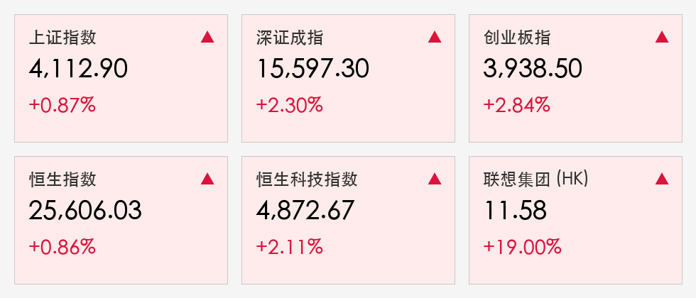

# A股反弹：科技成长全线爆发，联想暴涨19%领衔港股回升，和平红利预期点燃市场

**日期：2026年05月22日 (星期五)** &nbsp; **时段：晚报 (国内市场复盘)**

> **核心摘要**：在经历昨日放量大跌后，A股今日迎来强劲修复性反弹，创业板指大涨2.84%。中东和平谈判利好及国产大模型政策催化，资金大幅回流AI算力与半导体赛道，联想集团因财报优异及AI预期大涨19%。

## 核心行情复盘

周五A股与港股市场双双反弹，科技成长板块表现尤为亮眼。尽管两市成交额较昨日有所缩量，但仍维持在2.9万亿元的高位。

* **上证指数**：收报 **4112.90** 点，上涨 **0.87%**。
* **深证成指**：收报 **15597.30** 点，上涨 **2.30%**。
* **创业板指**：收报 **3938.50** 点，大涨 **2.84%**。
* **恒生指数**：收报 **25606.03** 点，上涨 **0.86%**。
* **恒生科技指数**：收报 **4872.67** 点，上涨 **2.11%**。
* **领涨板块**：**PCB、CPO、半导体、机器人、超级电容**等科技赛道全线爆发。
* **领跌板块**：白酒、证券、机场航运等蓝筹防御板块表现疲软。

> **行情洞察**：今日行情特征为“科技主线回归”。在昨日高位放量调整后，短线获利盘已得到初步消化。资金迅速回流AI算力与国产芯片，显示出市场对科技成长逻辑的坚定信心。

## 核心解读与市场逻辑

1. **超跌修复与情绪扭转**：昨日市场的非理性跳水被视为一次暴力的“洗盘”。随着今日市场缩量反弹，市场普遍认为昨日的过度恐慌已得到修正，中期上升趋势未改。
2. **科技政策催化**：国家发改委指导国产大模型适配国产算力芯片，这一重磅信号直接点燃了国产半导体和AI产业链的投资热情。
3. **和平红利溢价**：美伊谈判的积极进展导致国际油价跳水，有效缓解了全球通胀压力和流动性收紧预期，提振了亚太市场的风险偏好。

## 政策脉动

* **算力自主可控**：发改委的最新指导意见明确了国产芯片在AI大模型应用中的核心地位，预计后续将有更多针对国产算力集群的财政补贴和税收优惠出台。
* **产业升级导向**：官方媒体发文强调，应通过“AI+”赋能传统制造业，联想集团的强劲表现反映了市场对终端设备智能化升级的高度认可。

## 最新机构观点

* **中金公司 (CICC)**：认为市场已进入“牛市中场”，震荡磨底后将开启由基本面驱动的新一轮行情，重点关注半年报超预期的科技龙头。
* **中信证券 (CITIC)**：指出当前两市成交维持在2.5万亿上方是常态化现象，流动性充裕背景下，科技内部的轮动将是未来获取超额收益的关键。
* **高盛 (Goldman Sachs)**：将中国科技股评级上调至“超配”，认为估值修复尚未结束，尤其是具备AI硬件能力的硬件巨头。

## 今日市场情绪：和平破晓，科技涅槃

今日市场情绪显著回暖。霍尔木兹海峡的和平曙光驱散了能源焦虑，而国产科技的政策利好则为市场注入了强心针。

> Prompt: Surrealism style, A flock of iridescent robotic birds representing tech stocks returning to a lush digital forest made of glowing fiber optic trees after a violent storm. In the background, a massive bridge made of golden light representing the Hormuz peace agreement is being restored over a calm blue sea. A human trader (real person) stands on the shore, looking at the scene with a sense of relief and hope. Masterpiece, high detail, intricate composition, cinematic lighting, 8k resolution.

---
免责声明：内容仅供参考，不构成投资建议。
