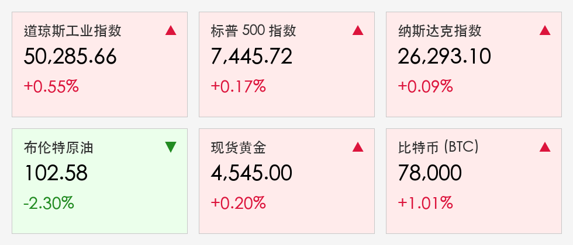

# 全球市场早报：中东和平谈判迎重大突破，道指首登 50,200 点创历史新高

**日期：2026年05月22日 (星期五)** &nbsp; **时段：早报 (国际市场复盘)**

> **核心摘要**：特朗普宣布美伊谈判进入“最后阶段”，霍尔木兹海峡重启预期引发油价继续跳水，标普纳指双双收涨，道指在 IBM 量化突破带动下再创历史新高。SpaceX 披露巨额比特币持仓支撑加密市场。

## 核心行情复盘

周四全球市场延续了风险偏好回升的态势。虽然开盘受沃尔玛疲软财报拖累，但随着能源价格进一步回落和地缘政治传出重大利好，美股三大指数成功实现逆转并集体收红。

* **道琼斯工业指数**：收于 **50,285.66** 点，上涨 **0.55%**，创下收盘历史新高。
* **标普 500 指数**：收于 **7,445.72** 点，上涨 **0.17%**。
* **纳斯达克指数**：收于 **26,293.10** 点，上涨 **0.09%**。
* **10年期美债收益率**：继续回落至 **4.57%**，主要受原油跌价减缓通胀压力驱动。
* **大宗商品**：布伦特原油结算价报 **102.58** 美元/桶，跌幅 **2.3%**；现货黄金微涨至 **4,545.00** 美元/盎司。
* **加密货币**：比特币稳定在 **78,000** 美元附近，SpaceX 披露持仓 18,712 枚 BTC 提振了市场信心。

> **行情洞察**：市场的重心正在从“通胀焦虑”转向“和平红利”。原油从晨间 109 美元的尖峰坠落，标志着地缘政治溢价正在快速挤出。道指的强势表现反映了资金在寻找 AI 之外的新增长引擎（如量子计算）。

## 核心解读与市场逻辑

1. **“最终协议”倒计时**：总统特朗普表示与伊朗的谈判已接近尾声。市场目前最关注的是 **霍尔木兹海峡** 的全面重新开放。若 14 点备忘录顺利签署，全球能源供应瓶颈将彻底打破。
2. **量子计算新边疆**：IBM 大涨 **6%**，GlobalFoundries 飙升 **11%**。政府宣布投入 20 亿美元支持量子产业，这标志着继 AI 之后，科技主权的下一个战场已经开辟。
3. **沃尔玛带来的警示**：尽管大盘上涨，但 **沃尔玛 (-7.3%)** 的谨慎指引提醒投资者，高通胀对底层消费能力的压制依然存在。这在一定程度上限制了消费板块的反弹高度。

## 政策脉动

* **美联储观望**：受地缘局势和能源价格变动影响，联储目前处于数据观察期。油价的回落为三季度降息窗口的打开提供了更多可能性。
* **量子主权战略**：白宫新政明确了量子计算的战略地位，预计后续将有更多配套资金 and 政策落地。

## 最新机构观点

* **高盛 (Goldman Sachs)**：下调布伦特原油预期至 **90 美元**，认为“供应正常化滞后”将是二季度的主旋律。
* **摩根士丹利 (Morgan Stanley)**：将霍尔木兹海峡的重新开放视为“终极催化剂”，预计一旦实现，科技与可选消费板块将迎来史诗级重估。
* **中金公司 (CICC)**：指出全球能源价格回落将减轻中国输入性通胀压力，并加速“绿电”设备对传统能源的替代趋势。

## 今日市场情绪：和平破晓，算力续章

今日市场情绪由“谨慎复苏”转为“信心增强”。霍尔木兹海峡的和平曙光与量子计算的政策东风，共同编织了 2026 年夏季行情的新底色。

> Prompt: A colossal golden gate opening at the Strait of Hormuz, with a radiant sunrise breaking through dark stormy clouds. In the foreground, a high-tech AI avatar is pointing towards the new horizon. Cinematic lighting, hope and relief, high detail, digital art.

---
免责声明：内容仅供参考，不构成投资建议。
