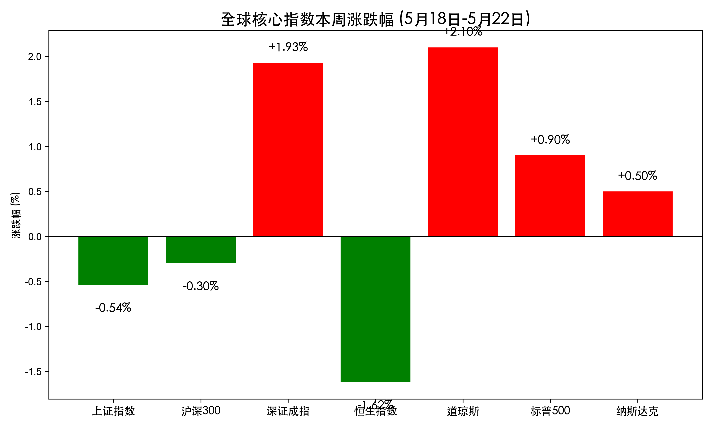
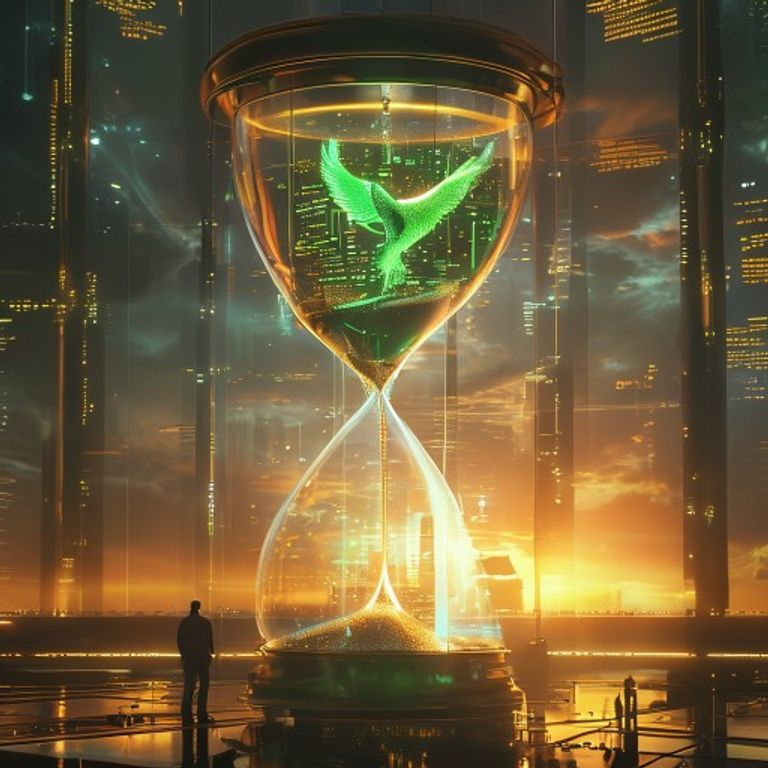

# 全球周评：道指跨越5万点大关，美股八连涨创纪录，A股科技主线强势回归

**日期：2026年05月23日 (星期六)** &nbsp; **时段：周评 (周末复盘)**

> **核心摘要**：本周全球市场见证了多项历史性时刻：道琼斯指数首次站上 50,000 点大关，美股录得八连周涨。尽管联储开启“沃什时代”释放鹰派信号，但英伟达强劲财报与中东和平曙光抵消了宏观焦虑。A股经历高位洗盘后，在国产算力政策催化下于周五实现科技股全面爆发。

## 核心资产周度/日度表现回顾

本周全球市场呈现明显的“先抑后扬”走势。美股在震荡中不断创出新高，而亚太市场则在经历了周初的调整后，于周五迎来强势反弹。

* **道琼斯工业指数**：周五收报 **50,579.70** 点，本周累计上涨 **2.10%**，创下历史新高。
* **标普 500 指数**：收报 **7,473.47** 点，本周累计上涨 **0.90%**，连续八周录得涨幅。
* **纳斯达克指数**：收报 **26,343.97** 点，本周累计上涨 **0.50%**。
* **上证指数**：周五上涨 0.87% 收报 **4,112.90** 点，本周累计微跌 **0.54%**。
* **深证成指**：周五大涨 2.30% 收报 **15,597.30** 点，本周累计上涨 **1.93%**。
* **恒生指数**：周五上涨 0.86% 收报 **25,606.03** 点，本周受地缘溢价回落影响，周度累计下跌 **1.62%**。

> **行情洞察**：本周市场的灵魂在于“确定性的回归”。美股的八连涨证明了由 AI 驱动的盈利周期依然稳固；而 A 股科技板块在经历周四的暴力洗盘后迅速修复，反映出资金对国产替代与算力自主逻辑的高度认可。道指 5 万点的突破不仅是心理关口的跨越，更是市场对美国经济韧性的终极背书。

## 过去 48 小时重磅事件深度复盘

1. **联储进入“沃什时代”**：凯文·沃什（Kevin Warsh）正式宣誓就任美联储主席。虽然此前被视为鹰派，但其上任首日恰逢地缘局势趋缓。4月会议纪要显示的“鹰派漂移”让市场意识到，即便未来降息，其步伐也将极为审慎。
2. **英伟达（Nvidia）财报“保送”行情**：英伟达 Q1 营收突破 816 亿美元，同比暴增 85%。虽然股价在财报后因技术性回调微跌，但其 800 亿美元的超大规模回购计划彻底锁定了科技股的下行空间，为全球 AI 产业链注入了强心针。
3. **中东局势的“最终和平协议”预期**：周五市场传闻美伊双方在霍尔木兹海峡通行权上达成初步谅解。这一预期导致油价显著回落，有效缓解了亚太市场的输入性通胀压力，也是周五港股与 A 股反弹的核心外部动因。
4. **国产算力政策重锤**：国家发改委明确指导国产大模型优先适配国产芯片，这一政策直接推动了周五 A 股半导体、PCB 及 CPO 板块的涨停潮。

## 下周全球宏观大事预警

* **美国阵亡将士纪念日 (周一)**：美股将于 5 月 25 日（周一）休市，预计下周初全球市场交投将趋于清淡。
* **和平协议靴子落地**：市场紧盯美伊和平协议的正式签署时间，一旦正式确认，原油价格可能面临二次下行压力，利好中下游制造业。
* **英伟达股东大会后续效应**：市场将继续消化英伟达关于新一代架构的更多细节，半导体板块的波动率预计将维持高位。

## 顶级机构周末策略内参摘要

* **高盛 (Goldman Sachs)**：**“美国仍是全球资产的避风港”**。维持对标普 500 的建设性看法，并指出黄金在“武器化金融基础设施”背景下具备长期对冲价值，目标价上调至 **5,400 美元/盎司**。
* **摩根士丹利 (Morgan Stanley)**：**“超配美日，警惕信用收缩”**。认为 AI 投资浪潮将支持 S&P 500 在 2027 年中期冲击 **8,300 点**，但提醒投资者关注企业大规模发债筹资对信用债市场的压力。
* **中信证券 (CITIC)**：**“结构性牛市的下半场”**。预判下半年 A 股将开启以“算力牛”和“复苏牛”为核心的结构性行情，建议继续聚焦具备海外扩张能力和核心技术突破的科技领头羊。
* **中金公司 (CICC)**：**“财政主导下的泡沫加速器”**。认为中美两国的财政扩张政策将共同推升权益类资产与大宗商品的价格，形成一种“股债金共舞”的特殊宏观环境。

## 今日市场情绪：跨越巅峰，蓄势待发

当前市场情绪正处于从“地缘焦虑”向“和平红利”转化的关键节点。道指 5 万点的里程碑不仅是财富的增长，更是市场对未来十年技术与政策协同发展的乐观预期。

> Prompt: Surrealism style, A massive golden hourglass standing on a futuristic trading floor, where the sand is replaced by glowing microchips. One side of the hourglass represents the AI boom with a rising green laser phoenix, and the other side represents the geopolitical tension in the Strait of Hormuz with a silhouetted oil tanker. A human trader (real person) stands between them, holding a golden key representing the new Fed leadership, looking towards a radiant sunrise., masterpiece, high detail, intricate composition, cinematic lighting, 8k resolution

---
免责声明：内容仅供参考，不构成投资建议。
