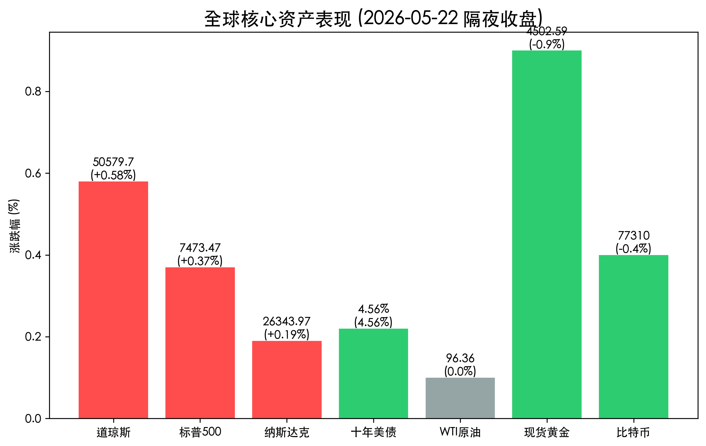
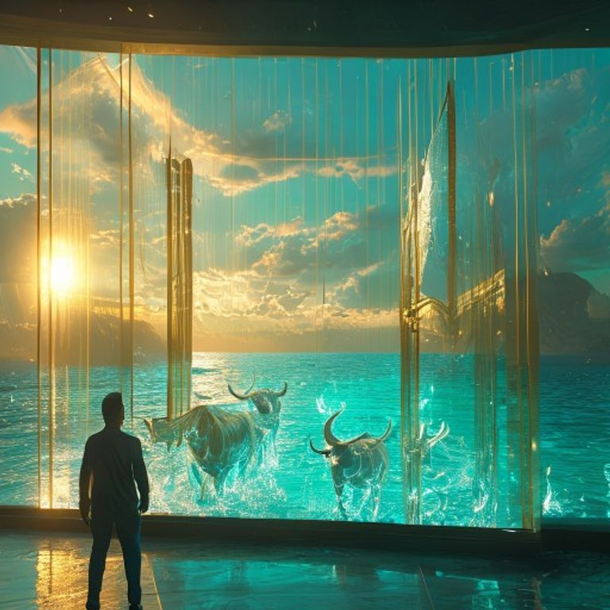

# 全球市场早报：标普纳指八连周涨创纪录，美伊和平协议进入最后通牒倒计时

**日期：2026年05月23日 (星期六)** &nbsp; **时段：早报 (国际市场复盘)**

> **核心摘要**：美股周五全线收高，标普500与纳指录得连续第八周上涨，创下2023年以来最长连涨纪录。市场聚焦美伊“最终和平协议”签署及新任联储主席沃什上任，尽管消费者信心创历史新低，但“和平红利”预期主导了市场情绪。

## 核心行情复盘

周五美股市场在和平谈判的乐观预期中强势收官，道指再创历史收盘新高。尽管日内公布的消费者信心数据疲软，但美债收益率的回落为成长股提供了支撑。

* **道琼斯工业指数**：收报 **50,579.70** 点，上涨 **0.58%**，创下历史新高。
* **标普 500 指数**：收报 **7,473.47** 点，上涨 **0.37%**。
* **纳斯达克指数**：收报 **26,343.97** 点，上涨 **0.19%**。
* **10年期美债收益率**：小幅回落至 **4.56%**。
* **大宗商品**：WTI原油稳定在 **96.36** 美元/桶；现货黄金下跌0.9%至 **4,502.59** 美元/盎司，受美元走强压制。
* **加密货币**：比特币报 **77,310** 美元左右，市场在“比特币披萨节”16周年之际情绪平稳。

> **行情洞察**：美股录得八连周涨，显示出极强的上升惯性。当前市场的核心驱动力已从单纯的“AI狂欢”转向“地缘修复+货币政策确定性”。虽然消费端数据发出警示，但在“和平红利”可能释放的海量流动性面前，空头选择了退缩。

## 核心解读与市场逻辑

1. **“和平协议”最后通牒**：市场传闻美伊双方正处于签署最终备忘录的边缘，霍尔木兹海峡的全面开放预期已在原油价格中得到部分体现。一旦靴子落地，全球供应链压力将极大缓解。
2. **沃什时代开启**：凯文·沃什（Kevin Warsh）今日正式宣誓就任美联储主席。作为典型的“鹰派”转“中立”风格人物，市场预期其在应对通胀时会更加果断，但也为地缘局势好转后的降息窗口留出了空间。
3. **消费者信心的背离**：密歇根大学消费者信心指数降至历史新低，与火热的股市形成了鲜明对比。这表明高昂的能源成本仍是底层经济的重担，股市的上涨更多依赖于流动性和头部企业的盈利韧性。

## 政策脉动

* **联储换帅**：沃什的上任标志着鲍威尔时代的结束。新主席的首场新闻发布会将成为下月全球金融市场的“终极博弈”焦点。
* **能源外交**：白宫表示正加速推动中东能源走廊的正常化，预计后续将有一系列针对战略石油储备（SPR）的回购计划。

## 最新机构观点

* **高盛 (Goldman Sachs)**：认为即便达成和平协议，供应正常化也需数月时间。维持布伦特原油在 **90 美元** 附近的长期均衡预期。
* **摩根士丹利 (Morgan Stanley)**：极为看好 AI 与和平红利的双击效应，将 S&P 500 年底目标上调至 **8,000 点**，认为当前上涨动能尚未耗尽。
* **摩根大通 (J.P. Morgan)**：维持“战术性看多”立场。认为当前风险在于通胀的反复而非衰退，建议继续超配新兴市场股票以博取地缘局势好转后的反弹收益。

## 今日市场情绪：和平曙光，八连胜赞歌

今日市场情绪处于亢奋与审慎的交界点。八连周涨的壮举为投资者注入了强信心，而霍尔木兹海峡的开启则被视为 2026 年上半年的“最强催化剂”。

> Prompt: Surrealism style, A massive golden gate representing the Strait of Hormuz slowly swinging open under a radiant sunrise. On the calm turquoise sea, eight translucent crystal bulls are marching forward, symbolizing the record 8-week market win streak. In the foreground, a human trader (real person) in a modern office watches the scene through a holographic window with a look of profound peace., masterpiece, high detail, intricate composition, cinematic lighting, 8k resolution

---
免责声明：内容仅供参考，不构成投资建议。
